# 고급 Topic Trigger 및 YAML 기반 토픽 편집

```{warning}
**Copilot Studio는 빠르게 발전하는 제품입니다.** UI 업데이트가 잦아 본 가이드의 스크린샷·메뉴 명칭과 실제 화면이 일부 다를 수 있습니다. 또한 SaaS 제품의 특성상 새로운 기능이 순차적으로 출시되는 과도기에는 사용자·환경마다 화면 구성이 조금씩 다르게 보일 수 있습니다.
```

## YAML 코드 편집기란?

Copilot Studio의 모든 토픽은 내부적으로 **YAML** 형식으로 저장됩니다. UI 캔버스에서 노드를 추가하면 자동으로 YAML이 생성되며, 반대로 YAML을 직접 수정하면 캔버스에 반영됩니다.

코드 편집기에 접근하는 방법: 토픽 편집 화면 상단 툴바의 **`...` → Open code editor** 를 선택합니다.

### YAML 편집기를 활용하면 좋은 경우

- **토픽 복사·붙여넣기**: 비슷한 구조의 토픽을 여러 개 만들 때, YAML을 복사하여 빠르게 클론할 수 있습니다. (단, 클론 시 각 노드의 `id` 값은 반드시 고유하게 변경해야 합니다.)
- **개인 선호 편집 방식**: 복잡한 조건 분기나 반복 노드를 다룰 때, UI보다 YAML이 더 직관적으로 느껴지는 메이커도 있습니다.
- **고급 트리거 설정**: 일부 트리거는 현재 기준으로 **UI에서는 선택할 수 없고 YAML에서만 설정 가능** 합니다. (예: `OnKnowledgeRequested` 트리거)

```{warning}
YAML 편집은 신중하게 진행해야 합니다. 들여쓰기나 구문 오류가 발생하면 토픽이 오작동하거나 대화 흐름이 중단될 수 있습니다. 변경 전에는 반드시 토픽을 복사해 백업해두는 것을 권장합니다.
```

## 생성형 오케스트레이션과 고급 트리거

아래 소개하는 세 가지 트리거는 **생성형 오케스트레이션(Generative Orchestration)** 과 밀접하게 연동되는 특수 트리거입니다. 생성형 오케스트레이션이 활성화된 에이전트에서 지식 검색, AI 응답 생성, 플래닝 완료 각 시점에 개입하여 동작을 커스터마이즈할 수 있습니다.

### 1. On Knowledge Requested (`OnKnowledgeRequested`)

**지식 검색(Knowledge)이 호출되기 직전에 실행**되는 트리거입니다.

**주요 활용 포인트:**

| 시스템 변수 | 설명 |
|---|---|
| `System.KeywordSearchQuery` | 키워드 검색 엔진에 전달되는 쿼리 (읽기 전용) |
| `System.SearchQuery` | 시멘틱 검색 엔진에 전달되는 쿼리 (읽기 전용) |
| `System.SearchResults` | 검색 결과를 덮어쓸 수 있는 테이블 변수 |

- 키워드 검색과 시멘틱 검색에 실제로 **어떤 쿼리가 전달되는지 확인**하는 데 유용합니다.
- `System.SearchResults` 변수를 직접 설정하면, **자체 검색 엔진(예: Azure AI Search, 외부 API)**의 결과를 Copilot Studio 지식 검색 결과로 주입할 수 있습니다. 이를 통해 에이전트가 기본 지식 소스 대신 커스텀 검색 엔진의 결과를 기반으로 응답하도록 설계할 수 있습니다.

```{note}
커스텀 지식 소스 연동에 대한 자세한 내용은 [Custom Knowledge Sources](https://learn.microsoft.com/en-us/microsoft-copilot-studio/guidance/custom-knowledge-sources) 문서를 참고하세요.
```

YAML 설정 예시:
```yaml
kind: AdaptiveDialog
beginDialog:
  kind: OnKnowledgeRequested
```

### 2. AI Response Generated (`OnGeneratedResponse`)

**LLM이 응답을 생성한 직후, 사용자에게 메시지가 전달되기 전에 실행**되는 트리거입니다.

**주요 활용 포인트:**

- **응답 전처리**: AI가 생성한 답변을 그대로 내보내지 않고, 내용을 가공하거나 보강할 수 있습니다.
- **응답 전송 제어**: `System.ContinueResponse` 시스템 변수를 `false`로 설정하면 오케스트레이터가 자동으로 응답을 전송하지 않습니다. 이때 메이커가 직접 Message 노드로 커스텀 응답을 전송할 수 있습니다.

| 핵심 변수 | 설명 |
|---|---|
| `System.Response.FormattedText` | AI가 생성한 응답 텍스트 |
| `System.ContinueResponse` | `true` → 오케스트레이터가 자동 전송 / `false` → 메이커가 직접 전송 |

YAML 설정 예시:
```yaml
kind: AdaptiveDialog
beginDialog:
  kind: OnGeneratedResponse
```

### 3. On Plan Complete (`OnPlanComplete`)

**생성형 오케스트레이터가 플랜(Plan)을 수립하고 실행을 완료한 직후에 실행**되는 트리거입니다.

생성형 오케스트레이션에서 오케스트레이터는 사용자의 의도를 분석하여 어떤 도구·토픽·지식을 호출할지 "계획(Plan)"을 세우고 실행합니다. `OnPlanComplete`는 이 계획이 완료된 시점에 추가 로직을 삽입할 수 있게 해줍니다.

**주요 활용 예시:**

- **만족도 수집**: 에이전트가 특정 조건을 충족하는 답변을 완료했을 때, 만족도 설문 토픽으로 이동
- **후속 작업 트리거**: 플랜 완료 후 로그 기록, 알림 발송, 후속 액션 자동 실행

YAML 설정 예시:
```yaml
kind: AdaptiveDialog
beginDialog:
  kind: OnPlanComplete
```

## 언제 어떤 트리거를 선택하는가?

| 트리거 | YAML 값 | 실행 시점 | 주요 용도 |
|---|---|---|---|
| On Knowledge Requested | `OnKnowledgeRequested` | 지식 검색 직전 | 쿼리 확인, 커스텀 검색 결과 주입 |
| AI Response Generated | `OnGeneratedResponse` | AI 응답 생성 후, 전송 전 | 응답 전처리, 인용 변경, 전송 제어 |
| On Plan Complete | `OnPlanComplete` | 오케스트레이터 플랜 완료 후 | 만족도 수집, 후속 작업 |

---

## 참고문헌

- [Topics code editor - Microsoft Learn](https://learn.microsoft.com/en-us/microsoft-copilot-studio/guidance/topics-code-editor)
- [Generative orchestration: Custom triggers - Microsoft Learn](https://learn.microsoft.com/en-us/microsoft-copilot-studio/guidance/generative-orchestration#custom-triggers-in-generative-orchestration)
- [Custom knowledge sources - Microsoft Learn](https://learn.microsoft.com/en-us/microsoft-copilot-studio/guidance/custom-knowledge-sources)

---

## 실습1: OnKnowledgeRequested 활용

### 학습 목표

- `OnKnowledgeRequested` 트리거를 사용하여 지식 검색이 호출되기 **직전** 시점에 개입하는 방법을 이해한다.
- `System.KeywordSearchQuery`(키워드 검색 쿼리)와 `System.SearchQuery`(시멘틱 검색 쿼리) 시스템 변수를 통해, 검색 엔진에 **실제로 전달되는 쿼리**를 확인하는 방법을 익힌다.

### 시나리오

- 지식(참조 자료) 기반으로 답변하는 에이전트가 있을 때, 사용자의 질문이 검색 엔진에 어떤 형태의 쿼리로 변환되어 전달되는지 확인하고 싶은 경우가 있다.
- `OnKnowledgeRequested` 트리거로 토픽을 만들고, 검색 직전에 키워드 쿼리와 시멘틱 쿼리를 메시지로 출력하여 검색 동작을 투명하게 관찰해본다.

### 지시사항

1. 새 에이전트를 만들고 이름을 `검색형 에이전트`로 설정한다. 개요 화면에서 `참조 자료 추가`를 통해 SharePoint에 있는 업무 지식이 담긴 문서(예: `콘토소 사내 규정.pdf`)를 지식 소스로 추가한다.

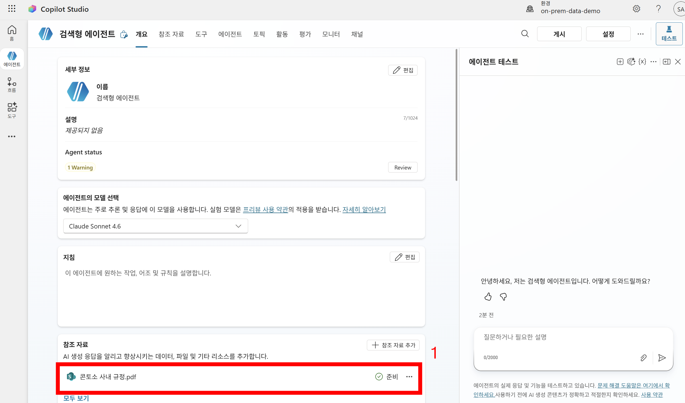

2. `토픽` 탭(①)으로 이동하여 새 토픽을 만들고, 토픽 트리거를 `참조 자료 검색이 시작될 때`(②)로 설정한다. 트리거 변경을 위해, 우측 상단 `자세히`(③) → `코드 편집기 열기`(④)를 클릭한다. OnKnowledgeRequested는 UI에서 제공이 안되고 코드로 수정해야 한다.

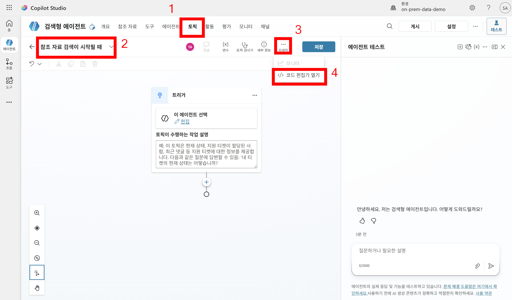

3. 코드 편집기에서 kind의 값을 `OnKnowledgeRequested`(①)로 수정한다. 확인 후 `코드 편집기 닫기`(②)를 클릭하여 그래픽 편집기로 돌아온다.

```yaml
kind: AdaptiveDialog
beginDialog:
  kind: OnKnowledgeRequested
```

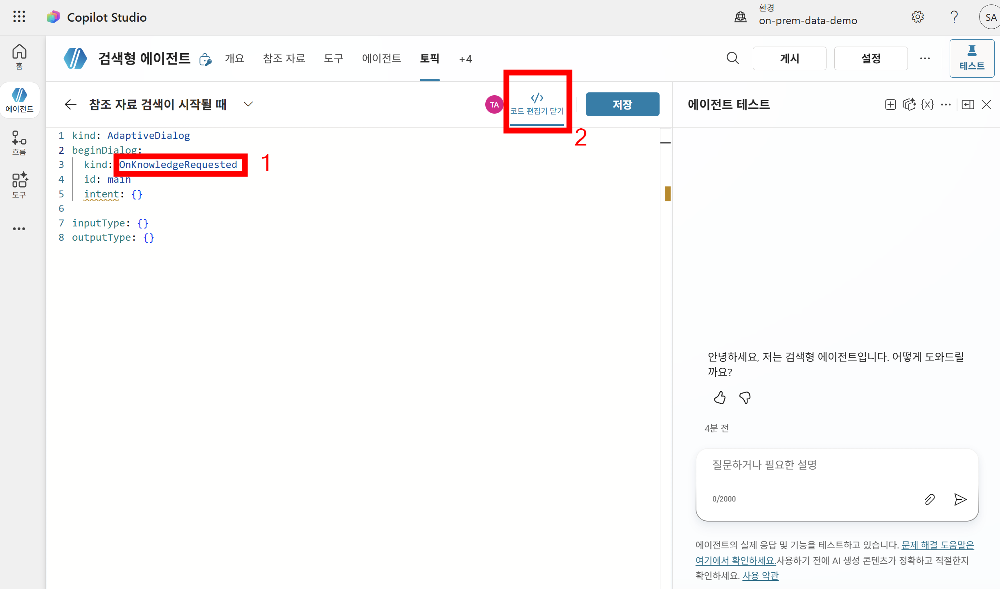

4. 트리거 아래에 `메시지 노드`를 추가하고, 검색 엔진에 전달되는 두 가지 쿼리를 출력하도록 구성한다. 메시지 입력란(①)에 아래처럼 작성하되, 변수 삽입 버튼 `{x}`(②)를 눌러 `시스템`(③) 탭에서 `query`(④)를 검색하여 `System.KeywordSearchQuery`와 `System.SearchQuery`를 각각 삽입한다.

```
- 키워드 쿼리: {System.KeywordSearchQuery}
- 시멘틱 쿼리: {System.SearchQuery}
```

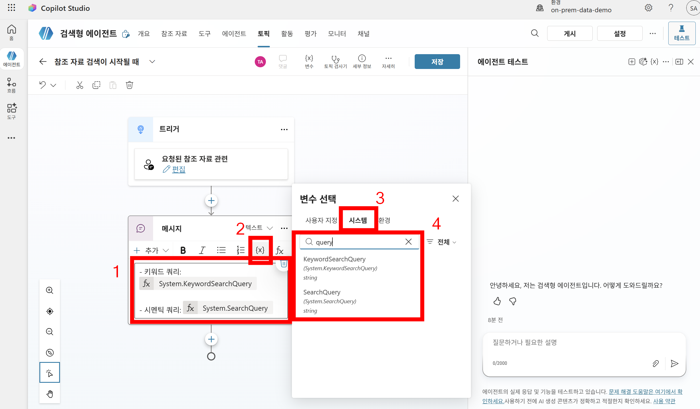

5. 저장 후 테스트 패널에서 지식 검색이 필요한 질문(예: `출장 시 식비 지원 얼마인가`)을 입력한다(①). 지식 검색 직전에 토픽이 실행되어, 검색 엔진에 전달되는 **키워드 쿼리**와 **시멘틱 쿼리**가 메시지로 출력되는 것을 확인할 수 있다(②). 이어서 에이전트는 SharePoint 지식 소스를 검색하여 답변을 생성한다.

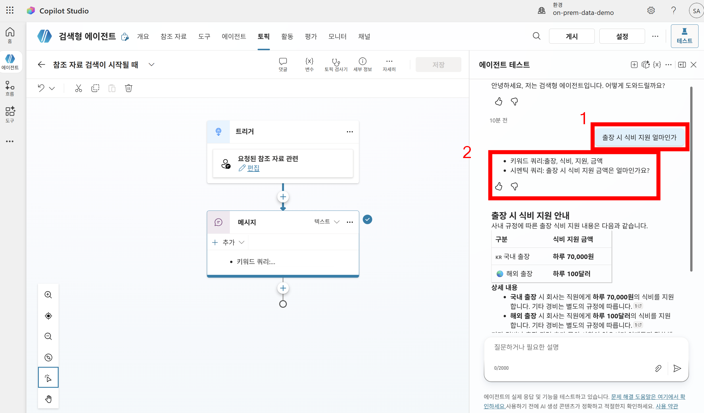

### 실습 요약

- `OnKnowledgeRequested` 트리거는 지식 검색이 호출되기 **직전**에 실행되며, 검색 동작에 개입할 수 있는 지점을 제공한다.
- `System.KeywordSearchQuery`와 `System.SearchQuery`를 통해 검색 엔진에 전달되는 실제 쿼리를 확인할 수 있어, 검색 품질을 디버깅하거나 검색 동작을 이해하는 데 유용하다.
- 더 나아가 `System.SearchResults` 변수를 직접 설정하면, 외부 검색 엔진(예: Azure AI Search)의 결과를 Copilot Studio 지식 검색 결과로 주입하는 커스텀 검색 시나리오도 구현할 수 있다.

---

## 실습2: OnGeneratedResponse 활용

### 지시사항

1. Copilot Studio 에이전트를 하나 만든다.

2. 지식에는 쉐어포인트에 제공된 지식을 참조시킨다.

3. 토픽으로 이동하여 새 토픽을 만든다.

4. 토픽 트리거 중 'AI가 생성한 응답이 곧 전송됩니다'을 선택한다.

5. 아래와 같이 토픽을 구축한 뒤 테스트 한다.

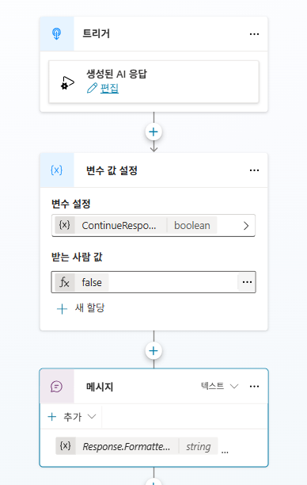

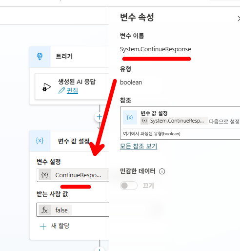

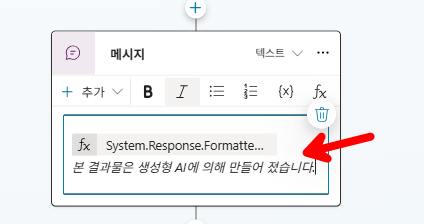

---

## 실습3: OnPlanComplete 활용

### 학습 목표

- `OnPlanComplete` 트리거를 사용하여, 생성형 오케스트레이터가 사용자의 의도에 맞는 플랜(Plan)을 **수립하고 실행을 완료한 직후** 추가 로직을 삽입하는 방법을 이해한다.

### 시나리오

- `OnPlanComplete` 트리거로 토픽을 만들어, 플랜이 완료된 직후 특정 작업이 실행되게 만들어 본다.

### 지시사항

1. 새롭게 에이전트를 만들거나, 또는 기존에 실습1에서 만든 `검색형 에이전트`(SharePoint 지식 소스가 연결된 에이전트)를 그대로 사용한다. `토픽` 탭(①)으로 이동하여 새 토픽을 만들고, 토픽 이름을 `계획이 완료되었을 때`로 설정한다(②). 트리거 변경 버튼(③)을 클릭한 뒤, `트리거 변경` 패널에서 `계획 완료`(④)를 선택한다.

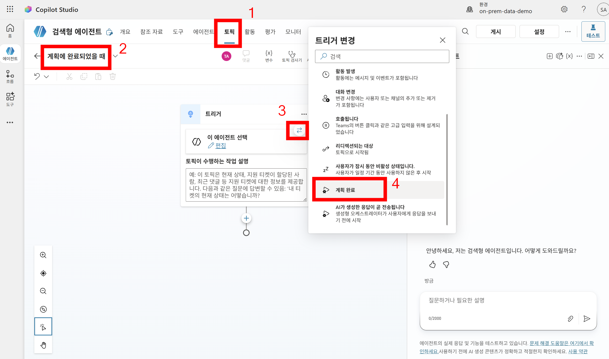

2. `계획 완료` 트리거 아래에 `메시지` 노드를 추가하고, 아래와 같이 마무리 안내 메시지를 입력한다(①). 입력 후 `저장`(②)을 클릭한다.

```
사용자의 문의에 답하기 위한 모든 작업을 마무리 한 후 발송되는 메시지입니다.
```

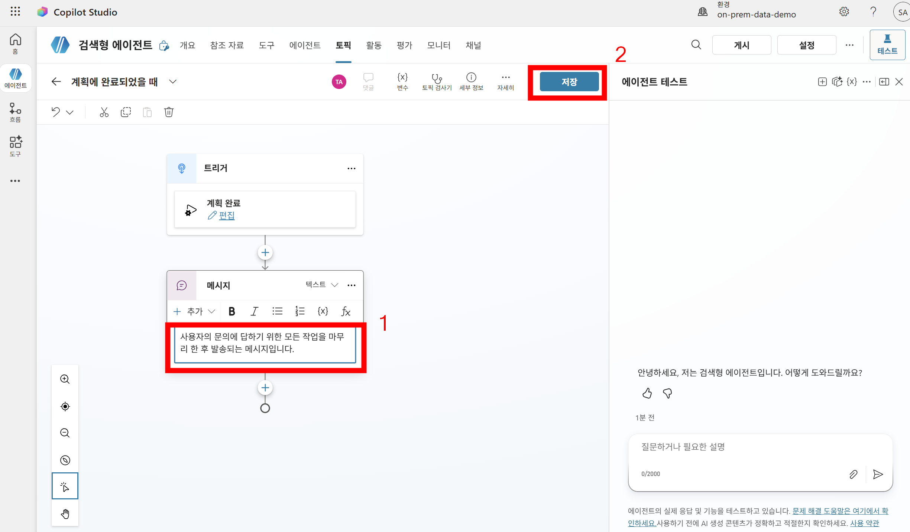

3. 테스트 패널에서 다양한 질문을 입력해본다.(예: `출장 시 경비 지원에 대해 알려주세요`)(①). 에이전트가 답변을 생성한 뒤, 플랜이 완료된 직후 `계획이 완료되었을 때` 토픽이 실행되어 사전에 정의한 마무리 메시지가 이어서 전송되는 것을 확인할 수 있다(②).

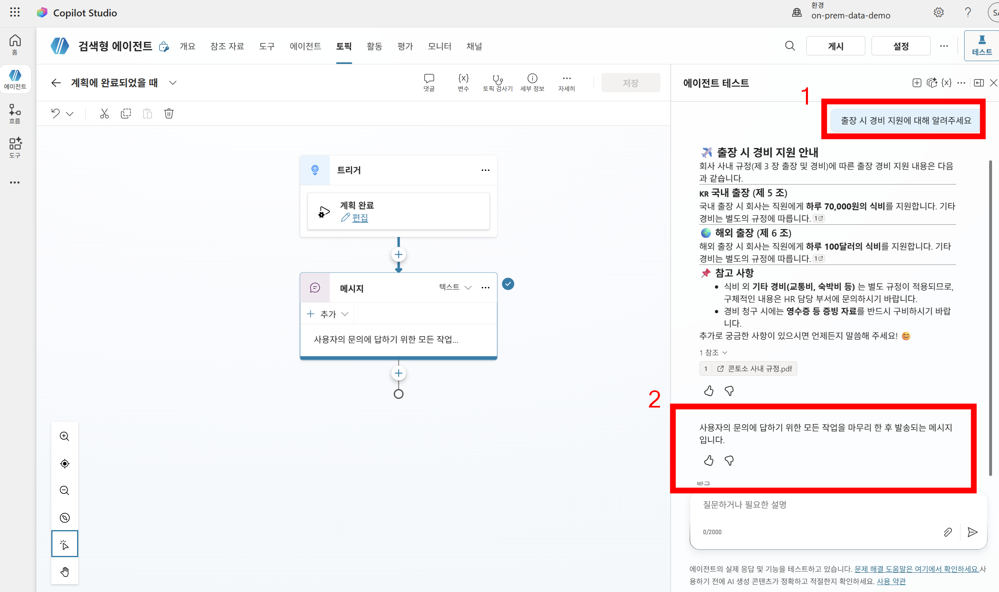

### 실습 요약

- `OnPlanComplete` 트리거는 오케스트레이터가 플랜을 수립하고 실행을 **완료한 직후**에 실행된다.
- 플랜 완료 시점을 활용하여 마무리 안내 메시지 발송, 만족도 설문 토픽으로 이동, 로그 기록·알림 발송 등 다양한 후속 작업을 자동화할 수 있다.

---

## 응용: 문의·답변 로그 기록 프로세스 만들기

`OnGeneratedResponse` 트리거를 활용하면, 질의응답이 목적인 에이전트에 대해 **사용자의 문의와 에이전트의 답변을 기록(로깅)하는 프로세스**를 직접 만들어볼 수 있습니다. 해당 방법은 Azure의 Application Insight 서비스 생성 권한이 없는 경우, 실무자 입장에서 간단하게 구현해볼 수 있는 로깅 방법입니다.

### 구현 아이디어

`OnGeneratedResponse`로 트리거되는 토픽 하나에서 문의와 답변을 **한 번에 기록**할 수 있습니다. 이 토픽 안에서 아래 두 변수를 함께 엑셀 파일에 기록하면 됩니다.

- 사용자가 입력한 문의 원문인 `System.Activity.Text`
- AI가 생성한 응답 텍스트인 `System.Response.FormattedText`

`OnGeneratedResponse`는 AI가 응답을 생성한 직후에 실행되므로, 이 시점에는 사용자의 문의(`System.Activity.Text`)와 그에 대한 답변(`System.Response.FormattedText`)이 모두 준비되어 있습니다. 따라서 해당 토픽 내에서 Excel 커넥터의 **"테이블에 행 추가"** 작업으로 두 값을 한 행에 기록하면, "질문 ↔ 답변" 쌍을 손쉽게 남길 수 있습니다.

| 변수 | 의미 |
|---|---|
| `System.Activity.Text` | 사용자가 입력한 문의 원문 |
| `System.Response.FormattedText` | AI가 생성한 응답 텍스트 |

### 보다 섬세한 로그가 필요하다면: Application Insights 연결

위와 같이 직접 로깅 프로세스를 구현할 수도 있지만, **보다 섬세한 수준의 로그**가 필요하다면 에이전트에 **Application Insights**를 연결하는 것을 권장합니다. Application Insights를 연결하면 위처럼 토픽으로 직접 구현할 필요 없이, 대화,이벤트 등 **더 상세한 telemetry 정보들이 자동으로 기록**됩니다.

```{note}
Application Insights 연결 방법은 [Capture telemetry with Application Insights - Microsoft Learn](https://learn.microsoft.com/en-us/microsoft-copilot-studio/advanced-bot-framework-composer-capture-telemetry) 문서에서 확인할 수 있습니다.
```


