# HITL(Human-in-the-Loop) 프로세스 구축 방법

```{warning}
**Copilot Studio는 빠르게 발전하는 제품입니다.** UI 업데이트가 잦아 본 가이드의 스크린샷·메뉴 명칭과 실제 화면이 일부 다를 수 있습니다. 또한 SaaS 제품의 특성상 새로운 기능이 순차적으로 출시되는 과도기에는 사용자·환경마다 화면 구성이 조금씩 다르게 보일 수 있습니다.
```

## Human-in-the-Loop(HITL)란?

**Human-in-the-Loop(HITL)** 은 에이전트가 특정 작업을 자동으로 처리하기 전에, **사람이 직접 확인하거나 승인하는 단계를 흐름 안에 포함시키는 설계 패턴**입니다.

예를 들어, 에이전트가 이메일을 발송하거나 데이터를 수정하기 전에 "정말 진행할까요?" 라고 사용자에게 물어보거나, 상급자의 승인을 받은 후에만 다음 단계로 넘어가도록 설계할 수 있습니다.

---

## 동기(Sync) 방식: 대화 안에서 즉시 확인받기

### 방법 1: 자체 제공 커넥터 활용

Power Automate에는 **Approvals(승인)** 커넥터가 내장되어 있습니다. Agent Flow 안에서 이 커넥터를 사용하면, 지정된 승인자에게 승인 요청을 보내고 응답을 기다리는 흐름을 만들 수 있습니다. 설정이 간단하고 별도 UI 개발 없이도 승인 흐름을 구현할 수 있다는 장점이 있습니다.

- [표준 승인 커넥터](https://learn.microsoft.com/en-us/connectors/approvals/)
- [고급 승인 커넥터](https://learn.microsoft.com/en-us/connectors/advancedapprovals/)

### 방법 2: Adaptive Card로 커스텀 확인 UI 구현

**Adaptive Card**는 Teams나 Copilot Studio 채팅 창 안에서 버튼, 입력 폼, 이미지 등을 포함한 **인터랙티브 카드**를 표시할 수 있는 기능입니다.

단순한 텍스트 메시지 대신, "승인" / "거절" 버튼이 있는 카드를 사용자에게 보여주고, 사용자가 버튼을 클릭하면 그 결과를 에이전트가 받아서 다음 흐름으로 이어가는 방식입니다. 자체 커넥터보다 더 풍부한 UI를 제공할 수 있습니다.

---

## ⚠️ 동기 방식의 근본적인 한계: 100초 응답 제한

Copilot Studio의 에이전트는 시스템 상 **약 100초 이내에 반드시 응답을 회신해야 하는 제한**이 있습니다.

만약 Agent Flow를 호출했는데 100초 안에 응답이 돌아오지 않으면, 다음과 같은 오류가 발생합니다:

```
FlowActionTimedOut
```

이 제한은 승인 커넥터나 Adaptive Card 방식 모두에 동일하게 적용됩니다. 

**왜 문제가 되는가?** 사람이 관여하는 승인 프로세스는 특성상 100초 안에 완료되기 어렵습니다. 승인자가 이메일을 확인하거나, Teams 메시지를 읽고 결정을 내리는 데는 몇 분, 몇 시간, 심지어 며칠이 걸릴 수도 있습니다.

> **결론**: 동기 방식 HITL은 **대화 안에서 즉각적인 확인(수 초 이내)** 이 가능한 경우에만 안정적으로 사용할 수 있습니다. 시간이 걸리는 승인 프로세스라면 반드시 **비동기 방식**을 사용해야 합니다.

---

## 비동기(Async) 방식: Agent Flow를 활용한 HITL

### 핵심 아이디어

비동기 HITL 패턴은 Agent Flow를 **두 단계로 분리**하는 것이 핵심입니다.

1. **빠른 동기 단계** (100초 이내): 에이전트가 Agent Flow를 호출하고, Flow는 즉시 "요청이 접수되었습니다"라는 응답을 반환합니다. 에이전트는 이 응답을 받고 사용자에게 안내 메시지를 보낸 뒤 대화를 종료합니다.

2. **느린 비동기 단계** (100초 이후 자유롭게): Agent Flow는 응답을 반환한 이후에도 계속 실행됩니다. 승인자에게 요청을 보내고, 승인 결과를 기다린 뒤, 완료되면 결과를 전달합니다.

### 전체 흐름

```
① 사용자가 에이전트에게 요청
         ↓
② 에이전트가 Agent Flow 호출 (System.Conversation.Id 함께 전달)
         ↓
③ Agent Flow가 즉시 "요청 접수" 응답 반환 (100초 이내 완료)
         ↓
④ 에이전트: "요청이 접수되었습니다. 승인 후 안내드리겠습니다." 안내
         ↓
⑤ Agent Flow: 승인자에게 요청 발송 → 승인 대기 (최대 약 30일)
         ↓
⑥ 승인 완료 → Agent Flow가 Teams 메시지, Outlook 이메일 등으로 결과를 사용자에게 전달
```

비동기 단계에서 결과를 기다리는 동안에는 **Power Automate 플로우의 플랫폼 한계**를 따릅니다. 즉, 에이전트의 100초 제한과 무관하게 **최대 약 30일까지 입력을 기다릴 수 있습니다.**

승인 결과가 들어오면 Agent Flow가 재개되어, **Teams 채널 메시지, Outlook 이메일 등 지원되는 방법**으로 결과를 사용자에게 직접 전달할 수 있습니다. 에이전트를 재호출하지 않고 커넥터로 바로 알림을 보내는 방식도 충분히 유효합니다.

### 구현 시 핵심 포인트

| 포인트 | 설명 |
|---|---|
| **"Respond to the agent" 위치** | 이 액션을 기준으로 앞은 동기(빠른) 처리, 뒤는 비동기(느린) 처리 |

```{tip}
비용 지출 승인 예시: 사용자가 경비 청구를 에이전트에 요청 → 에이전트가 "접수되었습니다" 즉시 안내 → Agent Flow가 관리자에게 승인 요청 발송 → 관리자가 며칠 후 승인 → Agent Flow가 에이전트를 재호출 → 에이전트가 사용자에게 "승인 완료" 알림
```

---

## Sync vs Async 비교

| 구분 | Sync (동기) | Async (비동기) |
|---|---|---|
| 응답 시간 | 100초 이내 필수 | 제한 없음 |
| 사용자 경험 | 대화 안에서 즉시 확인 | 별도 알림으로 나중에 안내 |
| 구현 난이도 | 상대적으로 단순 | Agent Flow 분리 설계 필요 |
| 적합한 케이스 | 즉각적인 버튼 확인 | 사람의 검토·승인이 필요한 프로세스 |
| 오류 위험 | 100초 초과 시 FlowActionTimedOut | 해당 없음 |

---

## 참고문헌

- [The 100-second wall and how to get past it - Microsoft CAT Blog](https://microsoft.github.io/mcscatblog/posts/combining-agent-flows-and-agents-gotchas-errors-and-patterns/#2-the-100-second-wall-and-how-to-get-past-it)
- [Error codes reference - Microsoft Learn](https://learn.microsoft.com/troubleshoot/power-platform/copilot-studio/authoring/error-codes)

---

## 실습1: HITL 시나리오 – Human review 커넥터(비동기 승인)

### 학습 목표

- `Human review` 커넥터의 `Request information` 작업을 사용하여, 담당자에게 이메일로 승인 카드를 보내고 응답을 받는 비동기(Async) HITL 패턴을 이해한다.
- `Respond to the agent` 노드를 먼저 배치하여 에이전트가 100초 응답 제한에 걸리지 않고 즉시 사용자에게 안내하도록 구성하는 방법을 익힌다.
- 승인 결과를 후속 작업(이메일 통보)으로 연결하는 엔드-투-엔드 승인 흐름을 구현한다.

### 시나리오

- 법무팀 승인이 필요한 문서가 있을 때, 에이전트가 담당자에게 **검토 요청 이메일**을 보내고, 담당자는 이메일 안에서 **예/아니요**로 승인 여부를 응답한다.
- 승인 절차는 사람이 개입해야 하므로 언제 완료될지 알 수 없다. 따라서 에이전트는 사용자를 기다리게 하지 않고 **"요청이 접수되었으며 결과는 추후 이메일로 안내된다"** 고 즉시 응답한다.
- 담당자가 응답을 제출하면, 그 결과가 **별도 이메일로 통보**된다.

> 💡 이 실습은 앞서 설명한 **비동기(Async) 방식**과 **방법 1: 자체 제공 커넥터(Human review)** 를 결합한 구현입니다. 100초 제한을 우회하는 대표적인 패턴입니다.

### 지시사항

1. 새 에이전트를 만들고 이름을 `HITL 커넥터 에이전트`로 설정한다. 개요 화면에서 `도구 추가`를 클릭한 뒤, `새로 만들기`에서 `에이전트 흐름`을 선택한다.

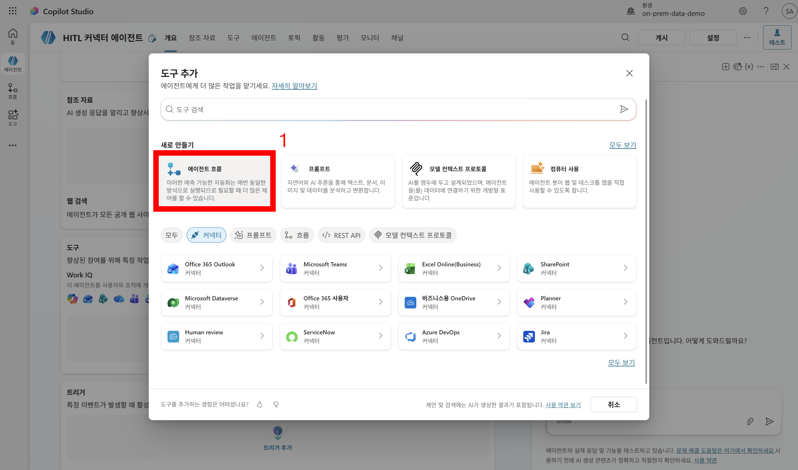

2. `에이전트가 흐름을 호출할 때` 트리거 아래에 `Respond to the agent` 노드를 추가한다. 이 노드를 **가장 먼저** 배치하는 이유는, 승인은 사람이 개입하는 비동기 작업이라 오래 걸릴 수 있으므로 에이전트가 100초 제한에 걸리지 않고 **즉시 사용자에게 응답**하도록 하기 위함이다. 출력값에 아래와 같은 안내 메시지를 설정한다.

```
법무팀에게 문서 승인 검토가 곧 발송될 예정입니다. 법무팀의 승인 여부는 추후 이메일을 통해 안내될 예정입니다.
```

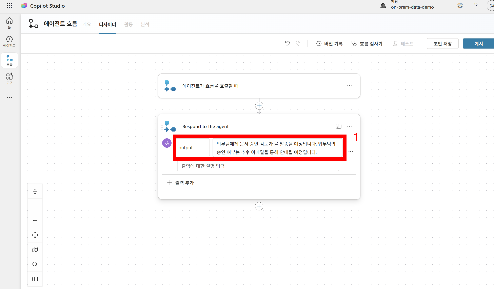

3. 그 아래에 `작업 추가`를 클릭하고, `Human review` 커넥터(①)의 `Request information`(②) 작업을 추가한다.

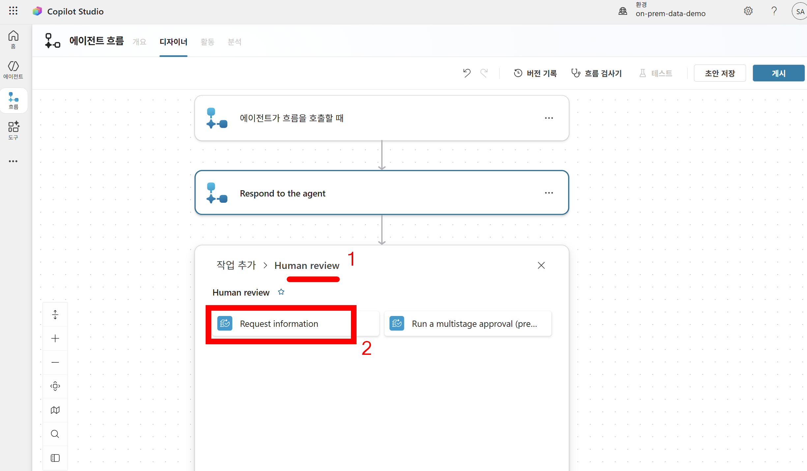

4. `Request information` 작업을 아래와 같이 설정한다. 담당자에게 발송할 검토 요청 본문 내용을 구성한다. 이 때 본문에는 마크다운 문법이 적용된다. 그리고 입력값으로 예/아니요 형태의 `승인 여부`를 추가한다.

- **Title**: `문서 검토 요청 드립니다.`
- **Message**: 
```
안녕하세요. HITL 에이전트에서 자동 발송되었습니다.

아래 문서 검토 요청드립니다. 

- [Microsoft Learn](https://learn.microsoft.com/)

감사합니다.
```
- **Assigned to (first to respond)**: 본인 이메일
- **Channel**: `Outlook`
- **Input**: `예/아니오` 입력 유형 선택 후 이름을 `승인 여부`로 변경

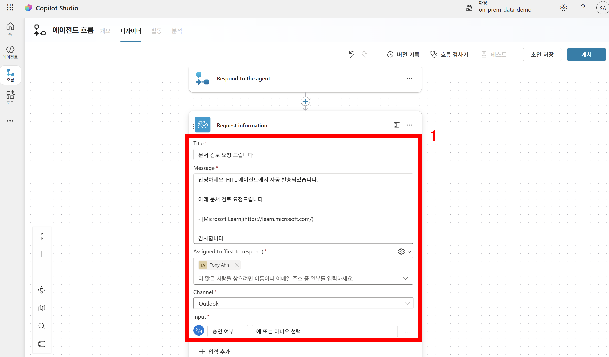

5. `Request information` 작업 아래에 Office 365 Outlook 커넥터에서 `메일 보내기(V2)` 작업을 추가한다(①). 담당자가 응답한 결과를 전달하는 이메일을 구성한다. 본문에는 `Request information`의 출력값인 `승인 여부`(②)를 동적 콘텐츠로 삽입한다.

- **받는 사람**: 본인 이메일
- **제목**: `법무팀 승인 결과`
- **본문**: 
```
법무팀 승인 결과: @{body('Request_information')?['boolean']}

*본 이메일을 자동 발신되었습니다.
```

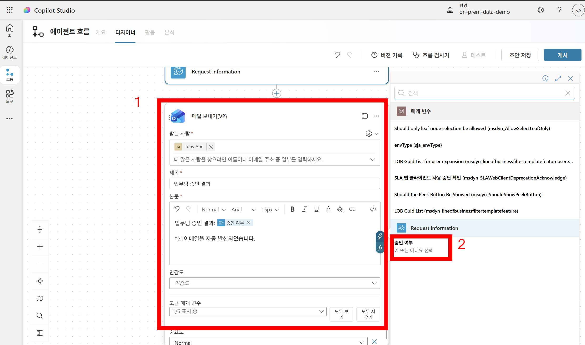

6. `게시`(①)를 클릭한 뒤 흐름 이름을 `법무팀 승인 요청`으로 변경한다(②). 최종 흐름은 `에이전트가 흐름을 호출할 때` → `Respond to the agent` → `Request information` → `메일 보내기(V2)` 구조가 된다.

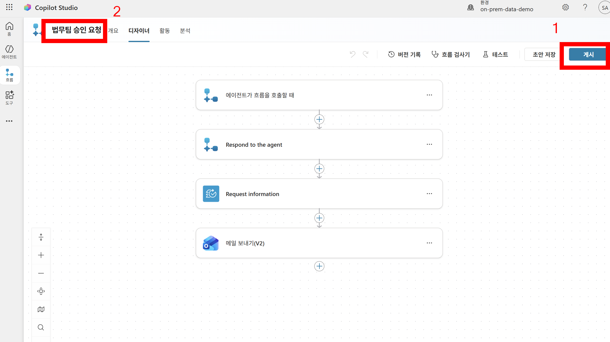

7. 에이전트로 돌아와 `도구 추가`(①)에서 방금 만든 `법무팀 승인 요청` 흐름을 도구로 추가한다(②). 그리고 지침(③)을 아래와 같이 설정한다.

```
법무팀 승인이 필요한 상황에는 /법무팀 승인 요청 을 사용한다.
```

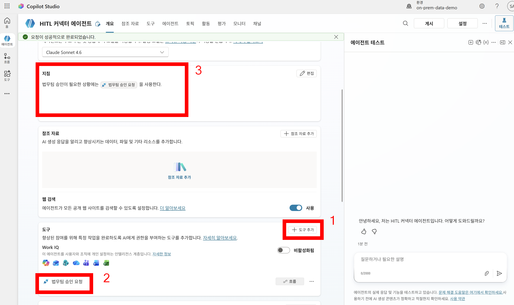

8. 테스트 패널에서 `법무팀 승인 요청`을 실행한다(①). 흐름 실행이 완료되면 `Respond to the agent`의 출력값(②)이 반환되고, 에이전트는 **즉시** "요청이 접수되었으며 승인 여부는 추후 이메일로 안내된다"고 응답한다. 사용자를 기다리게 하지 않는 비동기 패턴임을 확인할 수 있다.

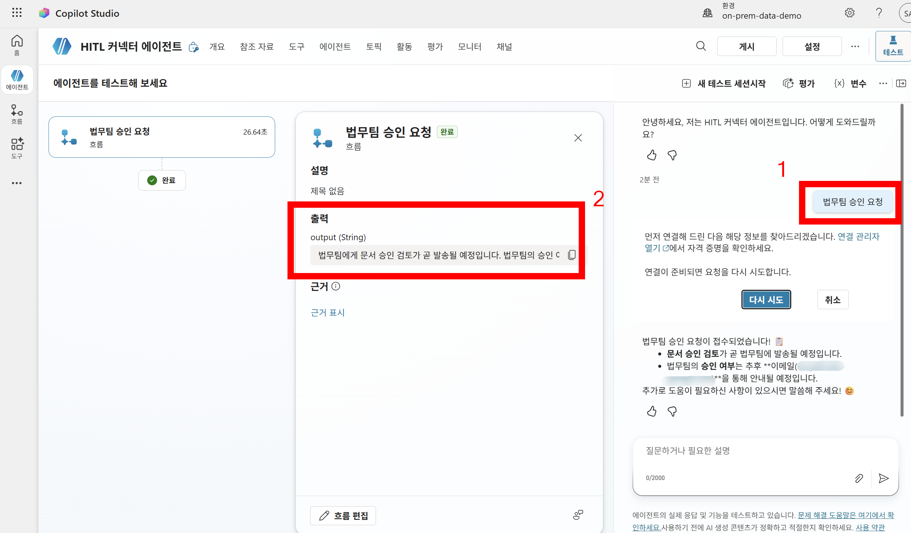

9. 본인의 Outlook 받은 편지함을 확인한다. `Request information`이 발송한 검토 요청 카드(①)가 도착해 있다. 본문에는 마크다운 문법이 적용된 것을 확인할 수 있다. `승인 여부`에서 `Yes`를 선택하고(②) `Submit`(③)을 클릭한다.

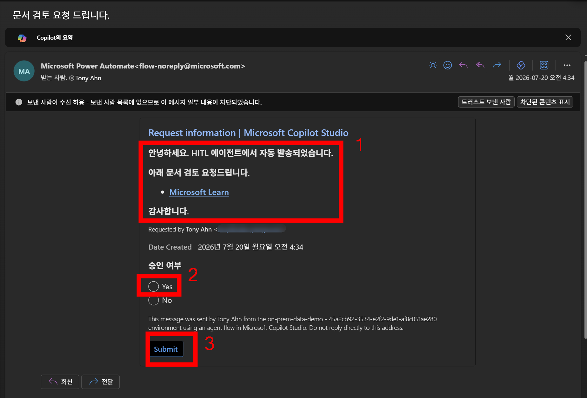

10. 담당자가 응답을 제출하면 `메일 보내기(V2)` 작업이 실행되어, `법무팀 승인 결과: Yes`(①)와 같이 승인 결과를 전달하는 이메일이 발송된 것을 확인할 수 있다.

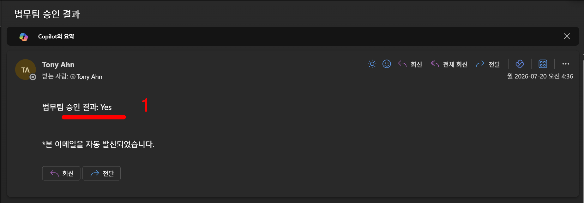

### 실습 요약

- `Human review` 커넥터의 `Request information` 작업으로 담당자에게 **이메일 기반 승인 요청**을 보내고 응답을 수집할 수 있다.
- `Respond to the agent` 노드를 흐름 앞부분에 배치하면, 승인처럼 오래 걸리는 비동기 작업에서도 에이전트가 **100초 제한에 걸리지 않고 즉시 응답**한다.
- 승인 결과는 후속 작업(예: `메일 보내기(V2)`)으로 연결하여 관계자에게 통보하는 등 엔드-투-엔드 승인 워크플로를 완성할 수 있다.

---

## 실습2: HITL 시나리오 – Adaptive Card

### 학습 목표

- Adaptive Card를 사용하여 사용자로부터 피드백을 받고자 하는 텍스트 초안을 편집 가능한 형태로 보여주는 방법을 이해한다.
- 토픽을 사용하면 Agent Flow처럼 도구를 연결할 수 있을 뿐만 아니라, 그것과 동시에 대화 흐름도 제어할 수 있음을 이해한다.

### 시나리오

- Lab 04에서는 이력서 PDF 파일이 업로드되면, 프롬프트 도구로 인해 이력서에서 핵심 정보들이 추출되고, 자동으로 엑셀 내 테이블에 입력이 되었다.
- 경우에 따라서는 프롬프트 도구가 추출한 정보들을 엑셀에 넣기 전에 사용자의 검토를 먼저 받고, 필요 시 사용자가 직접 수정하고 해당 내용으로 엑셀에 값을 넣는 워크플로가 필요할 수도 있다.
- 이러한 워크플로는 토픽과 프롬프트/커넥터 도구, 그리고 Adaptive Card와의 조합을 통해 구현할 수 있다.

### 지시사항

1. 파일 분석 에이전트로 이동하여 토픽으로 이동한다. Lab 04에서 만든 '파일 업로드 되면 바로 실행' 토픽을 비활성화한다. 새로운 토픽을 만들 것이기 때문이다.

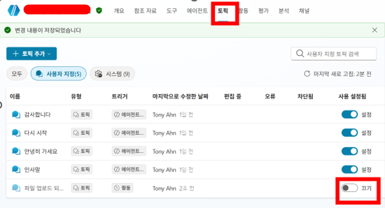

2. '파일 업로드 되면 바로 실행' 토픽의 추가 옵션 (…) 버튼을 눌러 복사본 만들기를 클릭한다.

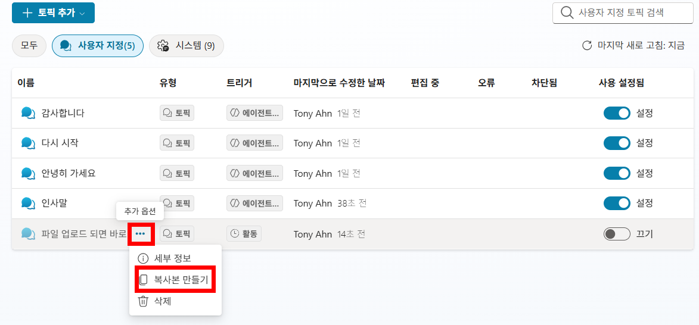

3. 토픽 제목을 '파일 업로드시 사용자 검토 받기'로 설정한다.

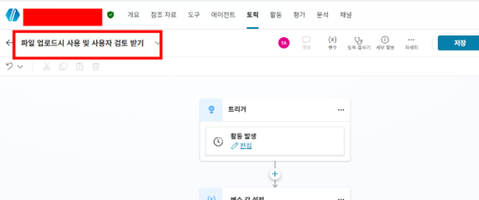

4. '변수 값 설정' 과 '목록을 통해 루프' 노드는 그대로 사용한다. '작업' 노드와 '메시지' 노드는 삭제한다. 진행 과정 틈틈이 저장 버튼을 누른다.

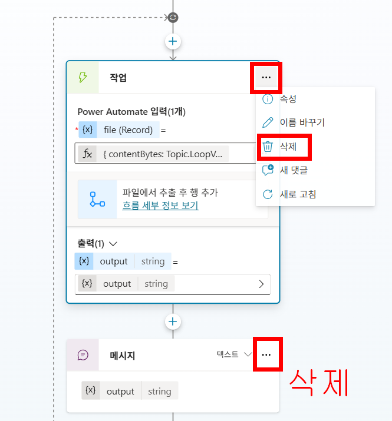

5. 루프 내 노드 추가 버튼을 클릭한 뒤 프롬프트 도구 중 '파일 이력서에서 데이터 추출'을 선택한다.

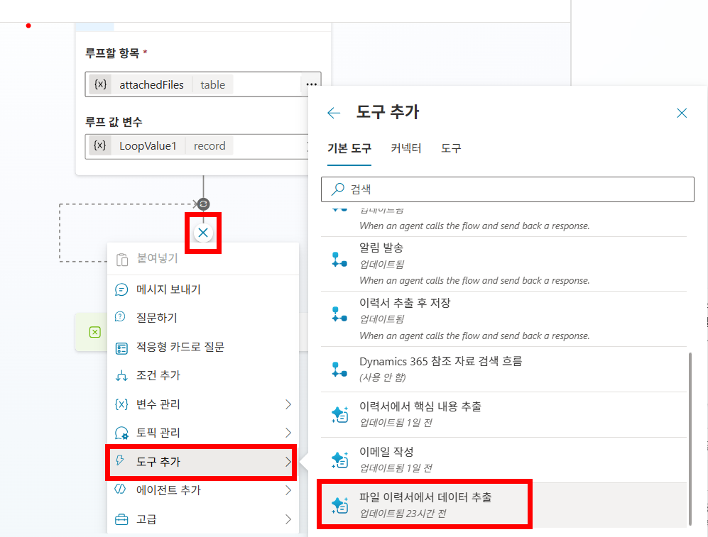

6. 입력 값에 변수가 한글이 영문 및 숫자로 인코딩 되다 보니 가독성이 떨어지는 것을 확인할 수 있다. … 을 클릭하여 현재 루프로 돌고 있는 LoopValue1 변수의 Content 값을 설정한다.

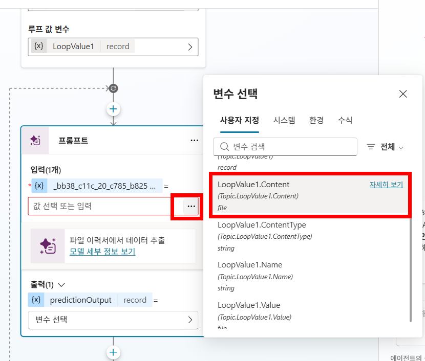

7. predictionOutput은 promptOutput에 저장한다. 없는 경우 별도로 만들어서 진행한다.

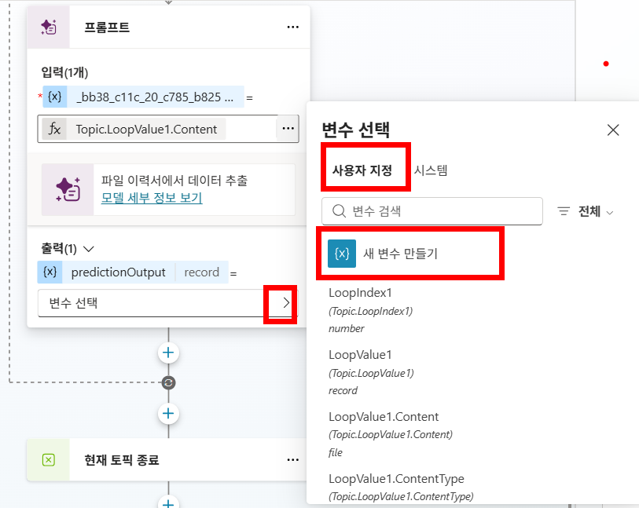

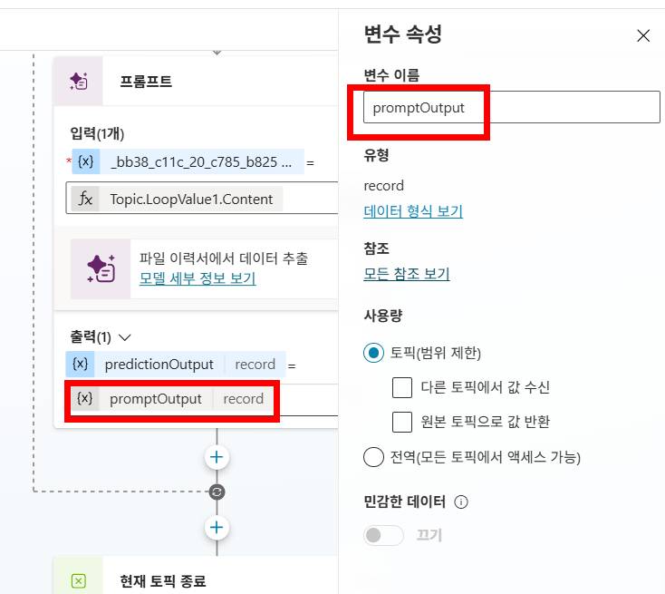

8. 적응형 카드로 질문을 추가한다.

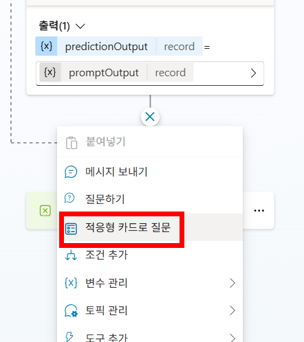

9. 속성으로 이동한다.

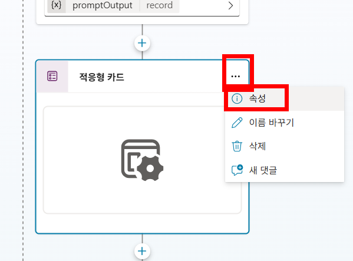

10. 적응형 카드 편집을 클릭한다. 아래 값을 전체 복사하여 카드 페이로드 편집기에 붙여넣고, Save를 클릭한 뒤 Close를 클릭한다.

복붙용 전체 코드:

```json
{
  "$schema": "http://adaptivecards.io",
  "type": "AdaptiveCard",
  "version": "1.5",
  "body": [
    {
      "type": "TextBlock",
      "text": "정보 입력",
      "size": "Large",
      "weight": "Bolder"
    },
    {
      "type": "Input.Text",
      "id": "userName",
      "label": "성함",
      "placeholder": "성함을 입력하세요"
    },
    {
      "type": "Input.Number",
      "id": "careerYears",
      "label": "총 경력 기간 (년)",
      "placeholder": "숫자 입력"
    },
    {
      "type": "Input.Text",
      "id": "keySkills",
      "label": "주요 역량",
      "placeholder": "핵심 기술 및 강점",
      "isMultiline": true
    }
  ],
  "actions": [
    {
      "type": "Action.Submit",
      "title": "저장하기"
    }
  ]
}
```

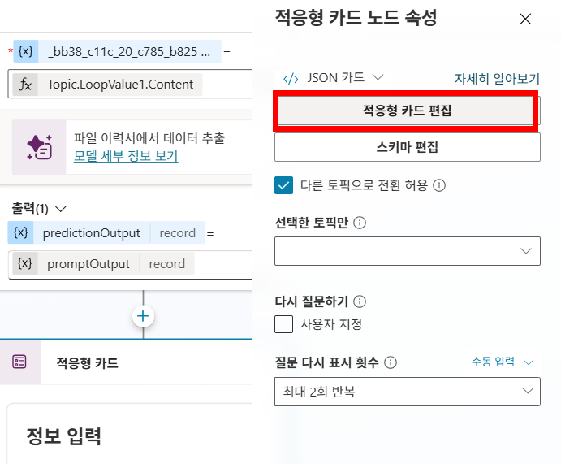

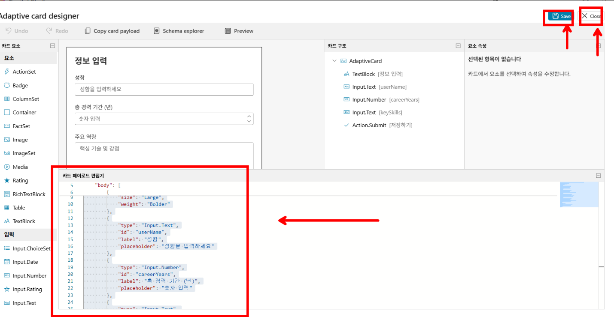

11. 수식으로 설정을 변경한다. 동적인 변수를 전달하기 위함이다.

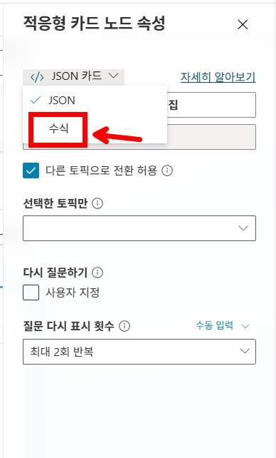

12. 아래 있는 값을 전체 복사하여 입력란에 붙여 넣는다.

복붙용 전체 코드:

```
{
  '$schema': "https://adaptivecards.io/schemas/adaptive-card.json",
  type: "AdaptiveCard",
  version: "1.5",
  body: [
    {
      type: "TextBlock",
      text: "정보 입력",
      size: "Large",
      weight: "Bolder"
    },
    {
      type: "Input.Text",
      id: "userName",
      label: "성함",
      placeholder: "성함을 입력하세요", 
      value: Topic.promptOutput.structuredOutput._C131_D526f5e99b692ad469881eb6252855aeaa
    },
    {
      type: "Input.Number",
      id: "careerYears",
      label: "총 경력 기간 (년)",
      placeholder: "숫자 입력",
      value: Topic.promptOutput.structuredOutput._CD1D_00d196df6c164941390d5de5383e11b58e
    },
    {
      type: "Input.Text",
      id: "keySkills",
      label: "주요 역량",
      placeholder: "핵심 기술 및 강점",
      isMultiline: true,
      value: Topic.promptOutput.structuredOutput._C8FC_C65fe8008944132a0093afe8b3757a7fed
    }
  ],
  actions: [
    {
      type: "Action.Submit",
      title: "저장하기"
    }
  ]
}
```

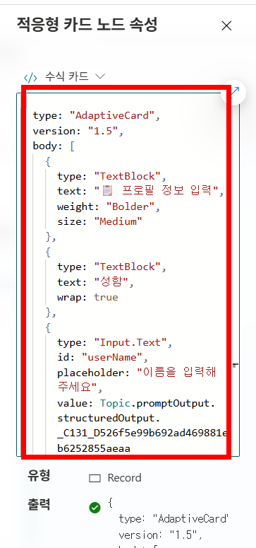

13. 테이블에 행 추가 커넥터를 추가한다.

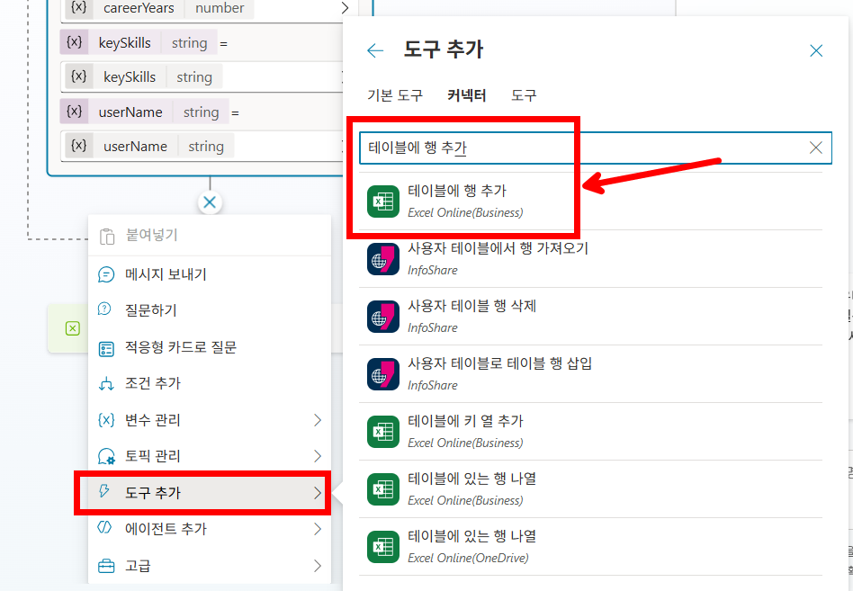

14. 입력 값을 클릭하면 설정할 수 있는 창이 우측에 뜬다. 각 값을 적절하게 입력한다.
  - Location: OneDrive for Business
  - Document Library: 문서 (또는 OneDrive)
  - File: 지원자 정리.xlsx
  - Table: resume_table
  - Row:
    ```
    {
      "성함": Topic.userName,
      "총 경력 기간": Topic.careerYears,
      "주요 역량": Topic.keySkills
    }
    ```

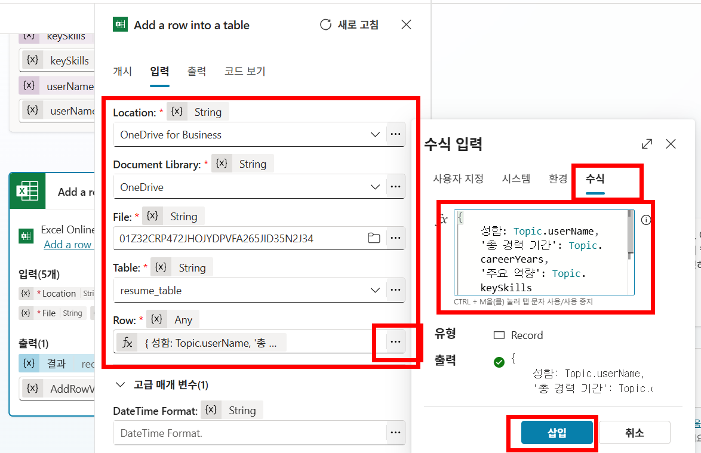

15. 홍길동_이력서.pdf와, 홍영미_이력서.pdf 를 테스트 패널에 함께 첨부하고, 에이전트와 대화해 보며 의도대로 잘 진행되는지 확인한다.

### 실습 요약

- Adaptive Card를 활용해 사용자로부터 다양한 입력값을 입력 받아볼 수 있다.

