# 프롬프트 도구로 JSON 및 문서 출력물 작성

```{warning}
**Copilot Studio는 빠르게 발전하는 제품입니다.** UI 업데이트가 잦아 본 가이드의 스크린샷·메뉴 명칭과 실제 화면이 일부 다를 수 있습니다. 또한 SaaS 제품의 특성상 새로운 기능이 순차적으로 출시되는 과도기에는 사용자·환경마다 화면 구성이 조금씩 다르게 보일 수 있습니다.
```

## 프롬프트 도구(Prompt Tool)란?

Copilot Studio의 프롬프트 도구를 활용하면 AI 모델을 직접 호출하여 구조화된 출력물을 생성할 수 있습니다. 기본 출력 형식인 **텍스트** 외에도 **JSON**과 **문서(Document)** 두 가지 추가 출력 형식을 지원합니다.

```{image} imgs/prompt-output-types.png
:alt: 프롬프트 출력 형식 선택 - 텍스트 / JSON / 문서
:align: center
```

## Part 1. JSON 출력

### JSON 출력이란?

기본값인 텍스트 출력은 단순한 응답에 적합하지만, 응답에 **여러 개별 요소**가 있다면 텍스트만으로는 한계가 있습니다. JSON 출력을 사용하면 프롬프트 응답을 **구조화된 JSON 형태**로 받아 에이전트, 클라우드 흐름, 앱에서 각 필드를 개별적으로 처리할 수 있습니다.

### 주요 활용 사례

- 프로젝트 일정, 제품 정보 등 **구조화된 콘텐츠** 표시
- 인보이스, 구매 주문서, 배송 서류 등에서 **데이터 추출**
- 이메일, Dataverse 데이터 등에서 **객체 속성 식별**
- 텍스트에서 여러 **카테고리나 감정(Sentiment) 분류**

### JSON 출력 설정 방법

1. 프롬프트 편집기 우측 상단에서 **출력: JSON** 선택
2. JSON 형식 편집 아이콘(설정)을 클릭하여 포맷 확인 및 수정

### JSON 포맷 모드

| 모드 | 설명 |
|---|---|
| **Auto detected (자동 감지)** | 테스트할 때마다 모델이 응답 형식을 자동으로 감지 및 갱신. 프롬프트 개발 초기 단계에 유용 |
| **Custom (사용자 정의)** | JSON 예시를 직접 수정하면 Custom 모드로 전환. 저장 시 고정되며 런타임에도 동일 포맷 유지 |

> ⚠️ **저장 시 포맷 고정**: 프롬프트를 저장하면 마지막으로 감지된 Auto 포맷 또는 Custom 포맷이 고정됩니다. 에이전트나 흐름에서 사용할 때는 저장된 포맷이 일관되게 적용됩니다.

### 제한 사항

- JSON 스키마는 직접 수정 불가
- 필드 키 없는 JSON 배열 미지원: `["abc", "def"]` ❌ → `[{"Field1": "abc"}]` ✅
- 오류 발생 시 프롬프트 지침에 `Don't include JSON markdown in your answer` 추가 시도

---

## Part 2. 문서(Document) 출력

### 문서 출력이란?

문서 출력(Document, Preview)은 프롬프트 응답을 **Microsoft Word(.docx) 파일**로 생성하는 기능입니다. 사전에 업로드한 Word 레이아웃 템플릿의 플레이스홀더를 AI가 채워 완성된 문서를 반환합니다.

### 주요 활용 사례

- 인보이스, 제안서(RFP), 계약서 등 **비즈니스 문서 자동 생성**
- 다양한 소스에서 정보를 수집하여 **보고서 또는 문서 작성**
- 에이전트 채팅 세션에서 사용자에게 **특정 문서로 답변 제공**

### 문서 출력 설정 방법

1. 프롬프트 편집기 우측 상단에서 **Document (preview)** 선택
2. **Document settings** 클릭 후 Word 레이아웃 파일 업로드

### 템플릿 작성 규칙

| 규칙 | 예시 |
|---|---|
| 교체할 필드는 이중 중괄호로 표시 | `{{FirstName}}` |
| 테이블 내 필드는 `테이블명.컬럼명` 형식 | `{{items.quantity}}` |
| 필드명에 공백 사용 불가 | `{{First Name}}` ❌ |

> ⚠️ 레이아웃 파일은 최대 **20MB**, `.docx` 형식만 지원합니다. 비밀번호 보호된 파일은 사용 불가합니다.

### 토픽에서 문서 출력 사용 시 주의사항

클라우드 흐름/에이전트 흐름과 달리, **토픽 내에서는 `Document Output Content Bytes`가 노드 출력으로 직접 제공되지 않습니다.** 사용자가 생성된 문서를 다운로드할 수 있게 하려면 아래 방식을 사용합니다:

1. **클라우드 흐름**을 중간 단계로 사용하여 문서 생성 및 OneDrive/SharePoint에 저장
2. **공유 링크(Sharing Link)** 생성 후 URL을 토픽 변수로 반환
3. 토픽의 메시지 노드에서 다운로드 링크를 사용자에게 전달

```
Your document is ready. [Download it here]({varDocumentURL})
```

### 제한 사항

- Solutions로 환경 이동 시 Word 템플릿은 함께 이동되지 않음 → 대상 환경에서 재업로드 필요
- 저장 후 문서 생성 실패 시 Word 레이아웃을 Document settings에서 재업로드
- 텍스트 서식(굵게, 색상, 제목 등) 지정 미지원
- Word 문서(.docx) 형식만 지원

## 실습: 수료증 생성 에이전트

### 학습 목표

- Microsoft Forms 응답 제출을 자동화 시작 이벤트로 활용하는 에이전트의 구조를 이해한다.
- 프롬프트 도구를 사용하여 정해진 형식의 문서 생성 로직을 구성하고, 이를 에이전트 또는 워크플로우에서 재사용하는 방법을 익힌다.
- 생성된 결과물을 OneDrive에 저장하고, 후속 조치로 Teams 알림을 발송하는 업무 자동화 시나리오를 구현한다.

### 시나리오

- 교육 운영 담당자는 수료 대상자의 정보를 수동으로 취합하고 수료증을 작성·저장·안내하는 반복 업무를 수행하고 있다. 이 과정은 시간이 많이 들고 누락 가능성이 있다.
- 이러한 과정을 자동화 해주는 에이전트를 구축해본다.
- 수료증 발급을 원하는 대상자가 있다면, 해당 인원이 직접 Microsoft Forms에 관련 정보를 입력하게 안내한다.
- Microsoft Forms에 값이 입력되면, 워드 파일로 된 수료증이 자동 생성되고, 해당 파일을 PDF로 자동 변환하여 이메일로 발송한 뒤, 발송 완료 되었음을 안내하는 Teams 메시지를 받을 수 있게 자동화 워크플로우/에이전트를 구축해본다.

### 지시사항

1. Copilot Studio (<https://copilotstudio.microsoft.com/>)로 이동하여 커스텀 엔진 에이전트를 하나 만든다. 그리고 에이전트 이름을 '수료증 생성 에이전트'로 설정한다.

2. 에이전트의 모델을 GPT-5 Chat으로 변경한다.

3. 에이전트를 게시한 뒤, Teams 채널에 에이전트를 추가한다. Teams에서 에이전트가 잘 추가되었는지 확인한다.

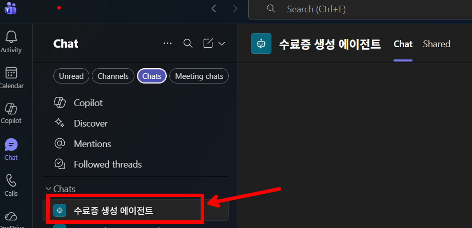

4. Microsoft Forms (<https://forms.office.com/>)로 이동한다.

5. 새로운 설문지를 하나 만든다.

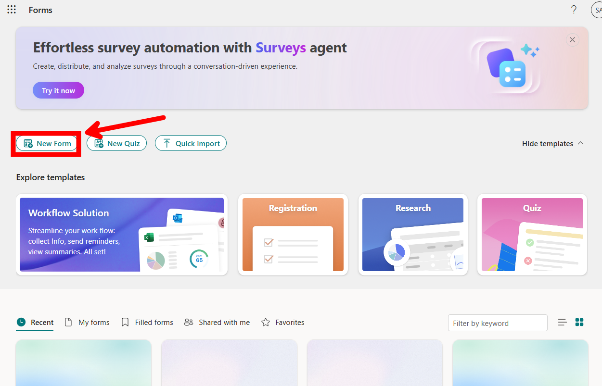

6. Forms 내 Copilot에게 아래와 같이 입력하여 설문지를 구축한다. 또는 수동으로 입력하여 아래 이미지와 같이 설문지를 구축한다.

   ```
   코파일럿 교육 수료증 발급 설문 작성해줘

   질문은 아래와 같아

   - 성함 (단답형)
   - 소속 (단일선택, 선택지는 영업, 마케팅, 재무)
   - 교육명 (코파일럿 기본, 코파일럿 심화)
   ```

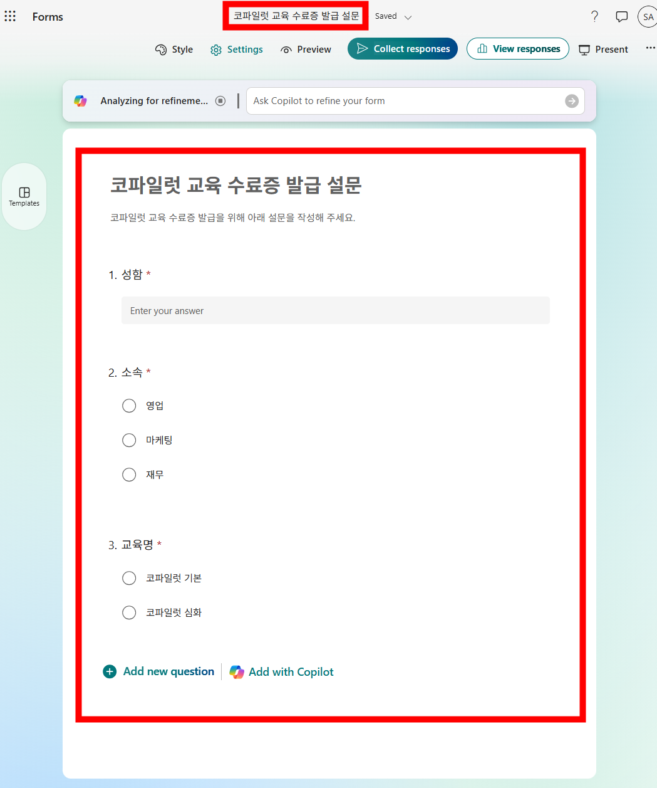

7. 응답자의 성함을 기록할 수 있도록 설문지 설정값을 적절히 설정한다.

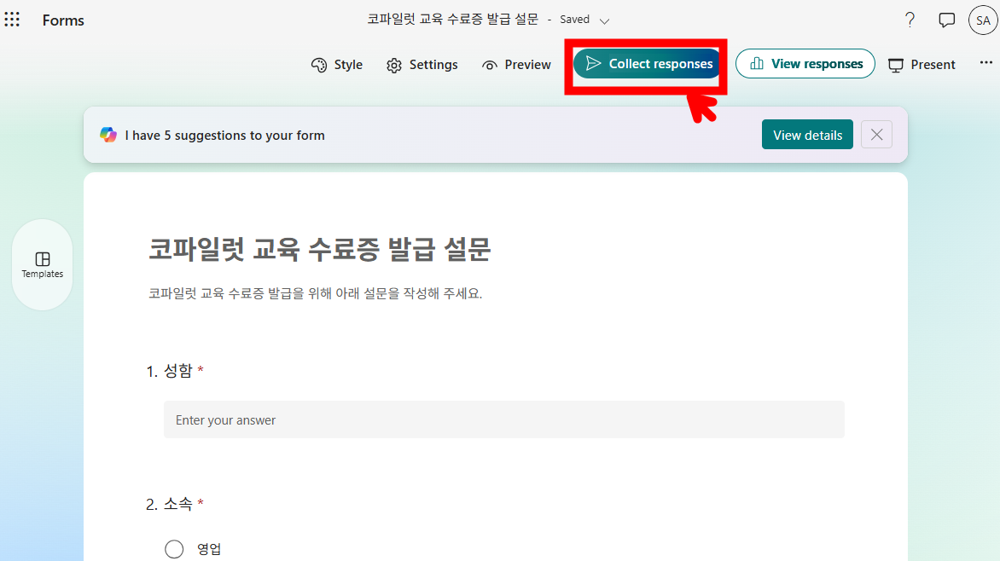

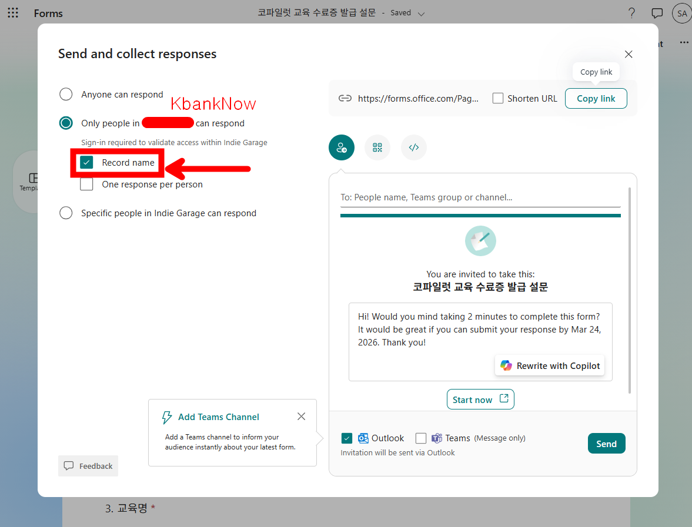

8. Copilot Studio 로 이동하여 에이전트 플로우 메뉴로 이동한다. 그리고 에이전트 흐름 버튼을 클릭한다.

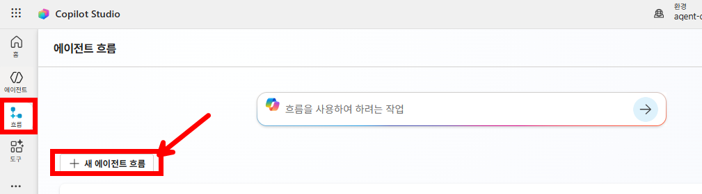

9. 트리거 추가 메뉴에서 Microsoft Forms 커넥터를 선택한 뒤 '새 응답이 제출되는 경우' 트리거를 선택한다.

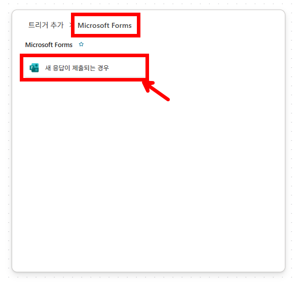

10. 양식 ID에서 제공하는 드롭다운 박스를 활용하여 앞서 만든 '코파일럿 교육 수료증 발급 설문'을 선택한다.

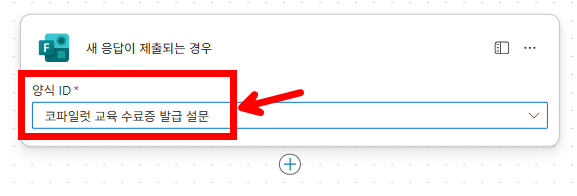

11. 트리거 하단에 프롬프트 실행 작업을 추가한다.

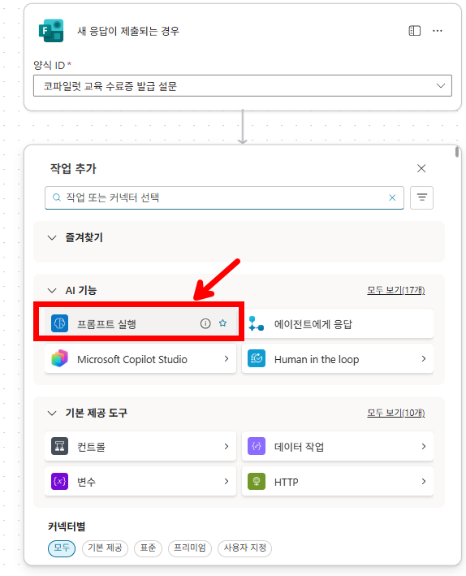

12. 새 사용자 지정 프롬프트를 클릭한다.

13. 프롬프트 도구 제목을 '수료증 생성'으로 변경한 뒤, 출력은 '문서(프리뷰)'로 변경한다.

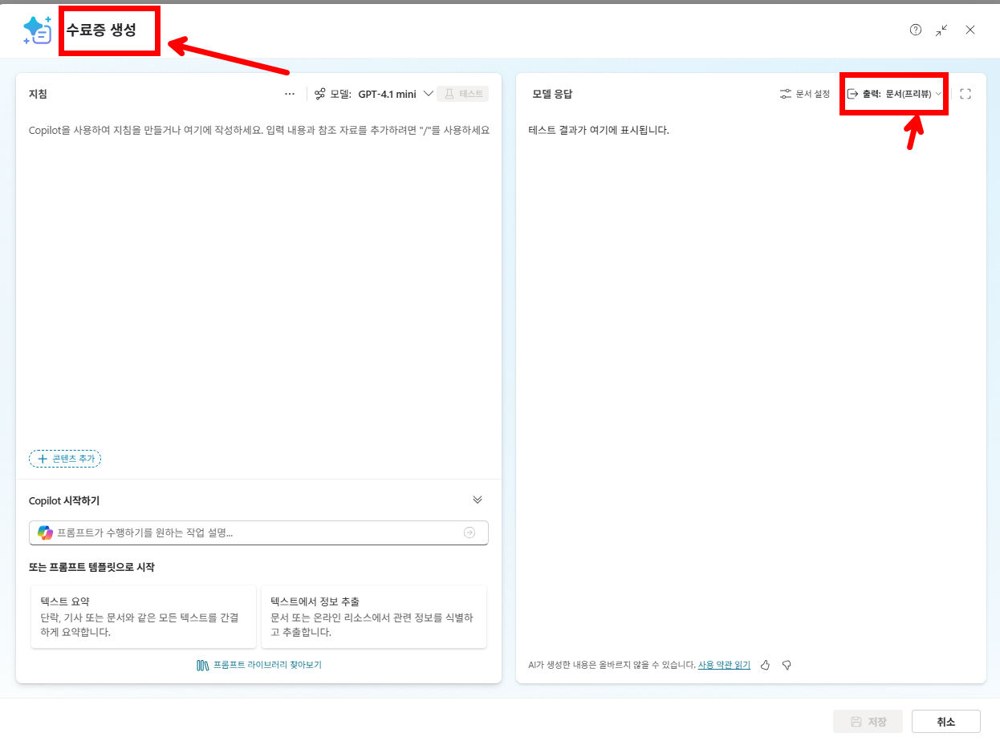

14. 문서 설정을 클릭한다.

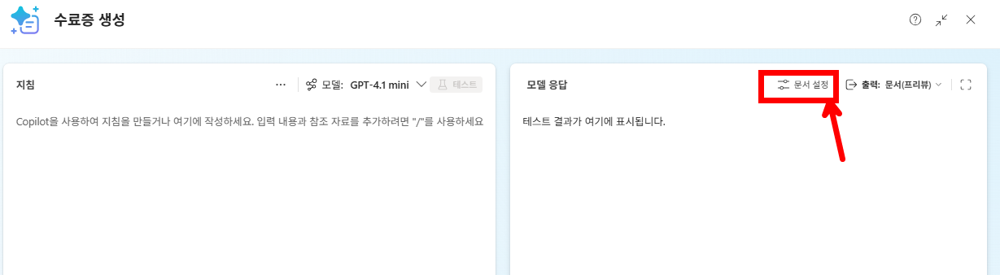

15. 제공된 `certificate.docx` 파일을 업로드한다. 아래 이미지처럼 4개의 필드가 변수로 식별된 것을 확인할 수 있다.

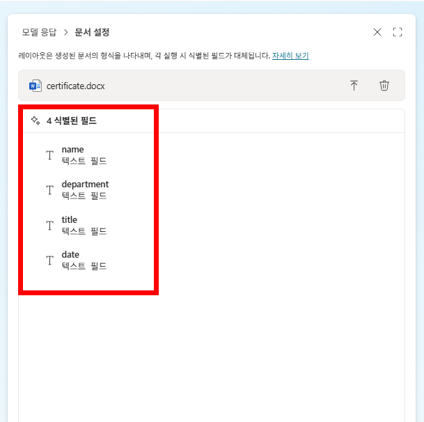

16. 프롬프트 도구의 모델을 GPT-5로 변경하고, 지침을 아래와 같이 입력해본다. 이 때, `/` 로 표시되어 있는 것들은 변수로 넣어야 하므로 '콘텐츠 추가' 버튼을 클릭하여 적절한 변수를 넣고 변수명을 설정한다. `date`만 Power Fx 변수로 넣고, 나머지는 텍스트 변수로 입력한다.

   ```
   아래 정보들을 워드 문서 양식에 적절한 위치에 대응시켜서 입력해줘.

   - name:  /name
   - department:  /department
   - title:  /title
   - date:  /date
   ```

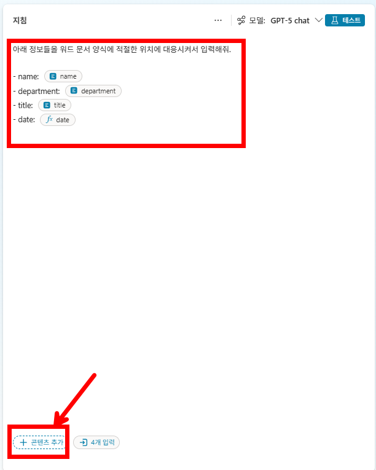

17. 각 변수에는 아래와 같이 샘플 데이터 또는 수식을 입력한다.
    - name: 홍길동
    - department: 영업
    - title: 코파일럿 심화
    - date: `Today()`

18. 테스트 버튼을 누르면 모델 응답에서 다운로드 할 수 있는 링크가 나타나는 것을 확인할 수 있다.

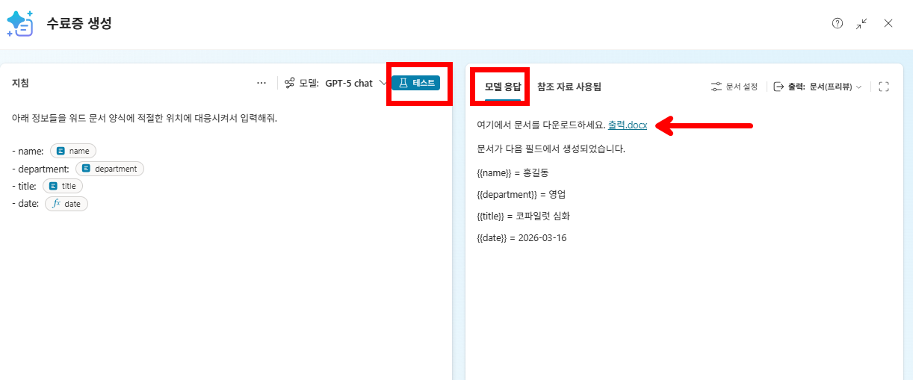

19. 링크를 클릭해보면 수료증 워드 양식에 적절한 값들이 입력된 것을 확인할 수 있다.

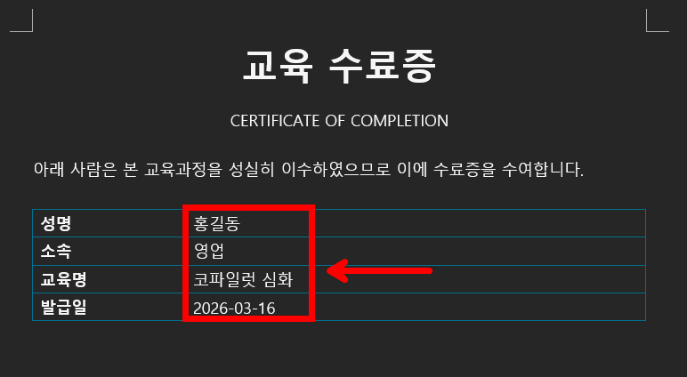

20. 프롬프트 도구 저장을 클릭한다.

21. Forms에 제출된 결과물을 가져오기 위해 '새 응답이 제출되는 경우'와 '프롬프트 실행' 사이에 '응답 세부 정보 가져오기' 작업을 추가한다.

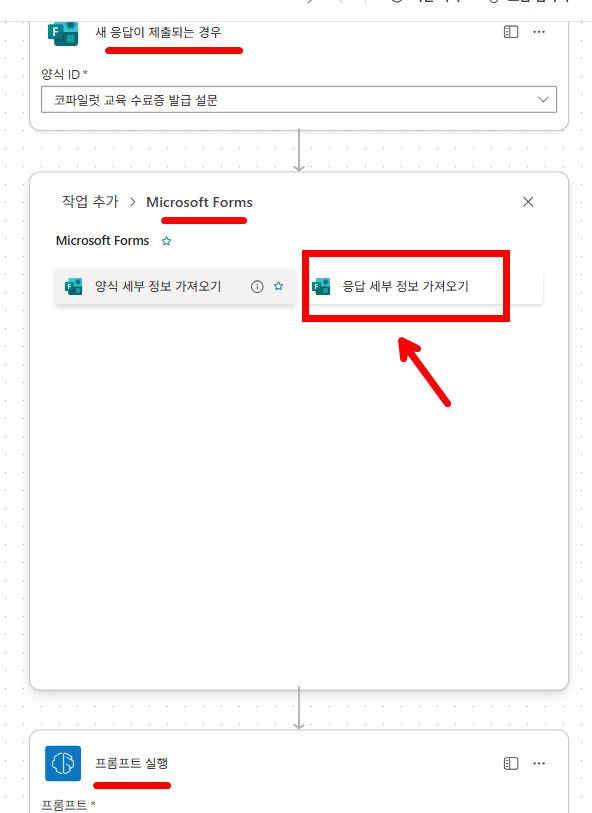

22. 양식 ID는 앞서 만들었던 Forms 이름을 찾아서 선택하고, 응답 ID에는 '새 응답이 제출되는 경우'에서 반환되는 '응답 ID'를 선택한다.

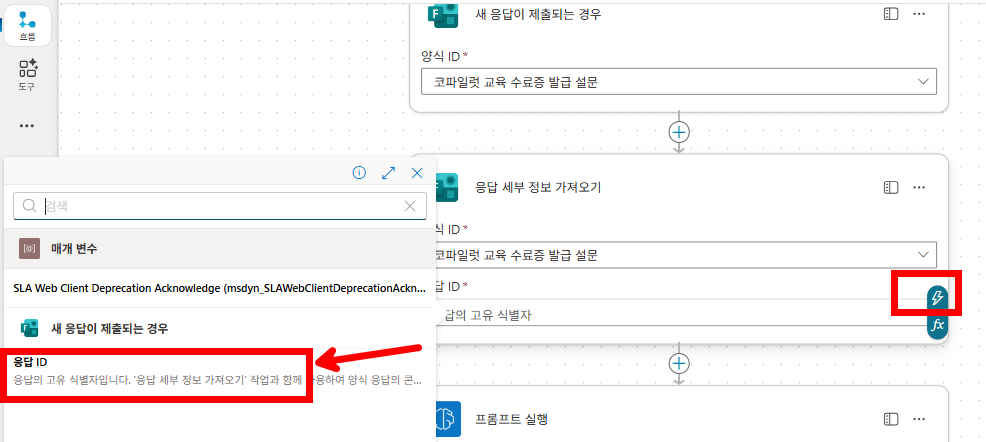

23. 프롬프트 실행에도 각 입력 파라미터에 적절한 값을 설정한다.

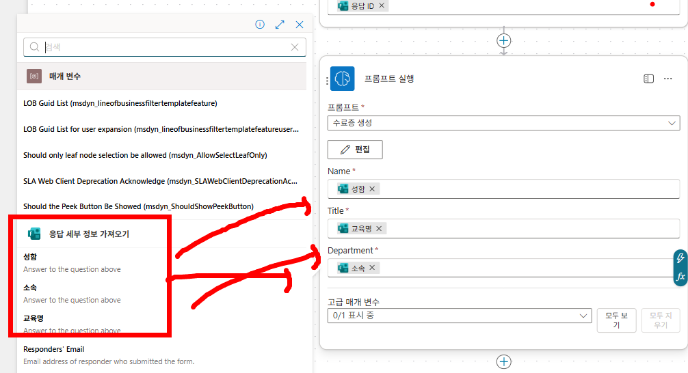

24. 에이전트 흐름을 '초안 저장'한 뒤 '게시'를 클릭한다.

25. 테스트를 수동으로 실행한다.

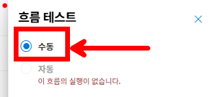

26. 코파일럿 교육 수료증 발급 설문에 응답자로 접속하여, 본인 성함을 넣고, 소속과 교육명도 원하는 값을 선택해본다. 그리고 제출한다.

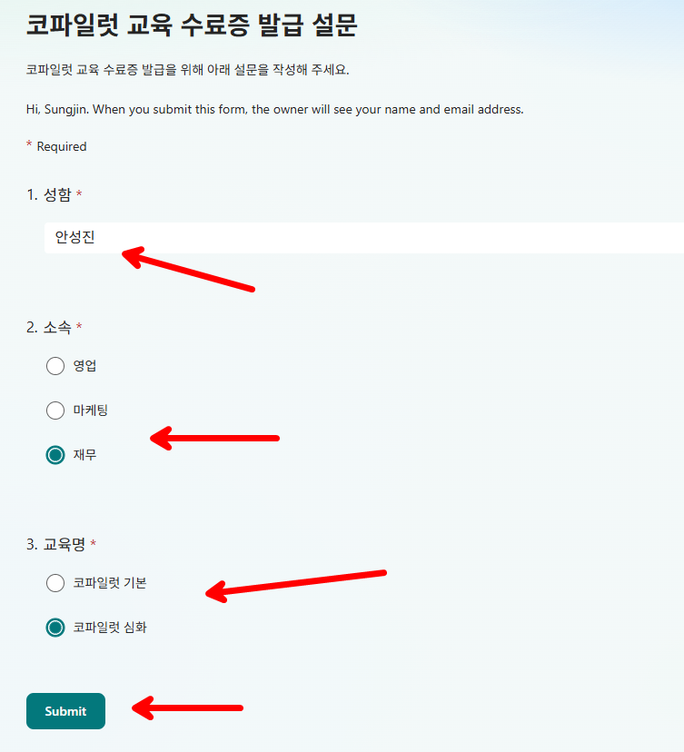

27. 에이전트 흐름이 잘 실행되었는지 확인한다.

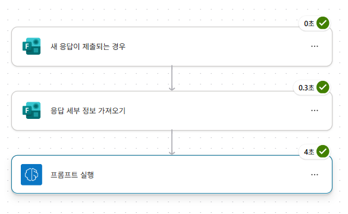

28. 에이전트 흐름의 제목을 '수료증 생성 및 메일 발송 플로우'로 변경한다.

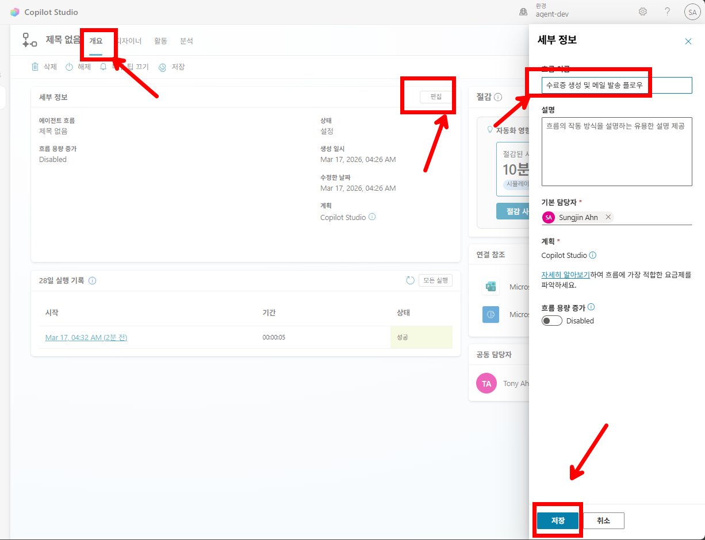

29. 프롬프트 실행에서 반환되는 워드 파일을 OneDrive에 저장하기 위해 OneDrive에 '2026 코파일럿 교육 심화' 폴더를 하나 만든다.

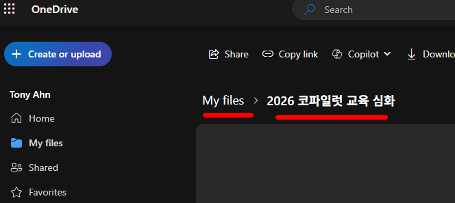

30. 비즈니스용 OneDrive(OneDrive for Business) 커넥터에서 파일 만들기 작업을 프롬프트 실행 하단에 추가한다.

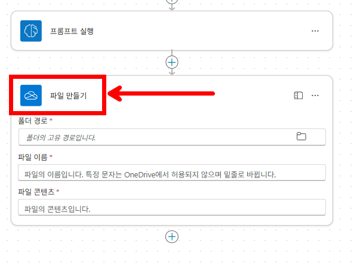

31. 폴더 경로는 앞서 만든 '2026 코파일럿 교육 심화' 폴더를 선택한다.

32. 파일 이름은 아래 수식을 사용한다. 첫 번째 파라미터는 `cert_`, 두 번째 파라미터는 양식에 제출한 성함(동적 콘텐츠로 입력), 세 번째 파라미터는 현재 시간, 네 번째 파라미터는 파일 확장자명이다.

    ```
    concat('cert_', outputs('응답_세부_정보_가져오기')?['body/rfa90357260914f8cbb5c9359ec1f4a93'], '_', formatDateTime(utcNow(), 'yyyyMMddHHmmss'), '.docx')
    ```

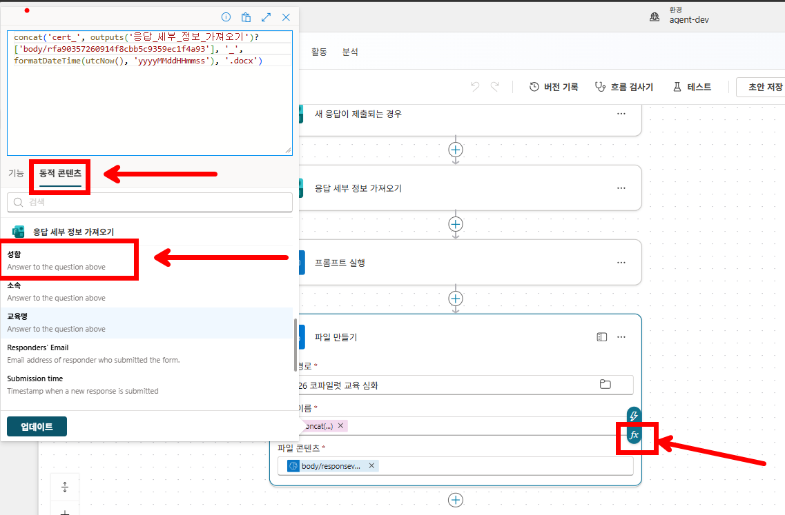

33. 파일 콘텐츠는 앞서 '프롬프트 실행' 단계에서 나온 결과물 중에 'Document Output Content Bytes'를 선택하여 입력한다.

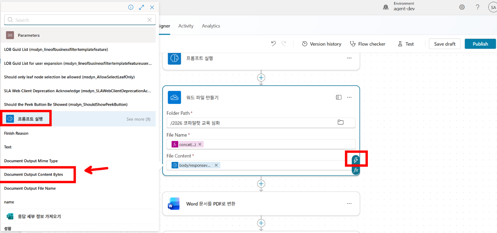

34. 수정된 흐름을 게시한 뒤 다시 테스트 한다. 이번에는 자동 테스트를 진행한다. 이 경우 앞서 수동 테스트를 통해 진행했던 샘플 데이터를 사용하게 된다.

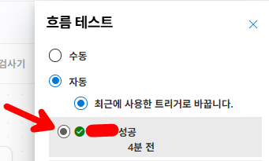

35. 성공적으로 실행되었다면 OneDrive에 파일이 하나 만들어진 것을 확인할 수 있다.

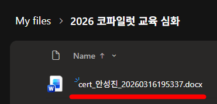

36. 양식도 잘 채워진 것을 확인할 수 있다.

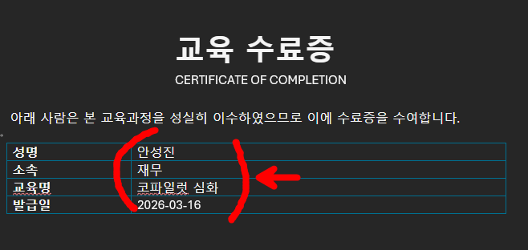

37. 해당 워드 문서를 PDF로 자동 변환하기 위해 'Word 문서를 PDF로 변환' 작업을 추가한다.

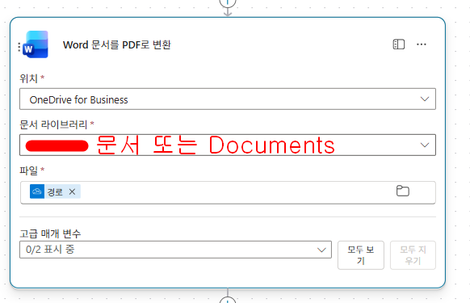

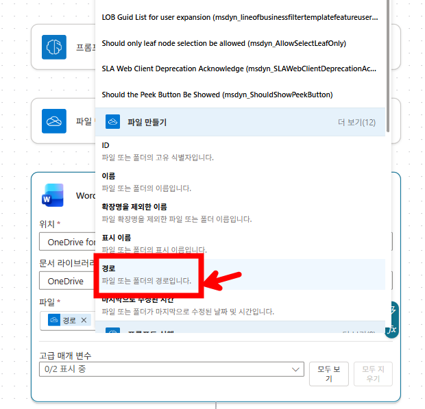

38. 변환된 PDF 콘텐츠를 파일로 저장하기 위해 OneDrive 커넥터의 파일 만들기 작업을 추가한다. 폴더 경로는 적절하게 설정하고, 파일 이름과 파일 콘텐츠는 아래와 같이 설정한다.

    ```
    concat(outputs('파일_만들기')?['body/NameNoExt'], '.pdf')
    ```

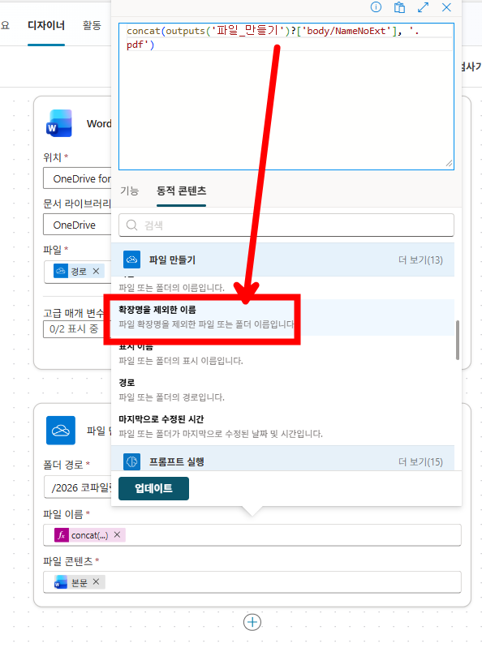

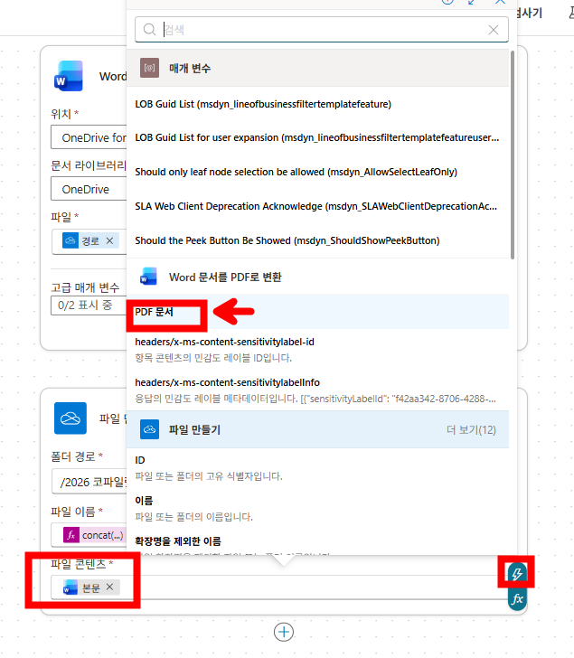

39. 에이전트를 통해 완료 메시지를 받기 위해 Teams 커넥터의 '채팅 또는 채널에서 메시지 게시' 작업을 추가한다. Recipient는 본인의 이메일을 입력한다.

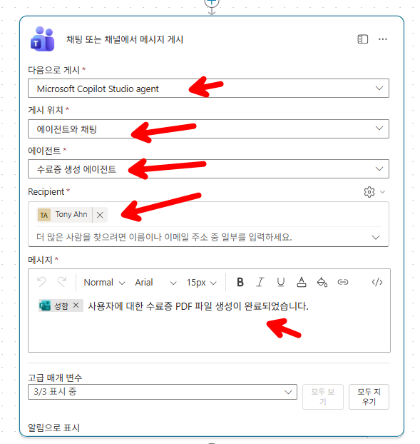

40. 최종적인 흐름은 아래와 같다.

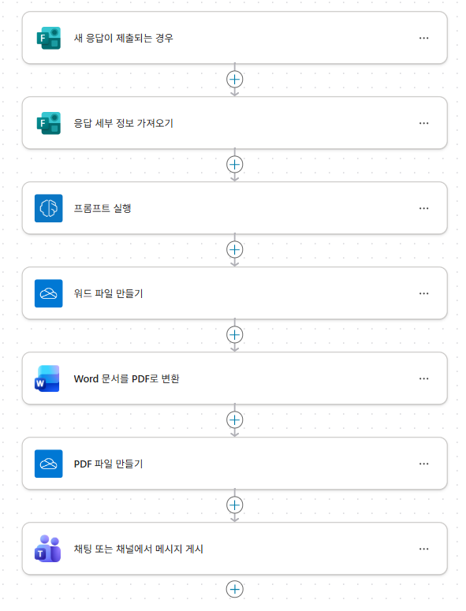

41. 게시를 한 뒤 테스트를 하면 Teams에 추가된 에이전트로부터 알림이 잘 수신되는 것을 확인할 수 있다.

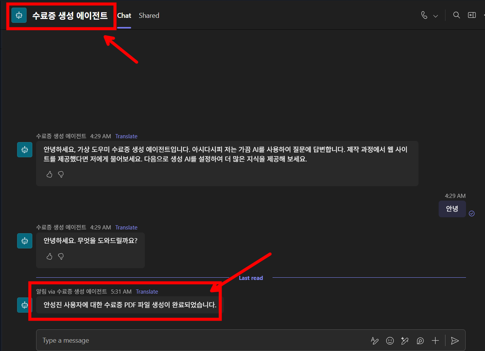

### 실습 요약

- 프롬프트 도구를 통해 워드 템플릿으로부터 문서를 만드는 과정을 살펴봤다.

## 참고문헌

- [Process prompt responses as JSON output - Microsoft Copilot Studio](https://learn.microsoft.com/en-us/microsoft-copilot-studio/process-responses-json-output)
- [Generate a document output from a prompt - Microsoft Copilot Studio](https://learn.microsoft.com/en-us/microsoft-copilot-studio/generate-document-output-prompt)


