# 실습 환경 세팅

```{warning}
**Copilot Studio는 빠르게 발전하는 제품입니다.** UI 업데이트가 잦아 본 가이드의 스크린샷·메뉴 명칭과 실제 화면이 일부 다를 수 있습니다. 또한 SaaS 제품의 특성상 새로운 기능이 순차적으로 출시되는 과도기에는 사용자·환경마다 화면 구성이 조금씩 다르게 보일 수 있습니다.
```

```{important}
실습 시작 전, 아래 링크에서 실습 파일을 먼저 다운로드하세요.

[📥 실습 파일 다운로드](https://github.com/SDSTony/copilot-studio-for-makers/raw/main/lab%20files/%EC%8B%A4%EC%8A%B5%ED%8C%8C%EC%9D%BC%EB%AA%A8%EC%9D%8C.zip)
```

## 학습 목표

- 실습 환경 세팅을 진행한다.

## 시나리오

- 실습 환경 세팅

## 지시사항

1. 교육에서 진행하는 모든 작업물은 본인만을 위한 별도의 개발자 환경에서 작업을 하고 저장할 것이다. 그러므로 Power Platform 관리자 센터 (<https://admin.powerplatform.microsoft.com/home>)로 이동한다.

2. 관리자 센터에서는 본인의 권한에 따라 보여지는 메뉴들이 다르다. (일반 사용자 vs 관리자)

3. 관리 > 환경 > 새로 만들기를 누른다.

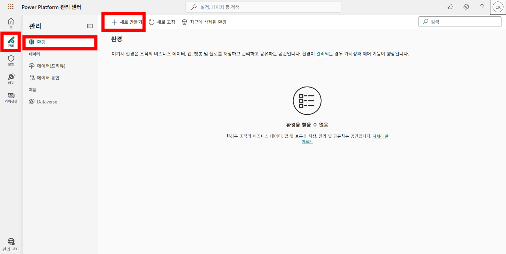

4. 아래와 같이 필요한 정보들을 채워넣는다. 그리고 다음을 클릭한다.
   - 이름: 본인 성함
   - 지역: 변경 없이 그대로 사용 (케이뱅크 같은 경우는 기본값이 아시아로 되어 있는데, 대한민국으로 바꾸면 물리적으로 데이터 센터랑 가까워서 조금은 반응 속도가 빨라질 수 있다)
   - 유형: 개발자

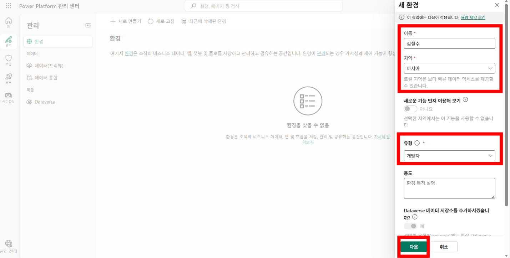

5. 저장을 클릭한다.

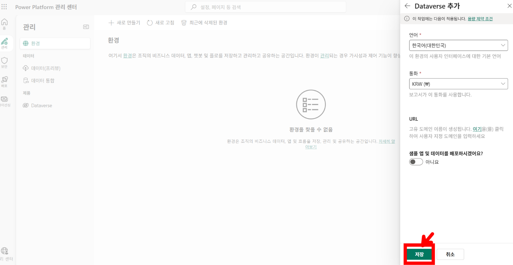

6. Power Automate와 Power Apps 탭은 이제 종료한다. Copilot Studio 탭에서 솔루션으로 이동한다.

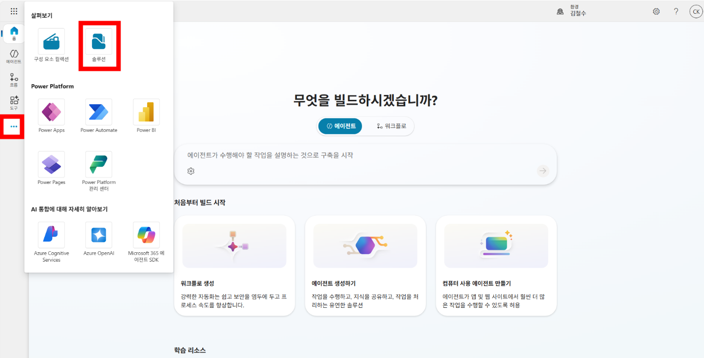

7. 새 솔루션을 클릭한다. 그리고 아래와 같이 설정한 뒤 '새 게시자'를 클릭한다.
   - 표시 이름: copilot studio 2026 advanced
   - 이름: copilotstudio2026advanced

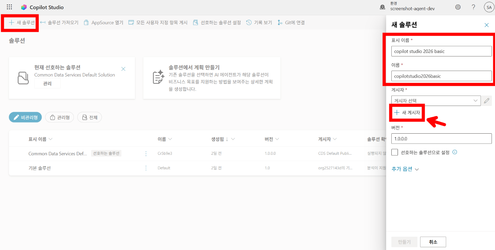

8. 아래와 같이 입력한 뒤 '저장'을 클릭한다. 게시자를 설정함으로써 해당 솔루션과 솔루션 내 구성 요소들을 체계적으로 관리가 가능하다.
   - 표시 이름: 본인의 영문 성함 (ex. sungjinahn)
   - 이름: 본인의 영문 성함 (ex. sungjinahn)
   - 접두사: 본인의 영문 이니셜 (ex. sja)

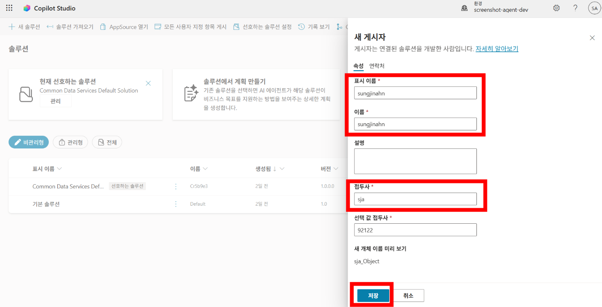

9. 새로 만든 게시자를 게시자 메뉴에서 선택한다. 선호하는 솔루션으로 설정 체크박스를 선택한다. 그리고 만들기를 클릭한다. 선호하는 솔루션으로 설정해두면 추후 개발하는 모든 에이전트들이 기본값(default)으로 해당 솔루션 내에 저장된다. 에이전트를 만드는 시점에서 해당 에이전트가 다른 솔루션 내에 저장되게 설정할 수도 있다.

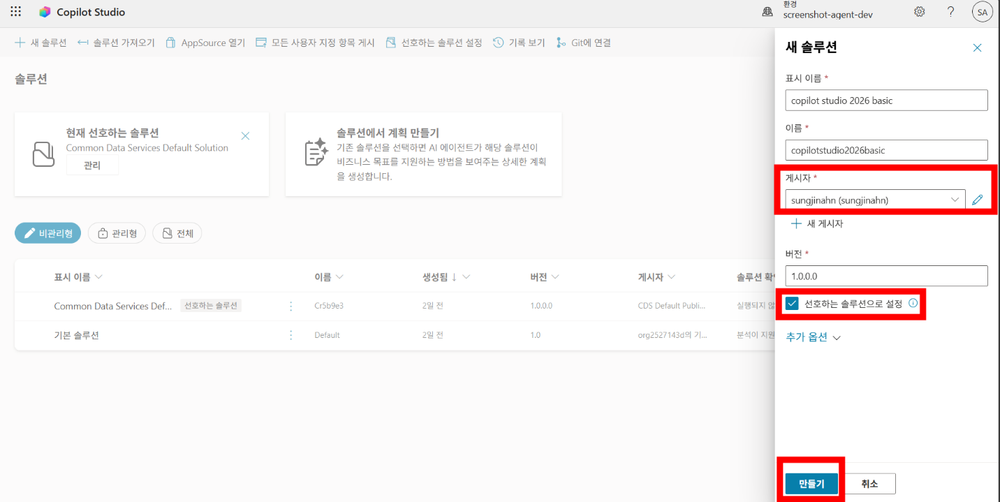

10. 솔루션이 만들어지면 좌측 메뉴에서 Power Platform에서 만들 수 있는 다양한 구성 요소들을 볼 수 있다.


11. 실습에 필요한 구성 요소를 미리 만들어 보기 위해 신규 > 자세히 > 연결 참조를 클릭한다.

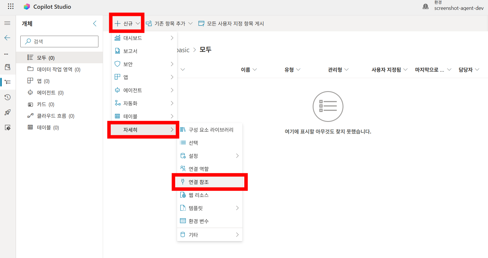

12. 아래와 같이 설정한 뒤 연결 드롭다운 박스에서 '새 연결'을 클릭한다.
    - 표시 이름: Excel
    - 커넥터: Excel Online(Business)

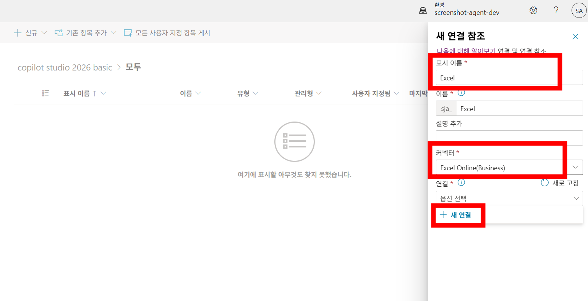

13. 만들기를 클릭한다.

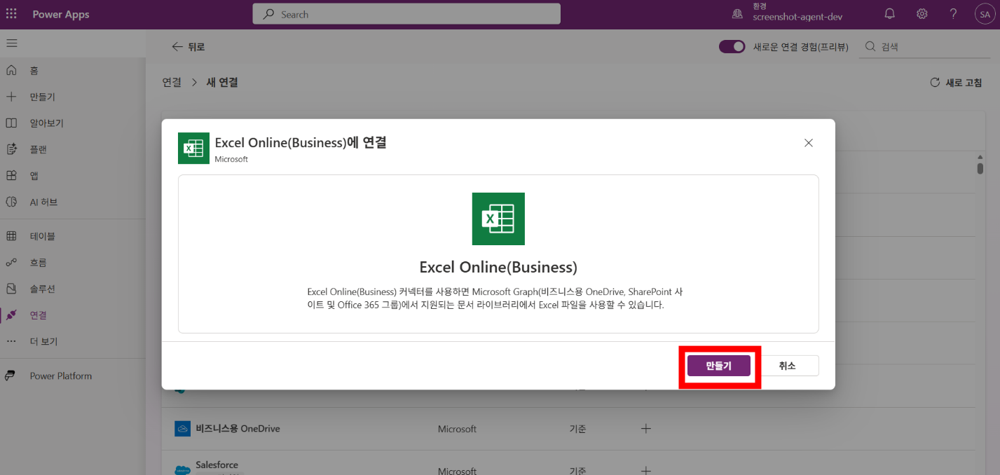

14. 로그인 창이 뜨면 본인의 kbanknow 계정으로 로그인을 잡아준다. Allow access 버튼이 뜨면 클릭한다.

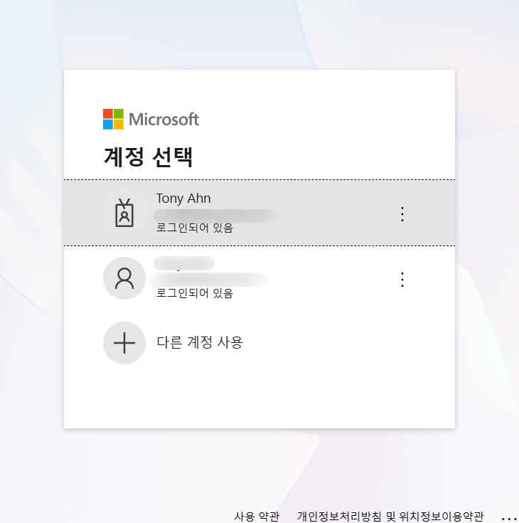

15. Power Apps 연결 화면에 성공적으로 연결 세팅이 하나 만들어진 것을 확인할 수 있다.

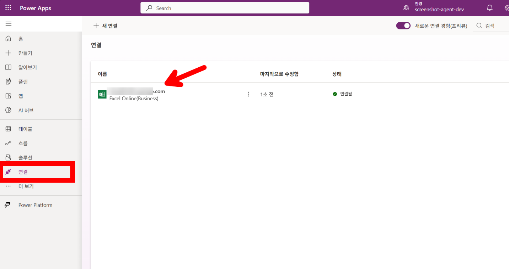

16. Copilot Studio 화면으로 돌아가서 연결 메뉴에 새로 고침을 눌러 보면 방금 추가한 연결이 나타나는 것을 볼 수 있고, 그것을 선택한 뒤 만들기 버튼을 누른다.

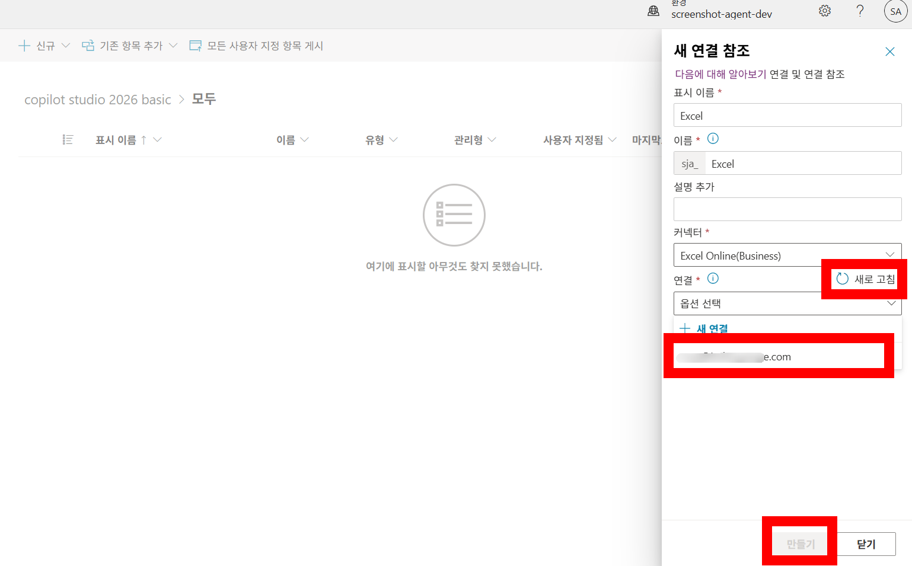

17. 13번부터 18번까지의 과정을 반복하여 아래의 연결 참조도 만든다.
    - 표시 이름: Teams / SharePoint / Outlook / Dataverse
    - 커넥터: Microsoft Teams / SharePoint / Office 365 Outlook / Microsoft Dataverse

18. 완료가 되면 총 5개의 커넥터가 표시된다.

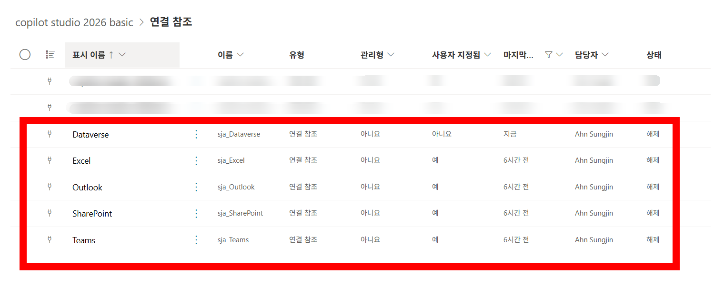

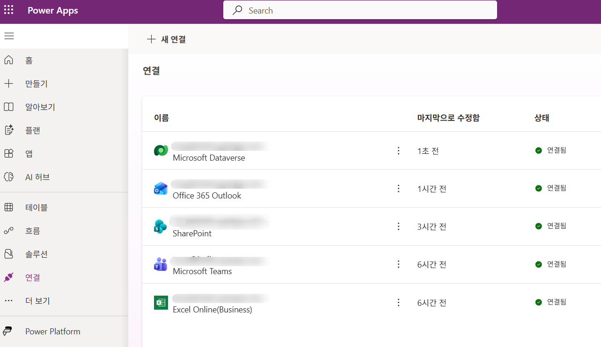

## 실습 요약

- 본 교육에서 실습을 하기 위해 개인별 개발자 환경을 만들었다.
- 실습을 위해 필요한 연결 참조들을 미리 만들어 두었다.
