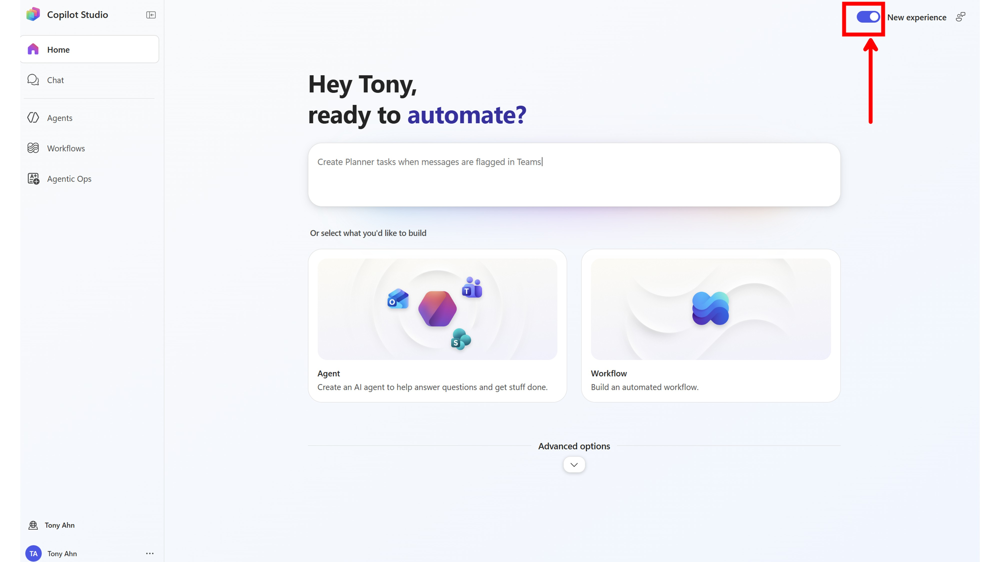

# 공통 안내 사항

실습을 시작하기 전에 아래 안내 사항을 반드시 확인해 주세요.

---

## Classic UI로 전환하여 진행

이번 교육에서는 **Copilot Studio New Experience** 화면이 뜨면, 우측 상단의 토글 버튼을 클릭하여 **Classic UI**로 변경한 후 진행합니다.

**전환 사유:**

- New Experience UI는 최근 출시된 첫 세대 제품으로, 다른 모든 초기 제품과 마찬가지로 자잘한 버그들이 존재합니다. 버그로 인해 실습이 방해받을 경우 새로운 개념을 학습하는 과정에서 불필요한 혼란이 생길 수 있습니다.
- Classic UI에 대한 향후 지원 종료 발표가 아직 나지 않았으며, 현재는 두 UI가 계속 병행 제공될 예정입니다.
- Classic UI에서 배우는 에이전트 제작의 개념적인 내용들은 New Experience UI에서 에이전트를 제작할 때에도 대부분 동일하게 적용됩니다.

---

## 환경(Environment) 확인

Copilot Studio 작업 시 항상 **우측 상단의 환경**이 원하는 환경으로 설정되어 있는지 확인하세요.

잘못된 환경에서 작업할 경우 에이전트나 리소스가 의도하지 않은 환경에 생성될 수 있습니다.
