# Lab: 사내 행사 준비 업무 도우미 에이전트

## 학습 목표

- M365 Copilot에 내장된 Copilot Studio Lite 활용
- 지침(Instructions) 이해
- 지식(Knowledge) 이해
- 기능(Capabilities) 이해

## 시나리오

- 사내 행사 준비를 위해 필요한 물품들을 정리해둔 상황이다.
- 해당 물품 중 어떤 물품들이 구매 전 부서장 승인이 필요한지 확인해야 한다.
- 해당 작업을 위해 각 실무자들이 사내 규정 파일이 있는 쉐어포인트 사이트 까지 매번 접근해서 규정 파일을 열어보는 상황이며, 부서장 승인 기준 금액을 확인 후 다시 물품 구매 리스트 파일을 열어서 어떤 물품이 금액이 기준에 부합하여 부서장 승인이 필요한지 확인하는 작업을 매번 진행하고 있다.
- 또한 행사 운영진 회의 때 발표용으로 간단한 물품별 금액 시각화 차트도 필요한 상황이다.
- 본 프로젝트에서는 이러한 작업들을 간소화해주는 에이전트를 만들어 본다.

## 지시사항

1. [https://m365copilot.com/](https://m365copilot.com/) 로 이동하여 좌측 메뉴 중에 **새 에이전트**를 클릭한다.

   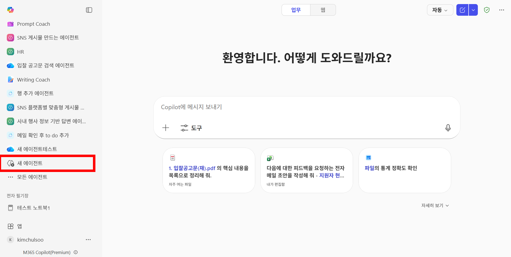

2. 좌측 상단에 메뉴 접기 아이콘을 눌러 작업하기 편하게 화면을 설정한다. **구성**을 클릭한 뒤 에이전트의 이름, 설명, 지침 메타데이터를 아래와 같이 설정한다. 그리고 우측 메시지 입력란에 `행사 시 준비해야 하는 물품들 어떤게 있었나요?`를 입력 및 전송한다. 에이전트가 일반적인 답변을 하는 것을 확인할 수 있다.

   - **이름**: 사내 행사 준비 업무 도우미
   - **설명**: 사내 행사 기획 시 관련 업무를 도와주는 에이전트
   - **지침**: 사용자의 질문에 친절하게 답변해주세요.

   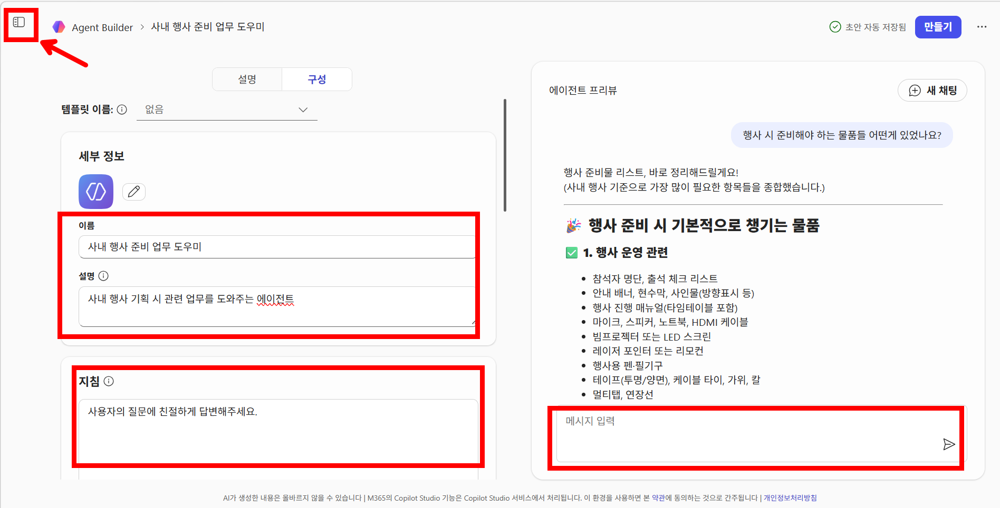

3. 현재까지의 행사 준비 현황 컨텍스트를 기반으로 답변하게 하기 위해 **지식**에서 **클라우드 파일 첨부** 아이콘을 클릭한다.

   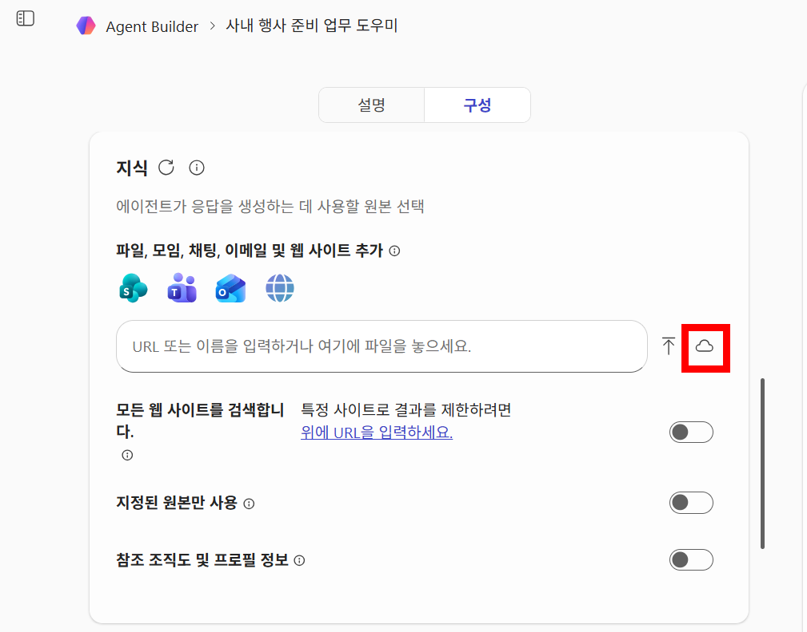

4. OneDrive로 이동하여 실습 파일이 들어 있는 폴더로 이동한다. (사진 필요)

5. `행사 물품 리스트.xlsx` 파일을 선택한 뒤 **선택** 버튼을 클릭한다.

6. **새 채팅**을 클릭하고 메시지 입력란에 `행사 시 준비해야 하는 물품들 어떤게 있었나요?`를 입력 및 전송한다. 결과물을 확인하면 `행사 물품 리스트.xlsx` 파일 내 데이터를 기반으로 답변하는 것을 볼 수 있다. 현재까지의 물품 리스트 맥락을 알고 있는 에이전트가 되었다.

   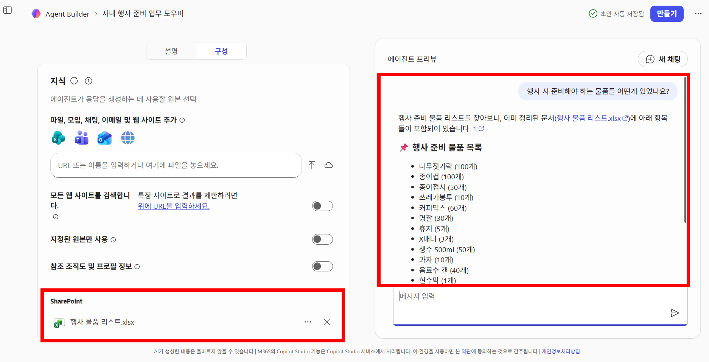

7. 스크롤을 내려 보면 참조란에 `행사 물품 리스트.xlsx` 파일이 참조된 것을 확인할 수 있다.

8. 데이터 시각화를 하기 위해 `물품을 Y축, 총금액을 X축으로 하는 가로 막대 그래프 그려주세요`를 메시지 입력란에 입력 및 전송한다.

9. 결과물을 보면 데이터 시각화를 위한 python 코드를 알려 줄 수도 있고, 엑셀에서 데이터 시각화 하는 방법을 글로 알려 줄 수도 있고 (아래 예시 이미지), 또는 키보드로 입력할 수 있는 문자들을 사용하여 접근성이 다소 떨어지는 시각화를 해줄 수도 있다. 개인마다 다른 결과물이 나올 것이고, 그것은 생성형 AI의 특징이다. 보다 일관적인 답변을 위해서는 지침을 더 구체적으로 쓰는 것이 도움될 수 있다.

   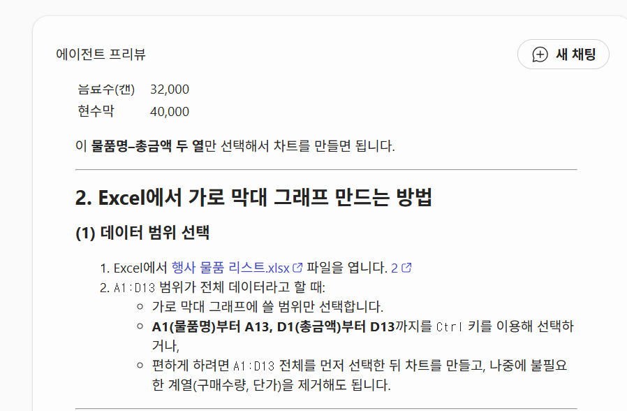

10. **기능 > 문서, 차트 및 코드 만들기**를 활성화 한 뒤 **만들기** 버튼을 클릭한다.

    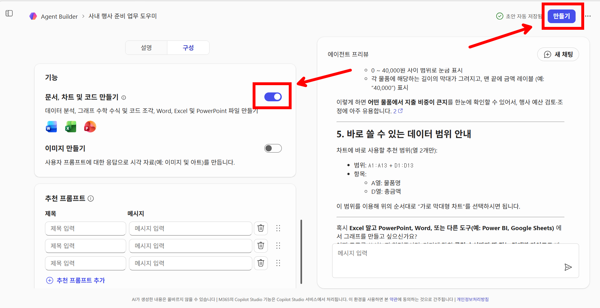

11. 만들기가 완료되면 **에이전트로 이동** 버튼을 클릭한다.

12. 입력란에 `물품을 Y축, 총금액을 X축으로 하는 가로 막대 그래프 그려주세요`를 입력한 뒤 전송한다.

13. 에이전트의 응답 도중 **코드 및 실행** 메뉴가 활성화 되면 정상적으로 코드 해석기 기능이 실행되었다고 볼 수 있다. **분석** 메뉴를 클릭하면 어떤 코드가 실행되었는지 확인할 수 있다. 시각화된 결과물을 보면 요청한 시각화가 이뤄진 것을 볼 수 있다. python에서 자주 사용하는 시각화 패키지인 matplotlib 패키지로 시각화가 이뤄진 것을 볼 수 있으나, matplotlib 패키지의 기본 설정값으로 인해 한글이 깨진 것을 확인할 수 있다. (개인마다 다를 수 있다. SaaS 제품이기 때문에 Microsoft가 백엔드 단을 업데이트를 하면 다른 결과물이 나올 수도 있다.)

    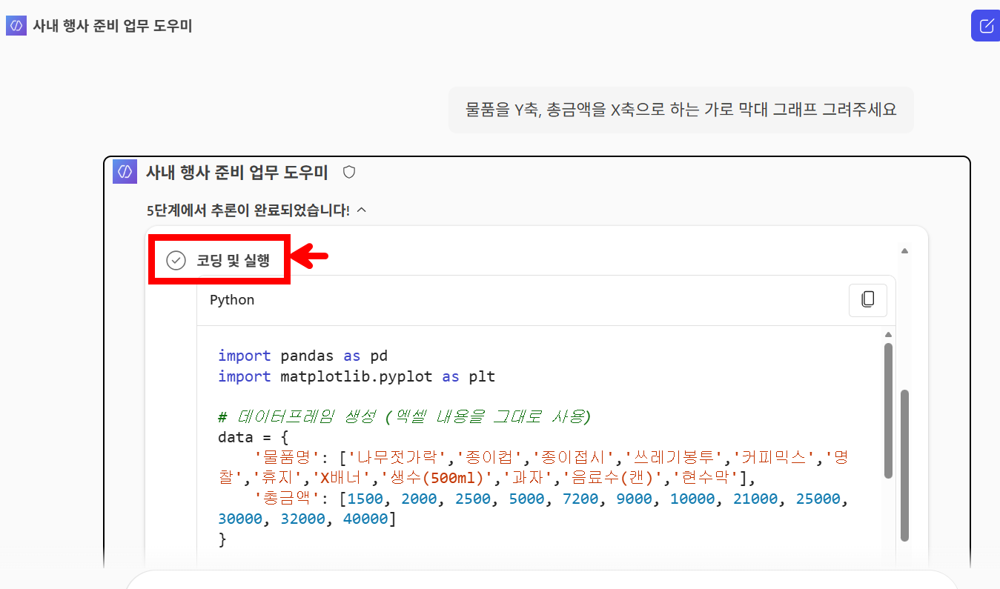

    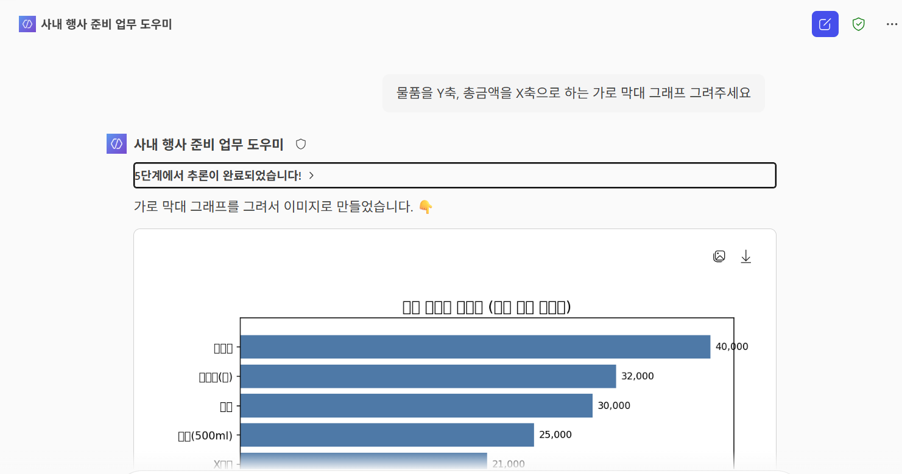

14. **새 채팅 시작** 아이콘을 클릭한 뒤 입력란에 `깊게 생각해서 plotly를 사용해서 물품을 Y축, 총금액을 X축으로 하는 가로 막대 그래프 만들어주고, 결과물은 .show() 메서드로 출력해서 보여줘`를 입력 및 전송한다.

15. 결과물의 **표시 옵션**을 **미리 보기**로 설정해야 할 수도 있다. 설정만 잘 되면 시각화된 결과물에는 한글이 잘 표시되는 것을 볼 수 있다. python의 plotly 패키지 특성상 기본 설정으로도 한글이 잘 표시된다.

    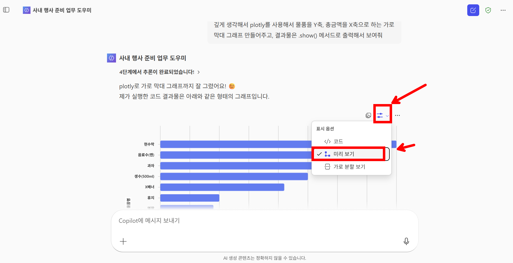

16. 추가 질문으로 `물품 중에서 부서장 승인을 받아야 하는 것들은?` 을 입력 및 전송한다. 답변 결과에는 `행사 물품 리스트.xlsx` 파일이 참조된 것을 확인할 수 있다. 다만, 부서장 승인 기준은 사내 규정에 기반되어 있지 않고 일반적인 통념을 기반으로 답변이 생성된 것을 확인할 수 있다.

17. 좌측 상단에 메뉴 확장 버튼을 클릭한 뒤 **사내 행사 준비 업무 도우미**의 **... > 편집** 메뉴를 클릭한다.

    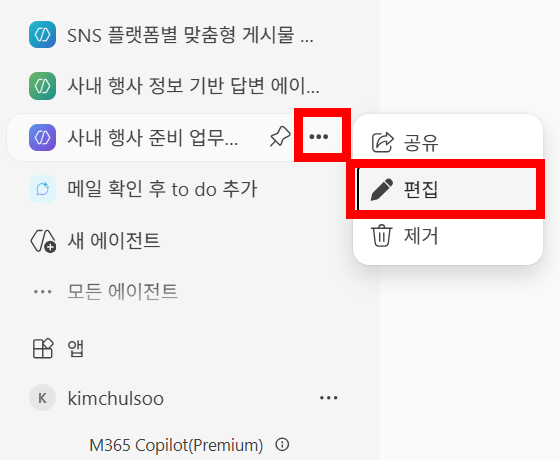

18. 지침을 다음과 같이 수정한다.

    - **지침**: 사용자의 질문에 친절하게 답변해주세요. 사용자가 데이터 시각화를 요청하면 default 패키지로 항상 plotly를 사용해주세요. 이 때 결과물은 show() 메서드를 사용하여 출력해서 보여주세요.

    > 💡 혹시 에이전트의 답변이 너무 장황하게 나온다고 생각되면, 그러한 부분도 지침에 명시하여 조절해보는 시도를 가져볼 수 있다. (예: `답변은 간결하게 할 것` ← 지침에 추가)

19. **지식 > 클라우드 파일 첨부** 아이콘을 클릭한다.

20. 실습용 파일이 있는 SharePoint 사이트로 이동한다.

21. `사내 행사 규정.docx` 파일을 선택 후 **선택** 버튼을 클릭한다.

22. **업데이트** 버튼을 클릭한다.

23. 업데이트가 완료 되면 **에이전트로 이동**을 클릭한다.

24. 지침이 잘 적용되는 지 확인하기 위해 메시지 입력란에 `물품을 Y축, 총금액을 X축으로 하는 가로 막대 그래프 그려주세요` 를 입력 및 전송한다.

25. 직접 사용자 쿼리에 명시하지 않아도 지침에 plotly에 대한 내용이 언급되어 있으므로, plotly가 기본으로 사용되어 데이터 시각화가 이뤄진 것을 확인할 수 있다.

26. 추가 질문으로 `이 중에서 부서장 승인을 받아야 하는 것들은 어떤것들 인가요?` 를 입력 및 전송한다. `사내 행사 규정.docx`에 따라 개별 품목 총금액이 25,000원 이상이면 부서장 승인을 받아야 한다는 내용이 언급되었다. 또한, 물품 품목 리스트에서 25,000원 이상인 값만 출력된 것을 확인할 수 있다.

27. 스크롤을 내려 보면 참조 문서에 `사내 행사 규정.docx`가 참조 된 것을 확인할 수 있다.

28. 해당 승인 기준 값을 기반으로 시각화된 차트의 서식을 변경하기 위해 `부서장 승인을 받아야 하는 물품들은 막대 차트에서 막대 색을 다른 색으로 표시 해주세요 구분되게.` 를 입력 및 전송한다. 개인에 따라 원하는 plotly 형태의 결과물이 아래와 같이 나올 수도 있다. 또는 생성형 AI 기반 제품의 불안정성으로 다시 matplotlib으로 회귀되어 의도하지 않은 결과물이 나올 수 있다.

    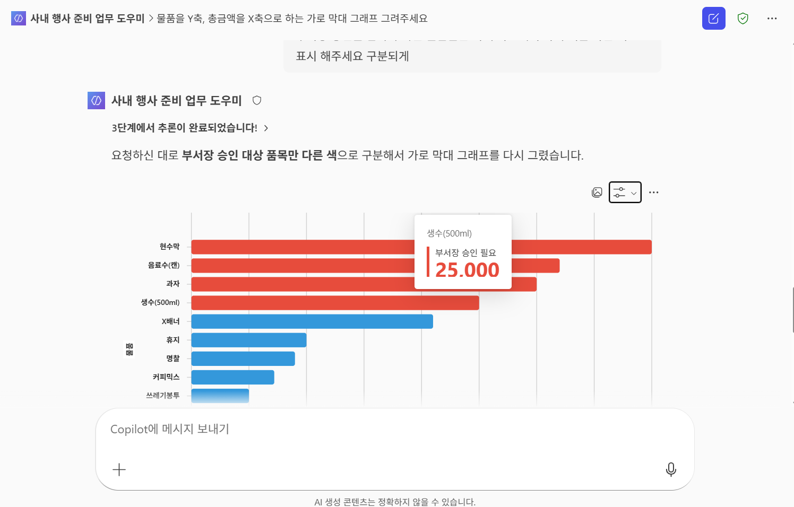

    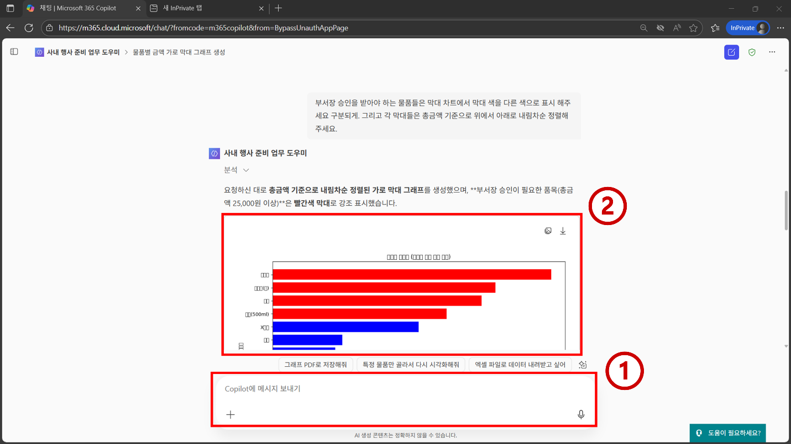

29. 같은 에이전트 대화창에서 아래 프롬프트를 입력 및 전송한다.

    ```text
    행사 물품 리스트 데이터를 기준으로 물품들의 카테고리를 너가 판단해주고, 그것들의 가격을 보여주는 대시보드를 만들어줘.
    ```

30. 응답으로 생성된 HTML 코드를 확인한다. `<!DOCTYPE html>`, `<head>`, `<body>`, 차트/테이블 영역이 모두 포함되어 있는지 확인한다.

31. 생성된 결과물의 미리 보기 버튼을 눌러 대시보드를 확인한다. 필요시 이미지로 저장한다. 

32. 후속 프롬프트를 지속적으로 입력하여 원하는 대시보드가 나오게 해볼 수 있다.

```text
- 상단 KPI 카드 3개(총 물품 수, 총 예산, 부서장 승인 대상 수)
- 품목별 금액 막대 차트(승인 대상은 빨간색, 그 외는 파란색)
- 품목 테이블(품목명, 수량, 단가, 총금액, 승인 필요 여부)
- 외부 빌드 도구 없이 브라우저에서 바로 열리도록 작성
```

31. 로컬 PC에 `event-dashboard.html` 파일을 생성하고, 에이전트가 생성한 HTML 코드를 전체 복사해 저장한다.

32. 저장한 `event-dashboard.html` 파일을 브라우저로 열어 KPI 카드, 차트, 테이블이 정상 표시되는지 확인한다.

33. 후속 프롬프트로 `회사 CI 컬러(네이비/그레이) 테마로 바꾸고, 승인 대상만 필터링하는 버튼을 추가해줘` 를 입력해 HTML 코드를 재생성한 뒤 파일을 덮어써 본다.

34. 필요 시 `이 HTML에서 차트 아래에 "승인 기준: 25,000원 이상" 안내 문구를 추가해줘` 같은 방식으로 반복 개선하며, 목적에 맞는 결과물을 완성한다.

## 실습 요약

- Copilot Studio Lite를 통해 자연어로 데이터를 검색하고 시각화 하는 에이전트를 빠르게 만들어 볼 수 있다.
- 지침을 통해 에이전트의 행동양식을 제어할 수 있다.
- 참조 지식과 기능을 통해 에이전트가 참조하는 지식의 범위를 제어할 수 있으며, 에이전트가 Python 코드를 실행하게 할 수 있다.
