# Lab 01 : 사내 행사 준비 업무 도우미 에이전트

## 학습 목표

- M365 Copilot에 내장된 에이전트 빌더 활용
- 지침(Instructions) 이해
- 지식(Knowledge) 이해
- 기능(Capabilities) 이해

## 시나리오

- 사내 행사 준비를 위해 필요한 물품들을 정리해둔 상황이다.
- 해당 물품 중 어떤 물품들이 구매 전 부서장 승인이 필요한지 확인해야 한다.
- 담당자들은 매번 여러 문서를 오가며 기준을 확인하고 있어 반복 업무가 많다.
- 본 실습에서는 에이전트 빌더를 활용해 관련 업무를 빠르게 도와주는 에이전트를 만든다.

## 지시사항

1. [https://m365.cloud.microsoft/](https://m365.cloud.microsoft/) 로 이동하여 좌측 메뉴의 **에이전트**를 연 뒤, 하위 메뉴에서 **새 에이전트**를 클릭합니다.

   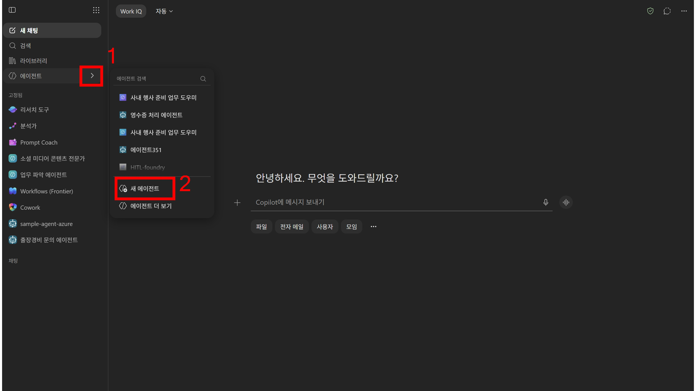

2. Agent Builder 화면이 열리면 우측의 **구성으로 건너뛰기**를 클릭해 설정 화면으로 바로 이동합니다.

   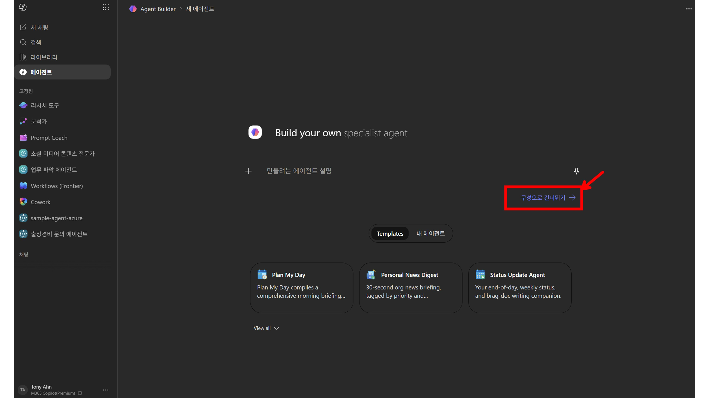

3. **구성** 탭에서 에이전트 기본 정보를 입력합니다.
   - 이름: `사내 행사 준비 업무 도우미`
   - 설명: `사내 행사 기획 시 관련 업무를 도와주는 에이전트`
   - 안내(지침): `사용자의 질문에 친절하게 답변해주세요. 가급적 간략하게 대답해줘 핵심 내용만.`

   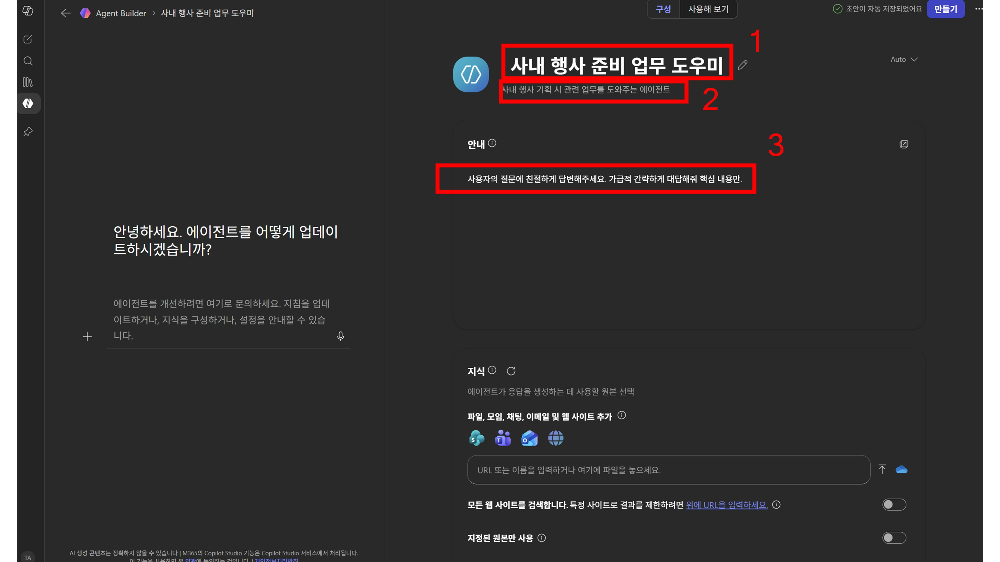

4. 지식 및 기능 부분에 토글이 켜져 있는 것들이 있을 겁니다. 모든 토글을 해제 합니다. 교육에는 초기 상태의 LLM을 기반으로, 하나씩 지식과 기능을 추가해보면서 점진적으로 기능이 향상되는 것을 확인하고자 합니다.

   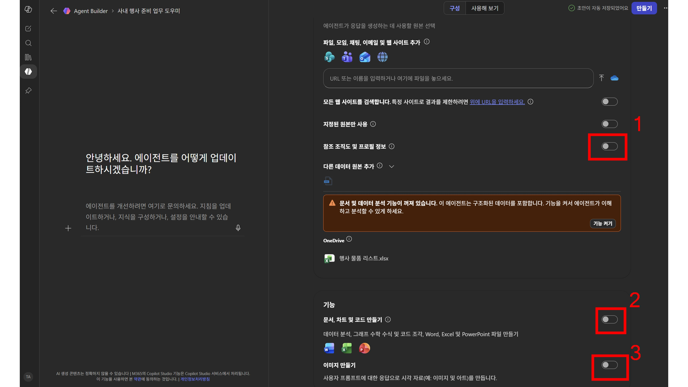

5. 상단의 **사용해 보기** 탭으로 이동한 뒤, 테스트 입력창에 `행사 시 준비해야 하는 물품들 어떤게 있었나요?`를 입력해 기본 응답을 확인합니다.

   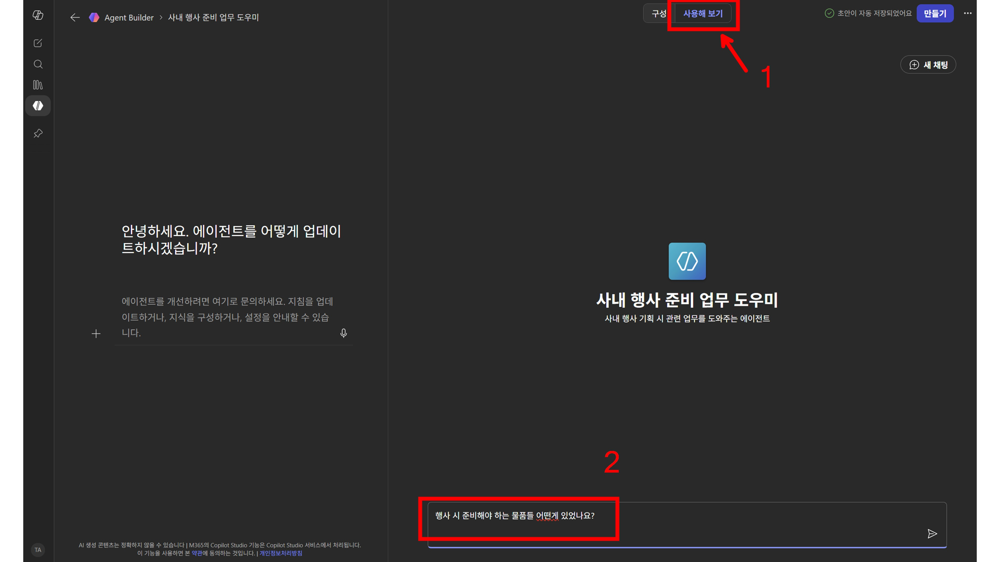

6. 응답 결과가 일반적인 내용으로 생성되는 것을 확인합니다. 이 상태는 아직 파일 지식이 연결되지 않은 기본 상태입니다.

   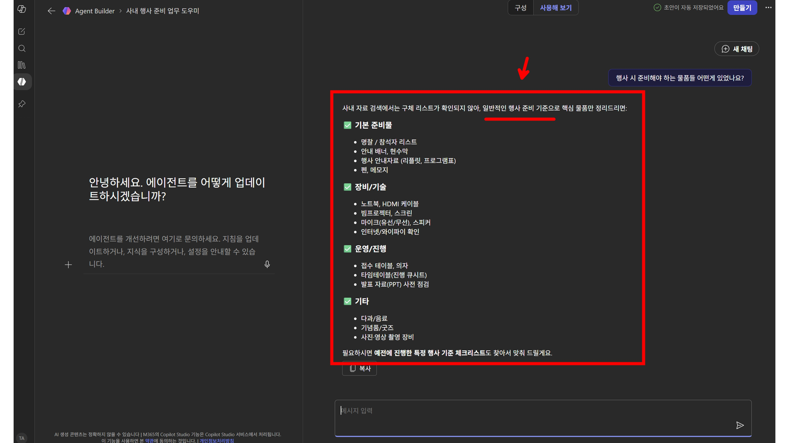

7. **구성** 탭으로 돌아와 **지식** 섹션에서 **클라우드 파일 첨부** 아이콘을 클릭합니다. 그리고 OneDrive에서 `행사 물품 리스트.xlsx` 파일을 선택해 지식으로 추가합니다.

   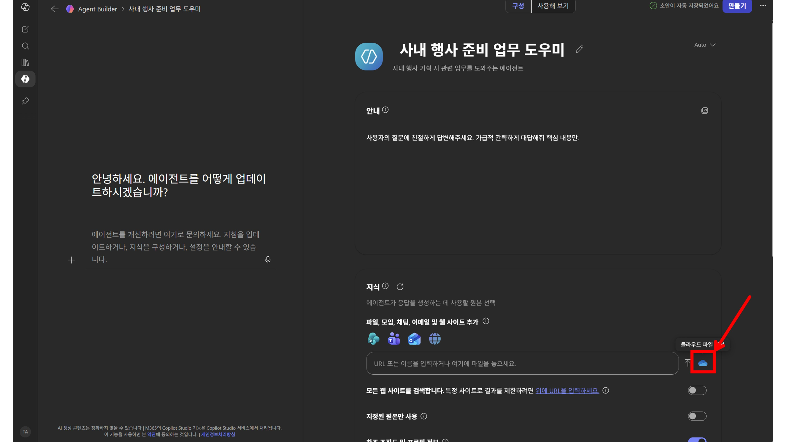
   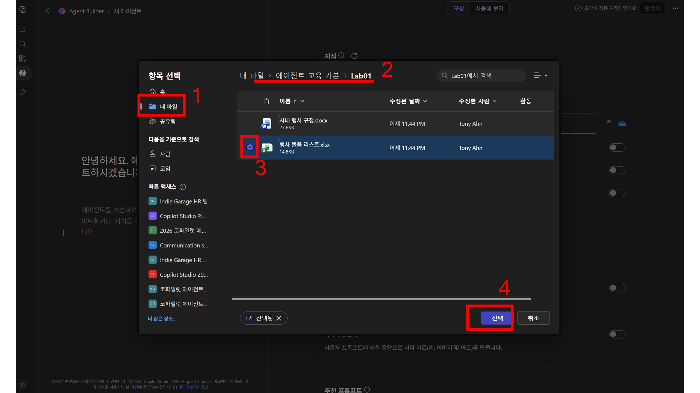

8. 파일 첨부 시 표시되는 안내 팝업(문서/차트/코드 기능 활성화 제안)을 확인하고, 화면 예시처럼 **취소**를 눌러 현재 흐름을 계속 진행합니다. 아직까지 교육에서는 해당 기능을 활성화하지 않고, 파일 지식 연결이 응답에 어떤 영향을 주는지 먼저 확인할 예정입니다.

   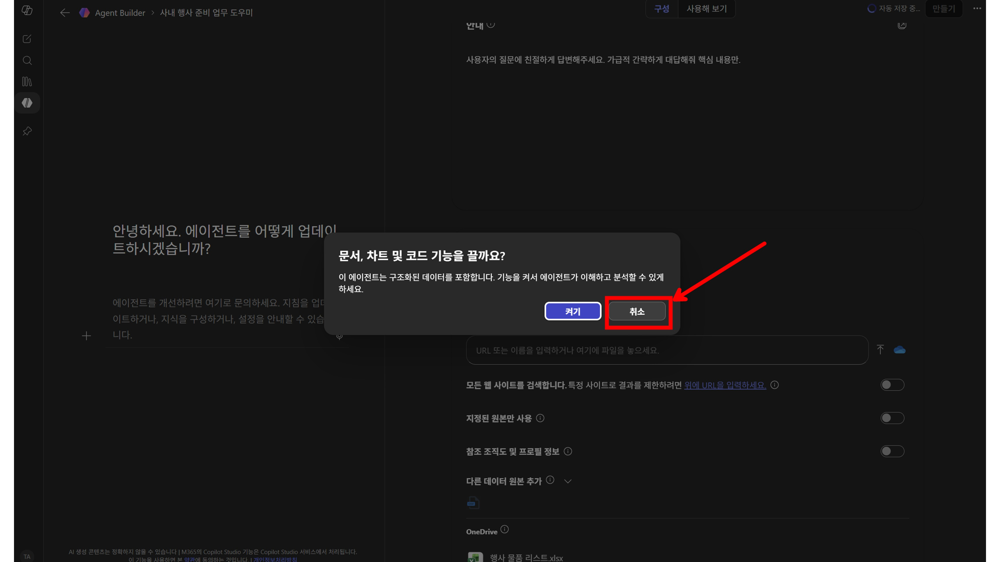

9. OneDrive 지식에 `행사 물품 리스트.xlsx`가 추가된 것을 확인한 뒤, 상단의 **사용해 보기**로 다시 이동합니다.

   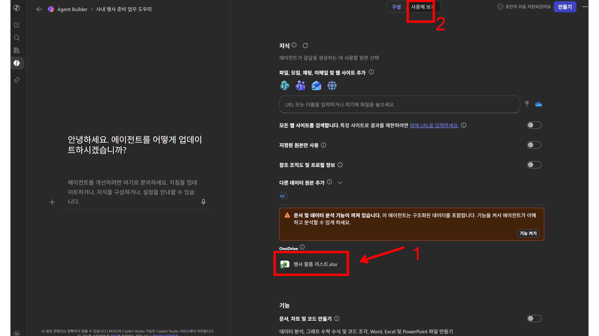

10. **새 채팅**을 시작한 후, 다시 `행사 시 준비해야 하는 물품들 어떤게 있었나요?`를 입력해 파일 지식 반영 여부를 확인합니다.

   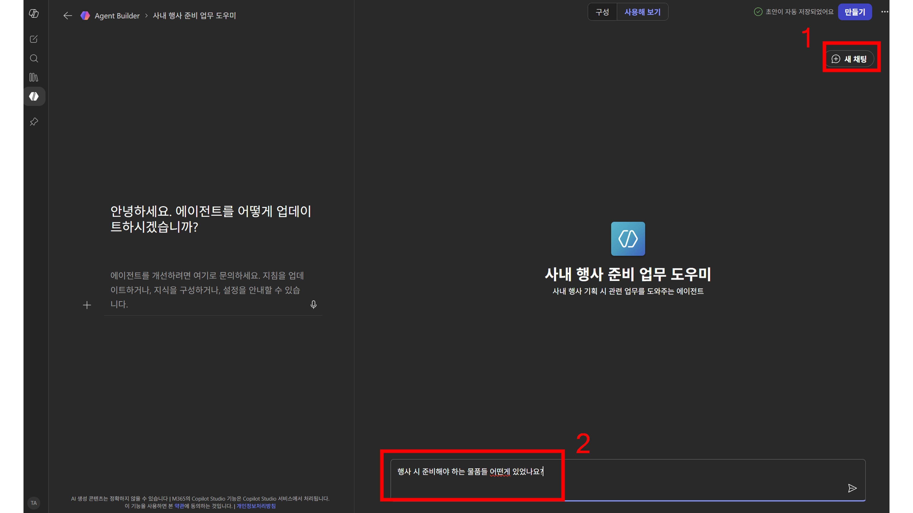

11. 답변에 `행사 물품 리스트.xlsx`가 참조되고, 파일 기반으로 목록을 정리해 주는지 확인합니다.

   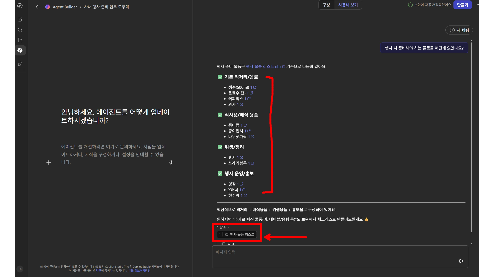

12. `물품을 Y축, 총금액을 X축으로 하는 가로 막대 그래프 그려주세요`를 입력해 시각화 요청을 테스트합니다. 결과물을 보면 데이터 시각화를 위한 python 코드를 알려 줄 수도 있고, 엑셀에서 데이터 시각화 하는 방법을 글로 알려 줄 수도 있고, 또는 키보드로 입력할 수 있는 문자들을 사용하여 접근성이 다소 떨어지는 시각화(아래 예시 이미지 참고)를 해줄 수도 있습니다. 개인마다 다른 결과물이 나올 것이고, 그것은 생성형 AI의 기본적인 특징입니다. 보다 일관적인 답변을 위해서는 지침을 더 구체적으로 쓰는 것이 도움될 수 있습니다. (예: `데이터 시각화는 python 코드를 이용해서 해줘. 엑셀에서 하는 방법은 알려주지 마.`) 

하지만 일반 사용자가 원하는 것은, 보다 사용자 친화적인 시각적인 결과물 일 것입니다. 이것은 Python 코드 실행을 통해 가능할 수 있는데, 현재는 기능이 활성화되어 있지 않기 때문에, 시각화 요청에 대한 답변이 일관적이지 않고, 원하는 결과물이 나오지 않을 수 있습니다. 다음 단계에서 기능을 활성화 한 뒤, 시각화 요청에 대한 응답이 어떻게 달라지는지 확인해 보도록 하겠습니다.

   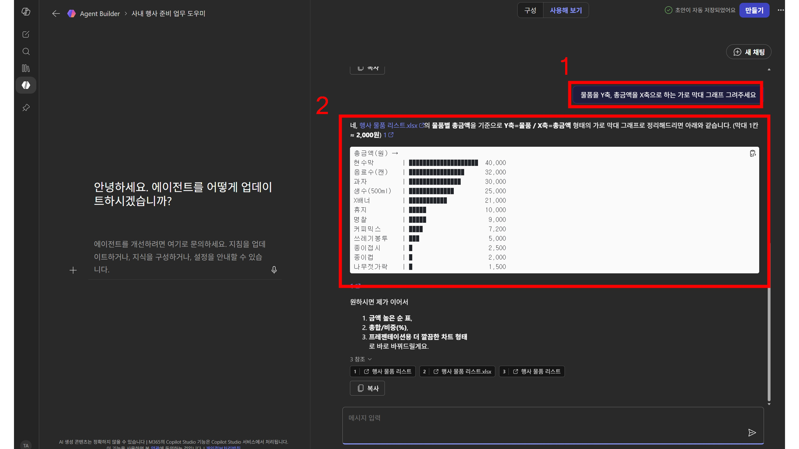

13. **구성** 탭으로 이동해 **기능 > 문서, 차트 및 코드 만들기** 토글을 켭니다.

   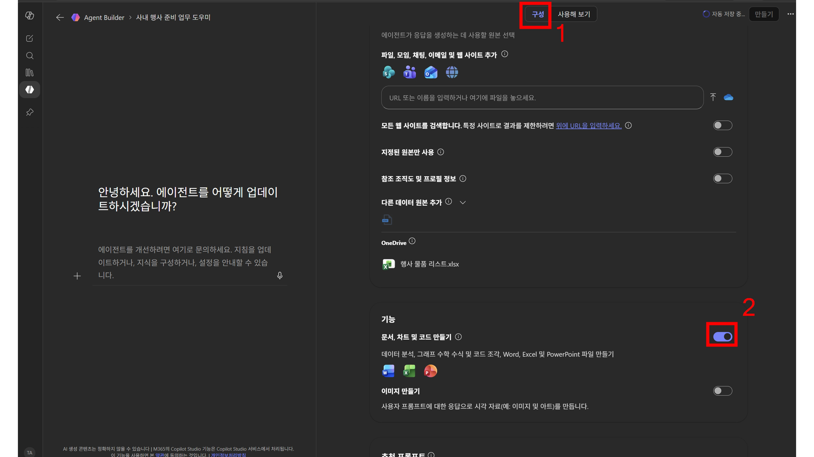

14. **사용해 보기**로 돌아와 **새 채팅**에서 `물품을 Y축, 총금액을 X축으로 하는 가로 막대 그래프 그려주세요` 요청을 다시 보냅니다. 이번에는 응답 중 **코딩 및 실행**이 동작하는지 확인합니다.

   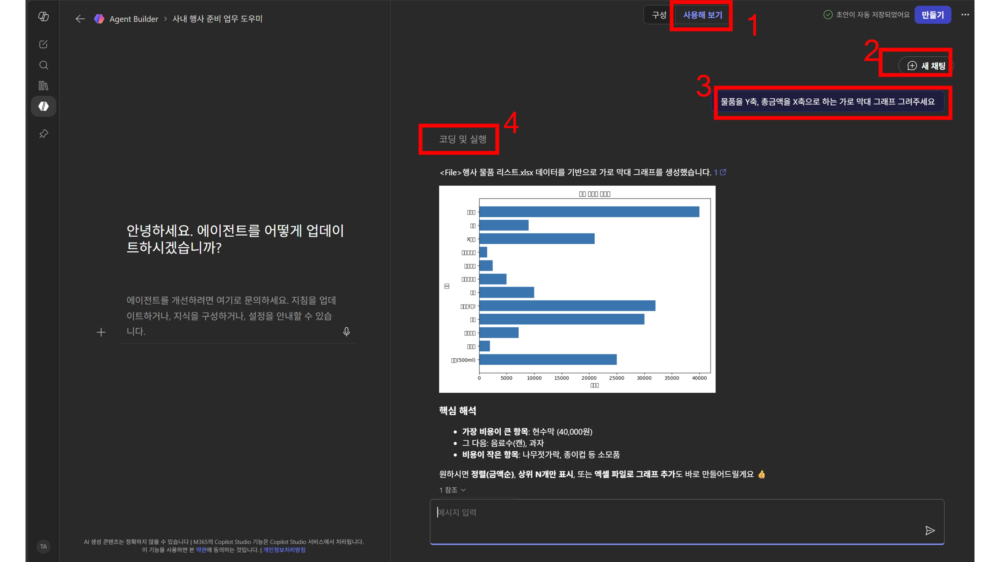

15. 실제 게시된 에이전트에서 테스트 해보기 위해 우측 상단의 **만들기** 버튼을 눌러 에이전트를 저장/업데이트 합니다.

   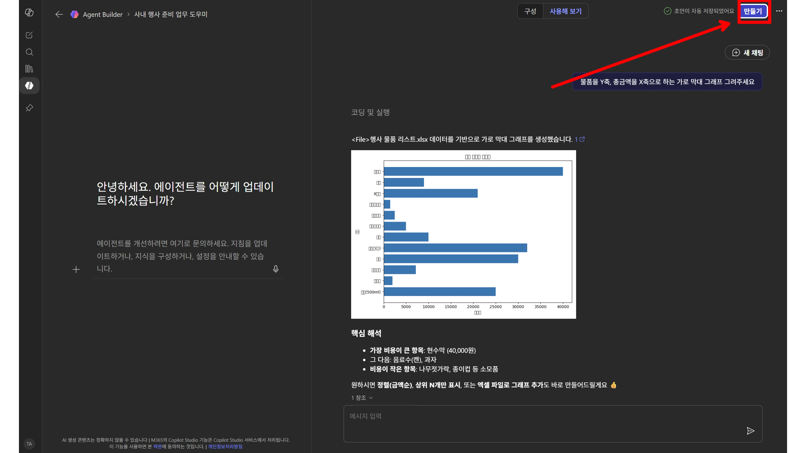

16. 완료 팝업이 뜨면 **에이전트로 이동**을 클릭해 실제 사용 화면으로 진입합니다.

   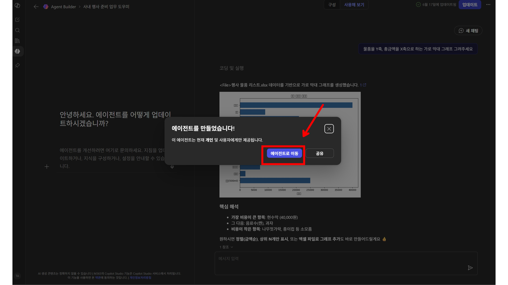

17. M365 Copilot 홈에서 좌측 **에이전트** 메뉴를 열고, 목록에서 방금 만든 **사내 행사 준비 업무 도우미**를 선택해 실행합니다.

   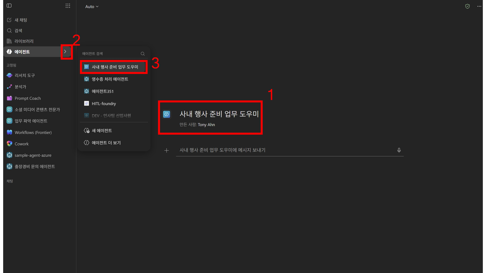

18. 이번에는 `깊게 생각해서 물품을 Y축, 총금액을 X축으로 하는 가로 막대 그래프 만들어주고, 한국어 잘 나오게 해주고, 결과물은 대화창에 바로 확인할 수 있게 해줘` 라고 입력하고, 응답에서 차트가 생성되는지 확인합니다. 또한, "N단계에서 추론이 완료되었습니다." 메시지가 표시되는지 확인합니다. 보다 시각적인 결과물이 나온 것을 확인할 수 있습니다. 

   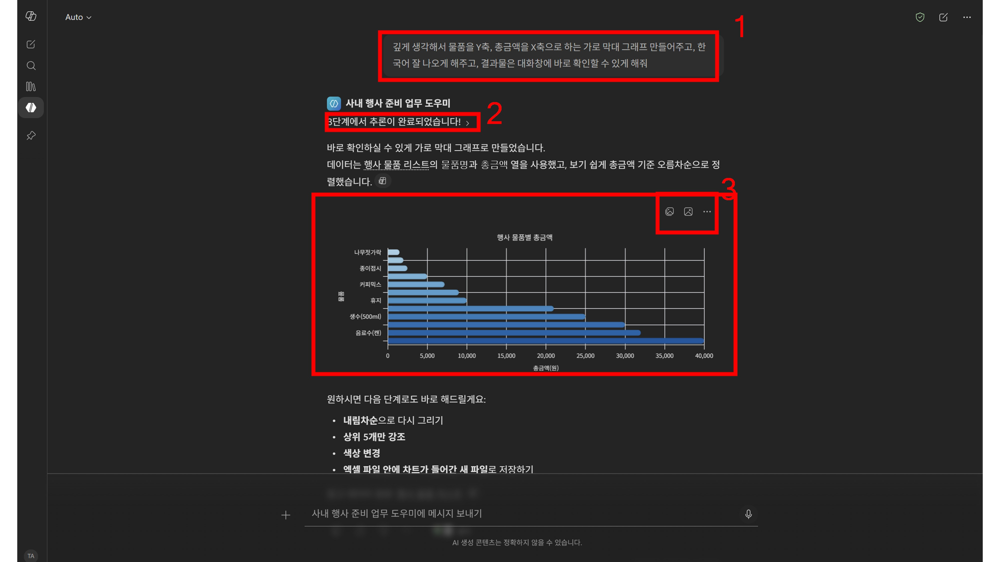

19. 이어서 `물품 중에서 부서장 승인을 받아야 하는 것들은?`을 질문해, 규정 문서가 없을 때 답변 한계를 확인합니다. 응답이 일반적인 내용으로 생성되는 것을 확인할 수 있습니다. 아직 사내 승인 기준에 대한 지식이 없기 때문에, 에이전트가 답변을 생성하는데 어려움을 겪는 것을 볼 수 있습니다.

   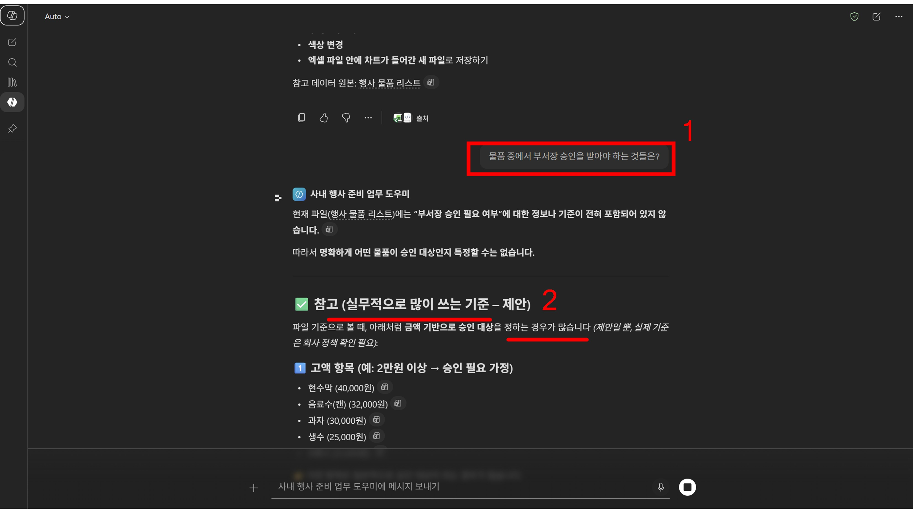

20. 좌측 **에이전트** 목록에서 대상 에이전트의 **...** 메뉴를 열고 **편집**을 클릭해 설정 화면으로 다시 들어갑니다.

   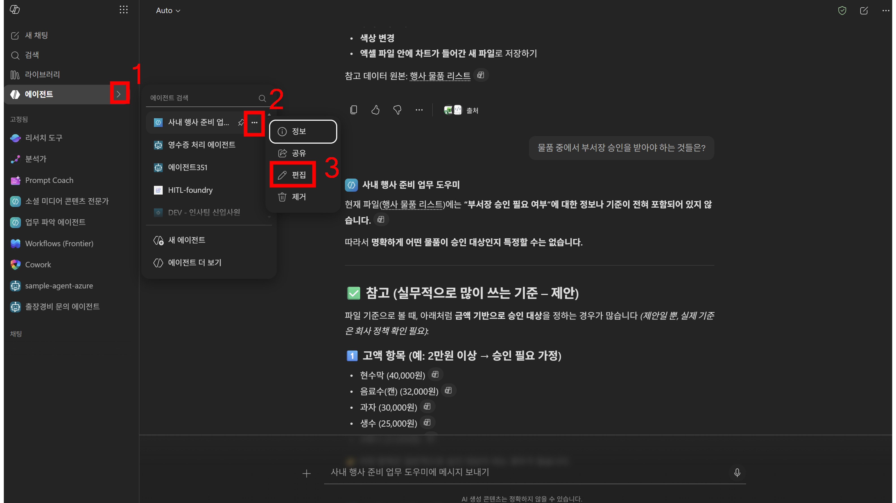

21. 지식의 **클라우드 파일 첨부**를 다시 눌러 파일 선택 창에서 `사내 행사 규정.docx`를 선택합니다.

   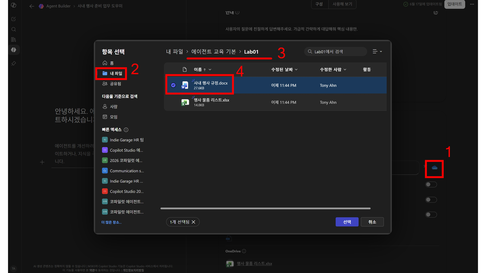

22. 안내(지침)를 아래와 같이 수정 및 보강한 뒤, 우측 상단 **업데이트**를 눌러 변경사항을 반영합니다.

```
사용자의 질문에 친절하게 답변해주세요. 가급적 간략하게 대답해줘 핵심 내용만.

데이터 시각화를 할 때는 항상 한글이 나타나게 처리하여 시각화 해주세요.
```

   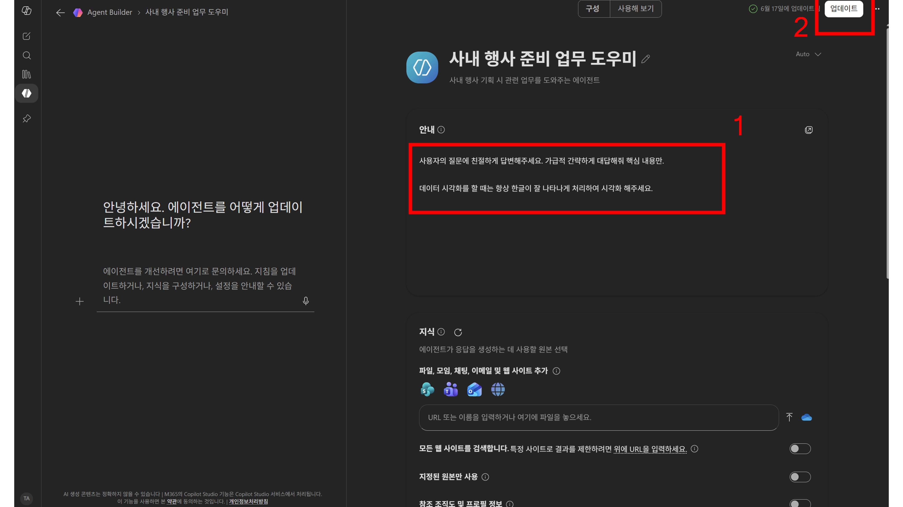

23. 업데이트 후 에이전트 화면에서 다시 `물품을 Y축, 총금액을 X축으로 하는 가로 막대 그래프 그려주세요`를 요청해 결과를 확인합니다.

   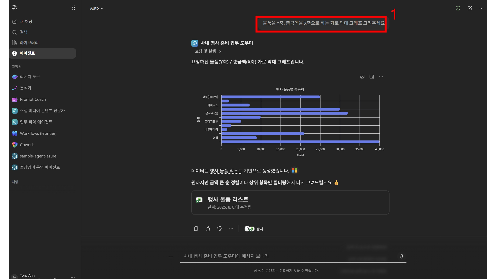

24. 이어서 `이 중에서 부서장 승인을 받아야 하는 것들은 어떤것들 인가요?`를 질문하고, 규정 문서 근거(25,000원 이상)가 반영되는지 확인합니다.

   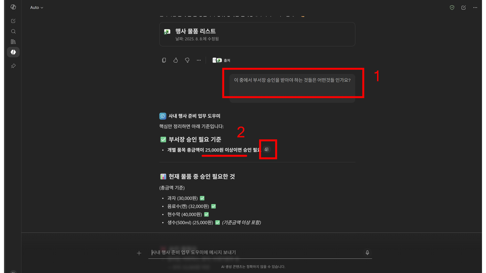

25. 마지막으로 `부서장 승인을 받아야 하는 물품들은 막대 차트에서 막대 색을 다른 색으로 표시 해주세요 구분되게`를 요청해, 승인 대상에 한하여 색상으로 구분된 차트가 생성되는지 확인합니다. 자연어를 통해 쉽게 차트의 시각적인 요소 편집이 가능합니다. 

   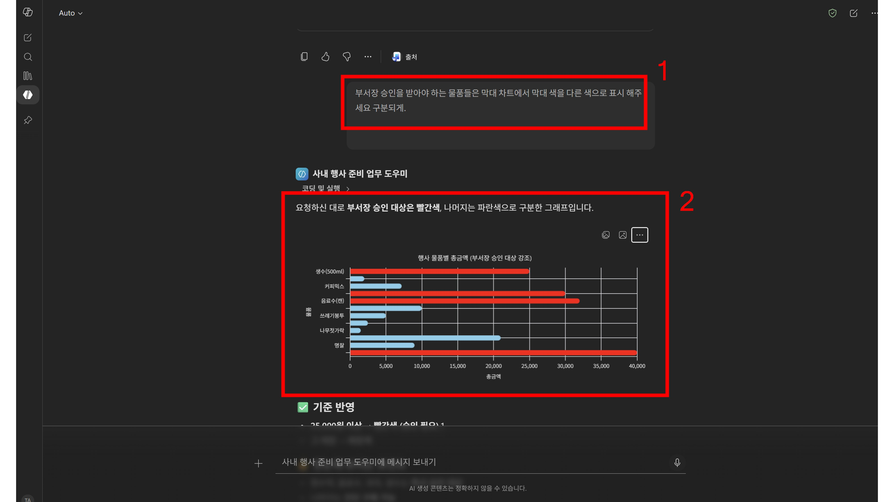

## 실습 요약

- 에이전트 빌더를 통해 자연어로 데이터를 검색하고 시각화 하는 에이전트를 빠르게 만들어 볼 수 있다.
- 지침을 통해 에이전트의 행동양식을 제어할 수 있다.
- 참조 지식과 기능을 통해 에이전트가 참조하는 지식의 범위를 제어할 수 있으며, 에이전트가 Python 코드를 실행하게 할 수 있다.

## 추후 확장 아이디어
- 코드 인터프리터를 통해 코딩 작업이 가능하므로, html 기반 대시보드 구축 등의 작업도 필요시 시도해볼 수 있다.