# 실습 환경 준비: Power Platform 환경 및 솔루션 세팅

## 학습 목표

- Power Platform의 UI를 탐험해 본다.
- 실습 환경 세팅을 진행한다.

## 시나리오

- Power Platform의 핵심 개념 및 UI 확인
- 솔루션 만들고, 참조 연결 세팅 하기

## 지시사항

1. 교육에서 진행하는 모든 작업물은 본인만을 위한 별도의 개발자 환경에서 작업을 하고 저장할 것이다. 그러므로 [Power Platform 관리자 센터](https://admin.powerplatform.microsoft.com/home)로 이동한다.

2. 관리자 센터에서는 본인의 권한에 따라 보여지는 메뉴들이 다르다. (일반 사용자 vs 관리자)

3. **관리 > 환경 > 새로 만들기**를 누른다.

   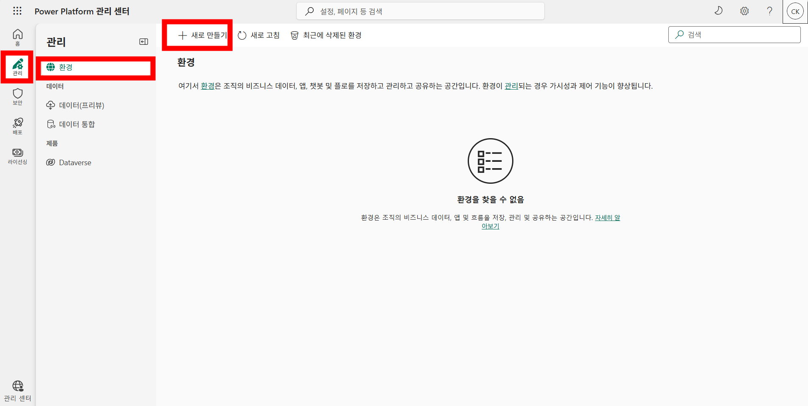

4. 아래와 같이 필요한 정보들을 채워넣는다. 그리고 **다음**을 클릭한다.

   - **이름**: 본인 성함
   - **지역**: 변경 없이 그대로 사용 (케이뱅크 같은 경우는 기본값이 아시아로 되어 있는데, 대한민국으로 바꾸면 물리적으로 데이터 센터랑 가까워서 조금은 반응 속도가 빨라질 수 있다)
   - **유형**: 개발자

   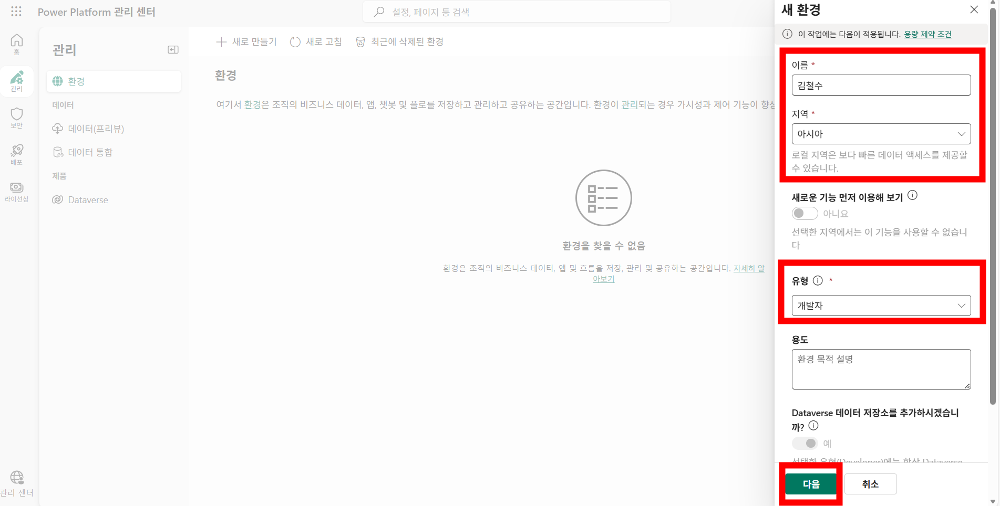

5. **저장**을 클릭한다.

   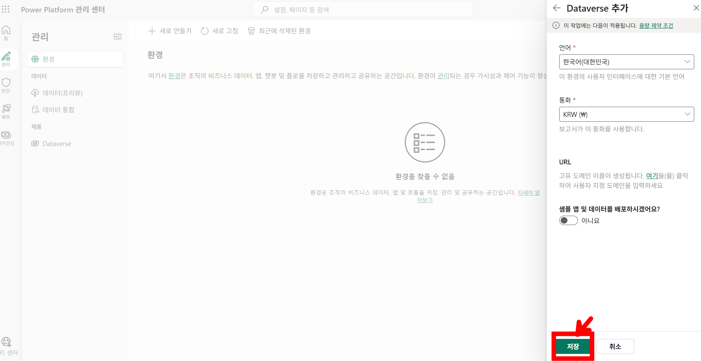

6. 브라우저 탭을 3개 띄워서, 아래에 안내된 각 사이트로 이동하여, 우측 상단의 개발자 환경을 본인이 만든 환경으로 변경한다. 앞으로 진행되는 모든 실습은 꼭 본인 환경에서 진행해야 함을 유의한다.

   - Copilot Studio: [https://copilotstudio.microsoft.com/](https://copilotstudio.microsoft.com/)
   - Power Automate: [https://make.powerautomate.com/](https://make.powerautomate.com/)
   - Power Apps: [https://make.powerapps.com/](https://make.powerapps.com/)

7. 각 사이트(Copilot Studio / Power Automate / Power Apps)의 좌측 메뉴에는 **솔루션**이라는 메뉴가 있다. 현재 선택된 Power Platform 환경에 저장된 모든 구성 요소들을 볼 수 있는 메뉴라고 생각하면 된다. PC로 비유하자면 일종의 파일 탐색기이다. 어느 사이트에서 접근하던, Power Platform 환경 기준으로 솔루션 내에 파일들이 나오기 때문에, 환경 세팅만 같으면 동일한 구성 요소들을 확인할 수 있다.

   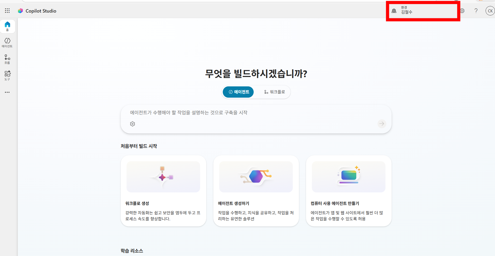

   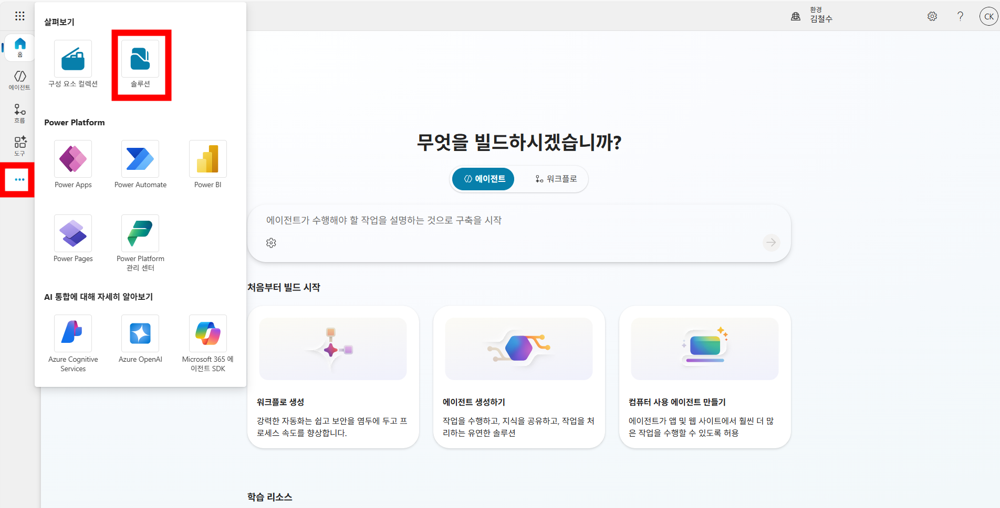

   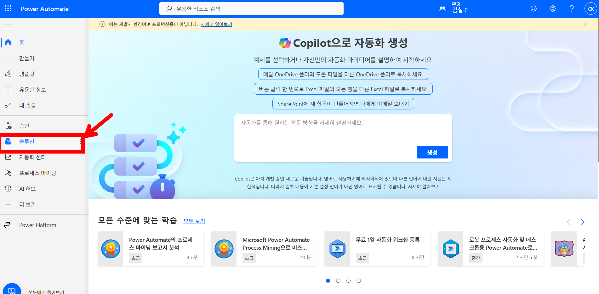

   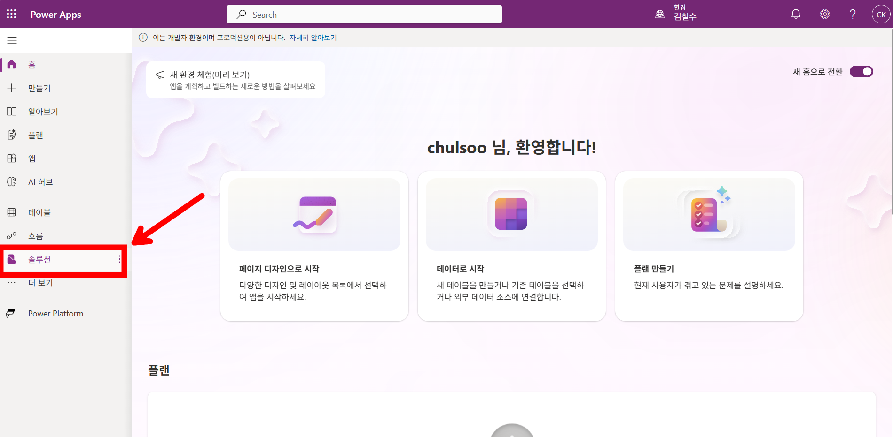

8. Power Automate와 Power Apps 탭은 이제 종료한다. **Copilot Studio** 탭에서 **솔루션**으로 이동한다.

9. **새 솔루션**을 클릭한다. 그리고 아래와 같이 설정한다. 만약 하나의 공용 환경을 사용중이라면 구분하기 위해 표시 이름 및 이름 가장 뒷부분에 본인 사번 또는 이니셜을 입력한다. (예: _sja, 또는 _1294) 그리고 **새 게시자**를 클릭한다.

   - **표시 이름**: `copilot studio 2026 basic`
   - **이름**: `copilotstudio2026basic`

   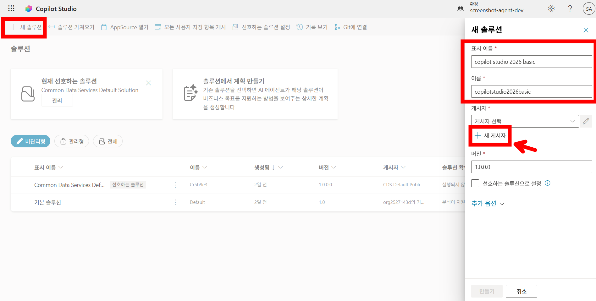

10. 아래와 같이 입력한 뒤 **저장**을 클릭한다. 게시자를 설정함으로써 해당 솔루션과 솔루션 내 구성요소들을 체계적으로 관리가 가능하다.

    - **표시 이름**: 본인의 영문 성함 (예: `sungjinahn`)
    - **이름**: 본인의 영문 성함 (예: `sungjinahn`)
    - **접두사**: 본인의 영문 이니셜 (예: `sja`)

    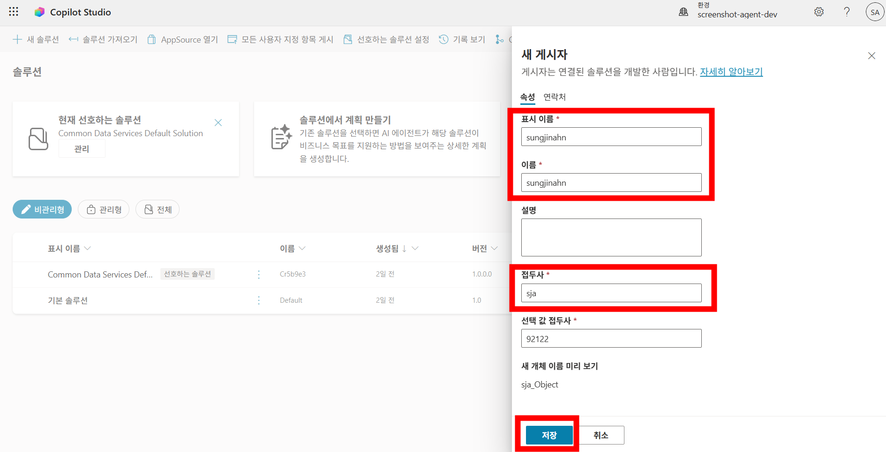

11. 새로 만든 게시자를 게시자 메뉴에서 선택한다. **선호하는 솔루션으로 설정** 체크박스를 선택한다. 그리고 **만들기**를 클릭한다. 선호하는 솔루션으로 설정해두면 추후 개발하는 모든 에이전트들이 기본값(default)으로 해당 솔루션 내에 저장된다. 에이전트를 만드는 시점에서 해당 에이전트가 다른 솔루션 내에 저장되게 설정할 수도 있다.

    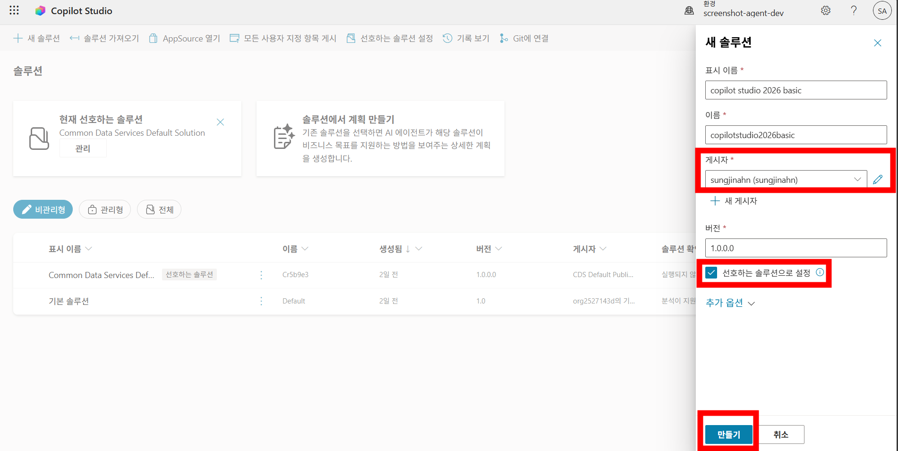

12. 솔루션이 만들어지면 좌측 메뉴에서 Power Platform에서 만들 수 있는 다양한 구성 요소들을 볼 수 있다.

    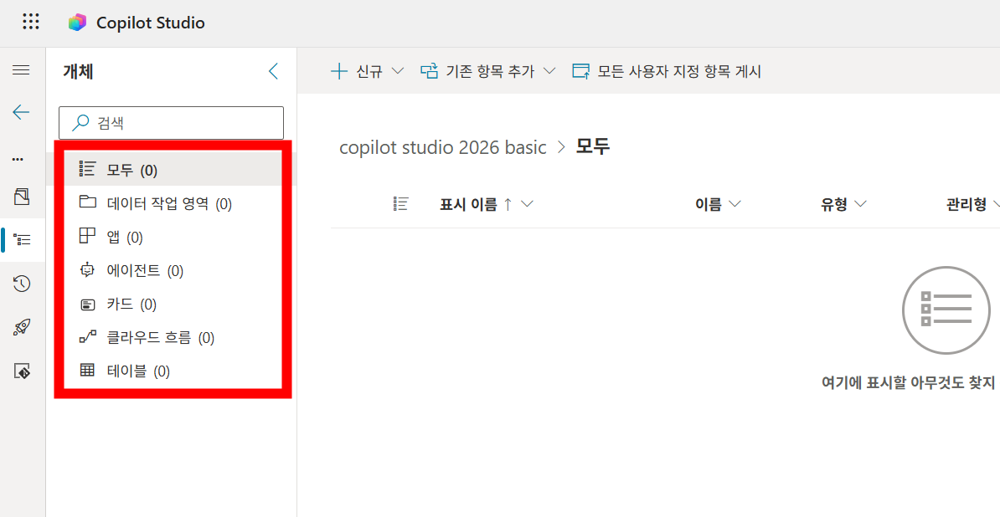

13. OneDrive로 이동한다. 

14. 제공되는 [링크] 로 이동하여 실습에 필요한 파일을 다운로드 한다. 그리고 OneDrive에서 새로운 폴더를 만들거나 또는 본인이 원하는 폴더에 해당 파일을 업로드한다. (예: Copilot Studio 에이전트 기초 교육/Lab) 
