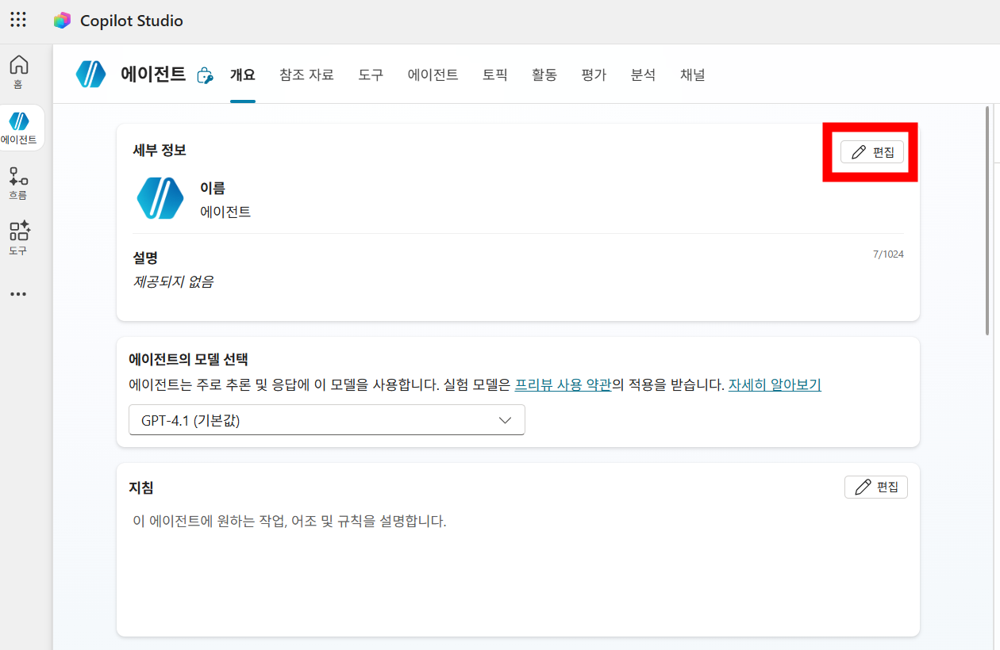
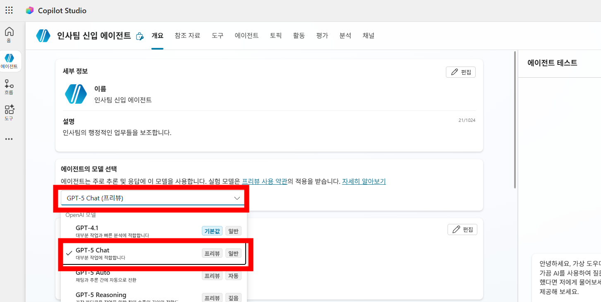
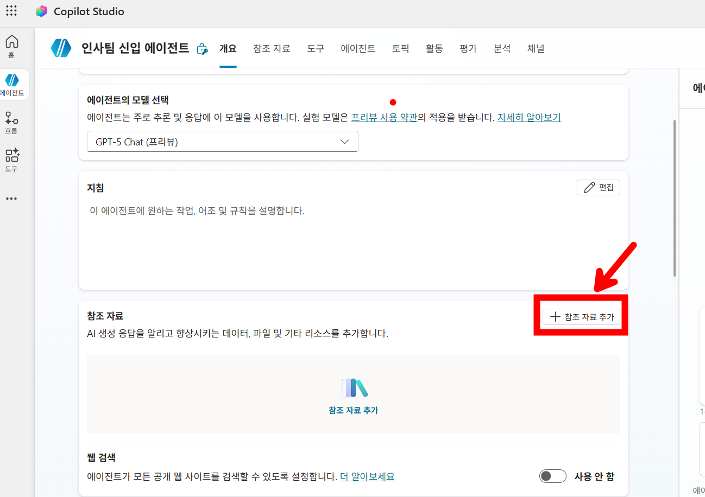
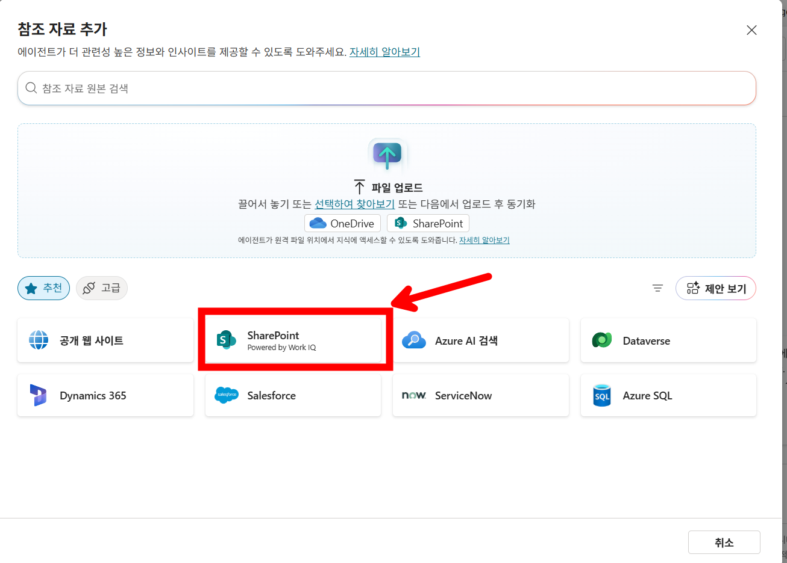
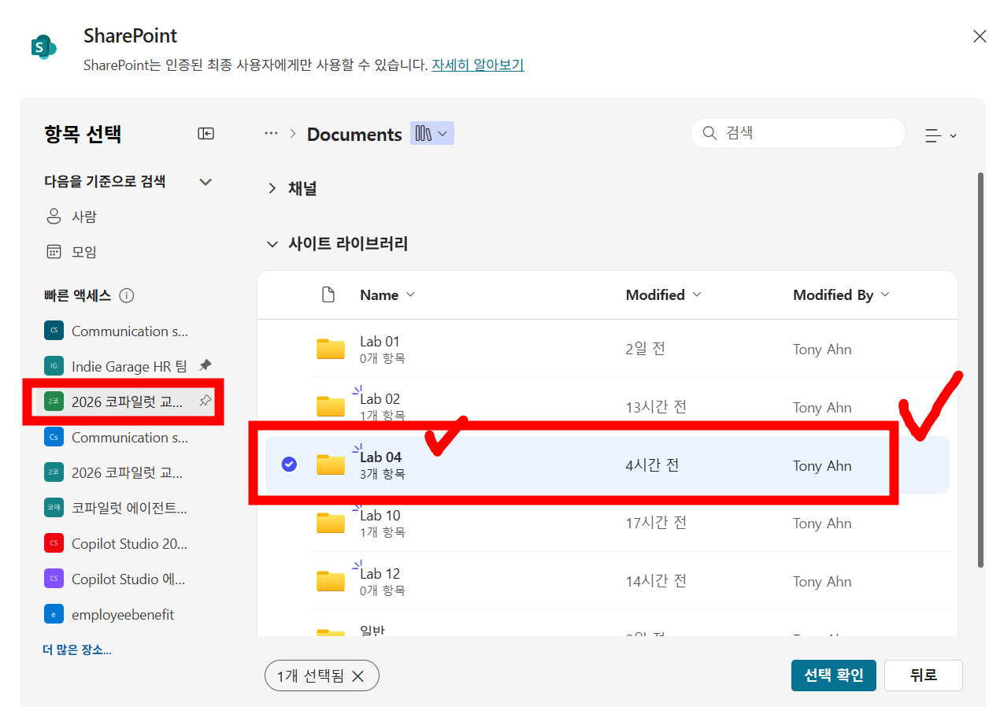
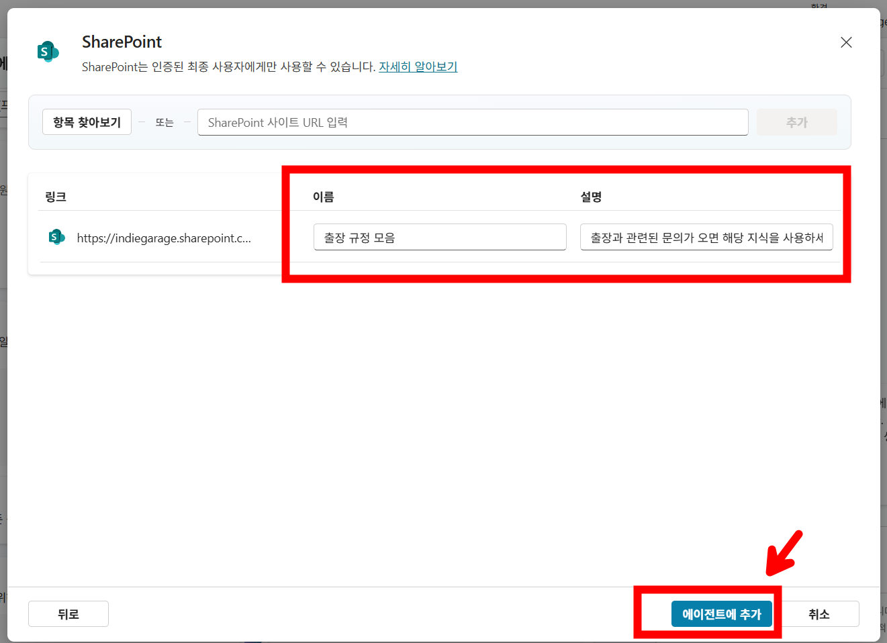
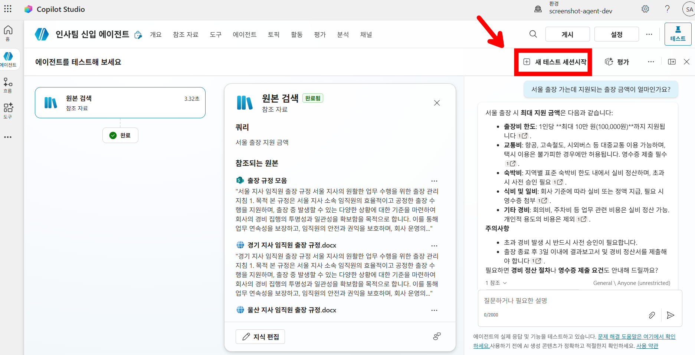
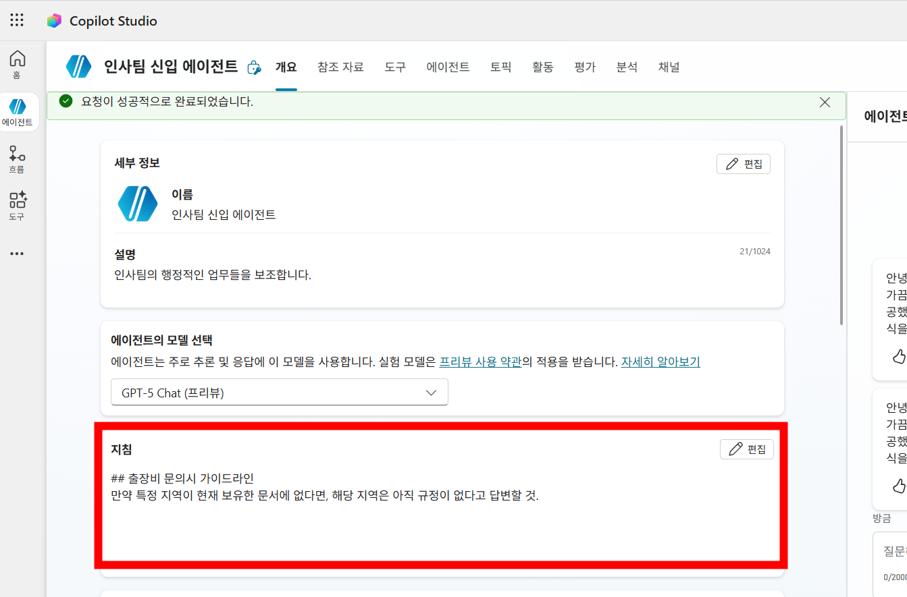
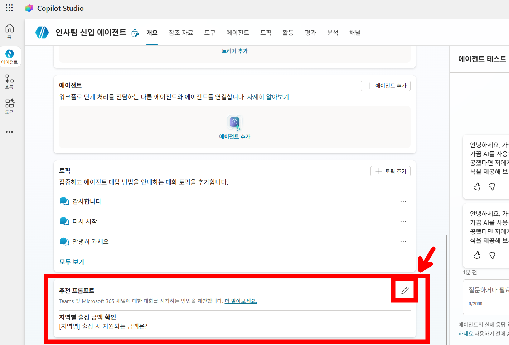
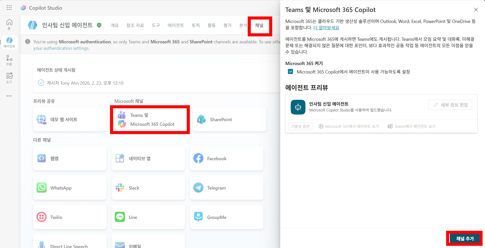

# Lab 03 : 인사 규정 안내 에이전트

## 학습 목표

- 에이전트 모델 변경
- 폴더 방식으로 SharePoint 사이트 내 자료 첨부
- 검색 결과 반환 시 결과물을 어떻게 처리하는 지 조절

## 시나리오

- 흩어져 있는 문서로부터 원하는 정보를 찾을 수 있는 에이전트를 만들어보고자 합니다.
- 기존에는 문서를 하나씩 열어 Ctrl + F 등을 통해 검색을 했다면, 이번에 만드는 에이전트는 질문만 던지면 흩어져 있는 문서로부터 적절한 답변을 찾아서 정리해서 답변하기 때문에, 업무 효율화를 가져가 볼 수 있겠습니다.

## 지시사항

1. [Copilot Studio](https://copilotstudio.microsoft.com/)로 이동하여 이번 교육에서 사용하기로 한 환경으로 이동한다.

2. **에이전트 > 빈 에이전트 만들기**를 클릭한다.

3. **세부 정보를 편집** 버튼을 눌러 아래와 같이 편집하고 저장한다.

   - **이름**: `인사팀 신입 에이전트`
   - **스키마 이름**: `hrAgent`

   

4. 에이전트의 **모델 선택** 드롭다운 메뉴를 사용하여, 모델을 **GPT-5 Chat**으로 변경한다.

   > ⚠️ **중요**: 실무에서도 필요 시 여러 모델을 바꿔가면서 task별 최적의 모델을 탐색하는 과정을 진행 해볼 수 있다.

   

5. 스크롤을 내려서 참조 자료 섹션으로 이동한다. 웹 검색이 켜져 있다면 비활성화 한다. **참조 자료 추가**로 이동하여 **SharePoint**를 선택한 뒤, 강사가 안내한 SharePoint 사이트로 이동한다. 그리고 이번 실습에 필요한 문서가 담긴 `Lab03` 폴더를 추가한다.

   

   

   

6. 해당 지식의 이름과 설명을 아래와 같이 변경한 뒤 **에이전트에 추가** 버튼을 클릭한다.

   - **이름**: 출장 규정 모음
   - **설명**: 출장과 관련된 문의가 오면 해당 지식을 사용하세요.

   

7. 테스트 화면에서 아래와 같이 입력하고 전송한다.

   ```
   서울 출장 가는데 지원되는 출장 금액이 얼마인가요?
   ```

8. 에이전트 답변 중에 `서울 지사 임직원 출장 규정.docx` 파일이 포함되는 지 확인하고, 1인당 10만원 이라는 내용이 포함된 것을 확인한다.

9. **새 테스트 세션**을 만든 뒤 아래와 같이 물어본다. 새 테스트 세션은 작은 **+** 아이콘을 클릭하면 된다.

   ```
   강릉 출장 시 지원되는 출장 금액은 얼마인가요?
   ```

10. 강릉 규정은 SharePoint 참조한 폴더에 없는데, 엉뚱한 답변이 나올 수 있다. 이는 아직 까지 GPT-5 모델의 범용적인 지능이 부족해서 그럴 수 있어 보인다. 모델 성능이 향상되면 알아서 잘 (즉, 적합한 결과가 없다고) 답변이 될 수 있으나, 현재는 그런 부분을 직접 지침에 넣어줘야 할 것으로 보여진다.

    

11. 지침에 아래 내용을 추가한다.

    ```
    ## 출장비 문의시 가이드라인
    만약 특정 지역이 현재 보유한 문서에 없다면, 해당 지역은 아직 규정이 없다고 답변할 것.
    ```

12. 새 테스트 세션을 열어 다시 한번 더 아래 내용을 물어본다.

    ```
    강릉 출장 시 지원되는 출장 금액은 얼마인가요?
    ```

13. 결과물을 보면 강릉은 규정이 없다고 답변하는 것을 볼 수 있다. 그리고 이어서 `울산은?` 이라고 물어보면, 맥락을 파악하여 잘 답변하는 것을 볼 수 있다. 이처럼 지침을 통해 대화 흐름을 제어해볼 수 있다. 예를 들어, `follow-up 질문의 경우 너가 보유한 출장 규정 지역은 어디어디가 있고, 그 중에서만 답변 가능하다고 해줘` 라는 것도 적용해볼 수 있겠다.

    

14. 사용자 편의를 위해 추천 프롬프트에 아래와 같이 추가한다.

    > 참고: 추천 프롬프트는 Teams 및 M365 Copilot에 추가된 에이전트로 이동했을 때 나타난다.

    - **제목**: 지역별 출장 금액 확인
    - **프롬프트**: `[지역명] 출장 시 지원되는 금액은?`

    

15. 우측 상단에 있는 **게시** 버튼을 클릭하여 에이전트 게시를 한다.

16. **채널**로 이동하여 **Teams 및 Microsoft 365 Copilot** 채널을 추가한다.

    

17. **Microsoft 365에서 에이전트 보기**를 클릭하면 M365 Copilot에 추가된 에이전트를 볼 수 있고, **Teams에서 에이전트 보기**를 클릭하면 Teams에 채팅 형태로 추가된 에이전트를 볼 수 있다.

## 실습 요약

- Copilot Studio에서 커스텀 엔진 에이전트를 만들어 보고, 구성해보고, 게시해보는 전체 과정을 진행했다.
- SharePoint로 참조 지식을 추가할 때는 파일별, 또는 폴더 단위로도 가능한 점을 확인했다.
- 지침을 활용하여 에이전트의 답변 방법 등을 제어해볼 수 있음을 확인했다.

