# Lab 06 : 이력서 분석 에이전트

## 학습 목표

- 토픽(Topic)을 사용하여 대화 흐름을 결정론적으로 설계하는 방법 이해
- **활동 발생(Activity Occurred)** 트리거를 활용하여 사용자 의도가 아닌 특정 이벤트(파일 첨부)로 토픽을 실행하는 방법 이해
- 시스템 변수(`System.Activity.Attachments`)를 읽고 별도 변수에 저장하는 방법 이해
- **목록을 통해 루프** 노드를 사용하여 여러 파일을 반복 처리하는 방법 이해
- 토픽 내에서 에이전트 플로우를 호출하고 Power Fx 수식으로 입력값을 전달하는 방법 이해

```{note}
에이전틱 하지는 않지만, Copilot Studio에서는 이러한 전통적인 로직 기반의 방법으로도 필요 시 프로세스 자동화를 진행해볼 수 있음을 확인해보는 것이 목표
```

## 시나리오

- 인사팀은 채용 과정에서 지원자들의 이력서를 다량 수신하며, 파일 형태(PDF)로 제출된 이력서에서 지원자 성함·경력·역량 등을 추출하여 별도 시트에 정리하는 작업(DB화 작업)을 반복하고 있다.
- 이력서를 여러 장 동시에 업로드하면 각 파일마다 자동으로 처리가 반복 실행되고, 사용자가 별도 명령어를 입력하지 않아도 파일 첨부 순간에 토픽이 자동으로 트리거되어 이력서 DB화를 자동으로 수행하는 결정론적(Deterministic) 구조를 구현한다.


## 지시사항

1. 새 에이전트를 만든다. 
    - 에이전트 이름: `이력서 분석 에이전트`


4. **도구 추가**를 눌러 새로운 에이전트 흐름을 추가한다.

5. **에이전트가 흐름을 호출할 때** 트리거 입력 값에 **파일** 입력값을 추가한다. 그리고 아래와 같이 설정한다.

   - 이름: `file`
   - 설명: `resume file`

   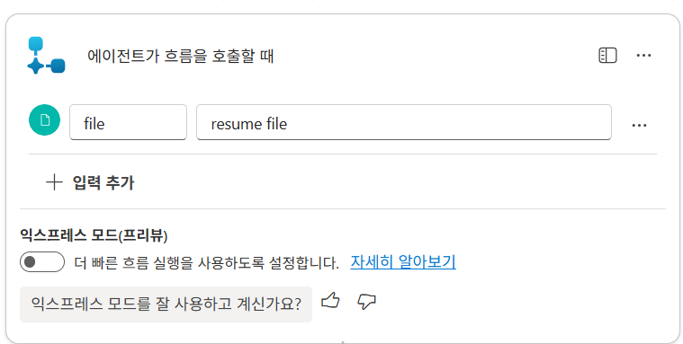

6. **프롬프트 실행** 작업을 하나 추가하고, **새 사용자 지정 프롬프트**를 클릭한다.

7. 아래와 같이 프롬프트의 구성요소를 설정한다. 에러 메시지가 풍부하지 않아 정확한 원인은 파악하기 어렵지만, 이번에는 **올해 연도**를 Power Fx 변수로 넣으면 시스템 에러가 발생하는 것이 종종 확인되었다. 그래서 이번 프롬프트에서는 올해 연도 변수 대신 `2026`으로 하드 코딩하였다.

   - **프롬프트 제목**: `파일 이력서에서 데이터 추출`
   - **모델**: GPT-5 chat
   - **지침**:

     ```
     /문서 입력 에서 지원자 성함, 총 경력 기간, 주요 역량을 추출해서 아래와 같은 포맷으로 반환해주세요. 민감한 정보는 처리하지 마세요. 총 경력 기간을 계산할 때는 지원자가 처음 일을 시작했을 때 부터 2026년 까지의 기간을 계산해주세요.

     {
     성함: 홍철수
     총 경력 기간: 5
     주요 역량: Power Apps를 활용한 프로젝트, ALM 전략 수립 경험, Power BI 대시보드 구축 경험
     }
     ```

   - **변수**:
     - `문서 입력`: 이미지 또는 문서

8. **문서 입력** 변수에 `홍영미_이력서.pdf`를 첨부한다. 그리고 출력은 **JSON**으로 변경한 뒤 **테스트**를 눌러 결과물이 잘 나오는지 확인한다. 테스트 후에 **저장**을 클릭한다.

   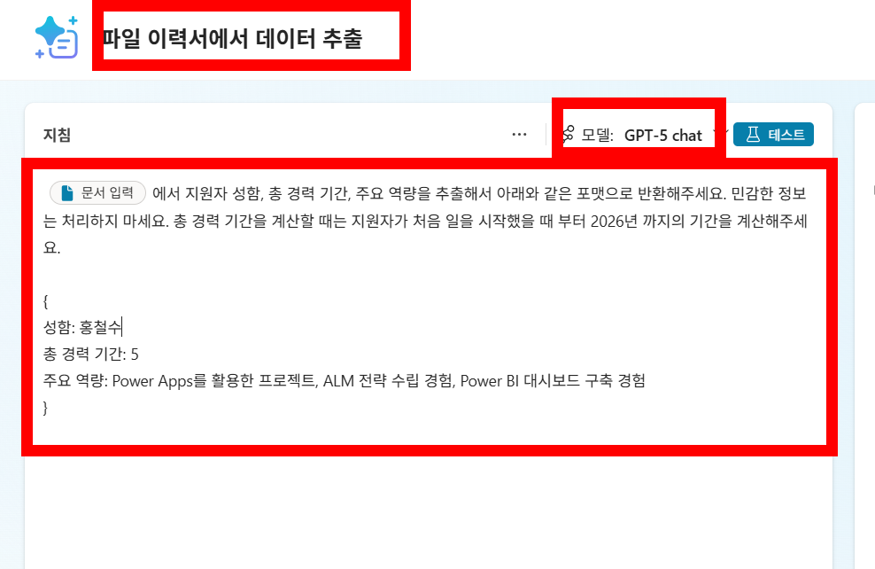

   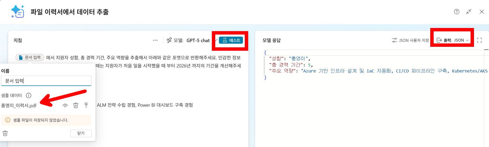

9. **프롬프트 실행** 작업의 **문서 입력** 란에는 앞서 트리거에서 제공하는 변수 중 `file contentBytes`를 선택하여 추가한다.

   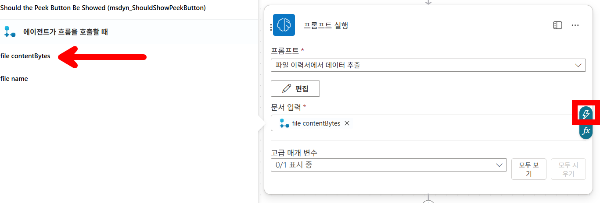

10. **테이블에 행 추가** 작업을 추가한 뒤 아래와 같이 설정한다.

    - **위치**: OneDrive for Business
    - **문서 라이브러리**: 문서 (또는 OneDrive)
    - **파일**: `에이전트 교육 기본/Lab06/지원자 정리.xlsx` (Lab 02에서 본인이 저장해둔 장소)
    - **테이블**: `resume_table`
    - **성함**: 프롬프트 실행의 성함 변수
    - **총 경력 기간**: 프롬프트 실행의 총 경력 기간 변수
    - **주요 역량**: 프롬프트 실행의 주요 역량 변수

    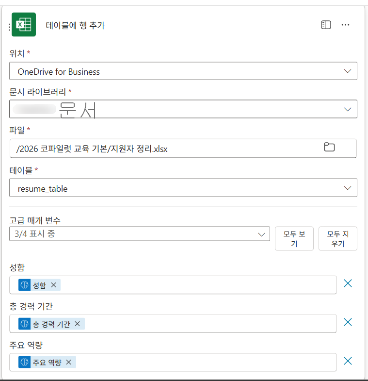

11. **Respond to the agent**에서 출력 변수에 텍스트 타입을 추가한 뒤 아래와 같이 설정한다.

    - 변수명: `output`
    - 값: `추가 완료 하였습니다.`

    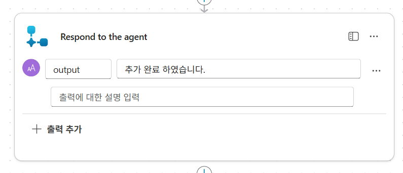

12. **초안 저장** 후 **게시**를 한다. 그리고 **개요**로 이동하여 흐름 이름을 `파일에서 추출 후 행 추가`로 변경한다.

13. **이력서 분석 에이전트**로 이동하여 새로운 토픽을 추가한다. 토픽명은 `파일 업로드 되면 바로 실행`으로 설정한다. 그리고 **트리거 변경** 버튼을 클릭한다.

    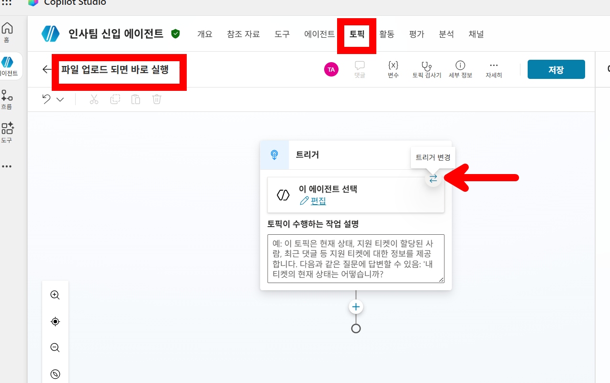

14. **활동 발생** 트리거를 클릭한다.

    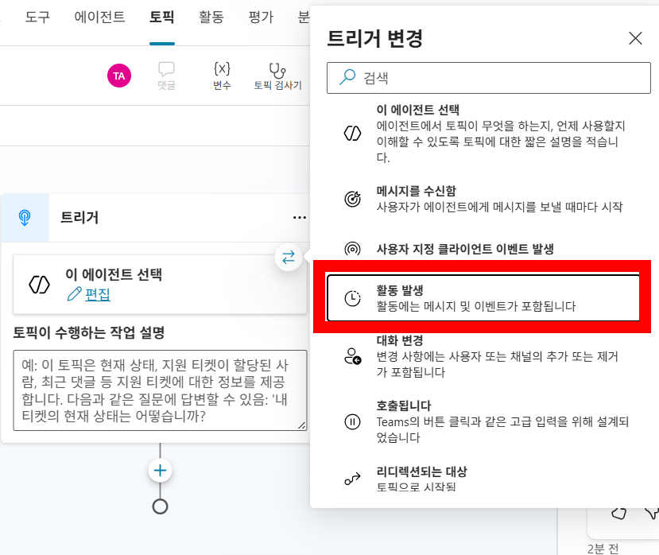

15. **활동 발생**의 **편집** 메뉴를 클릭한 뒤 조건을 아래 스크린샷에 안내된 것처럼 적절하게 설정한다. `System.Activity.Attachments` 변수에는 특정 Activity가 발생한 맥락 상에서, 사용자가 입력한 첨부 파일이 저장되는 변수이다. 예를 들어 사용자가 메시지를 에이전트에게 입력했을 때, 그 때 첨부 파일이 같이 있다면 `System.Activity.Attachments`에 저장된다. 해당 변수에 값이 있을 때 토픽이 트리거 되도록 설정한 것이다.

    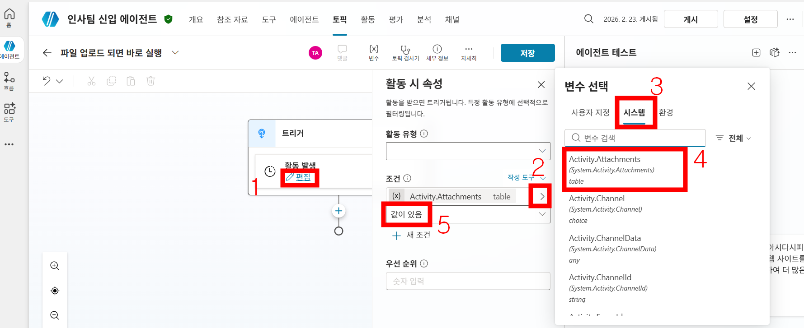

16. `System.Activity.Attachments` 변수는 Activity가 발생할 때마다 초기화가 된다. 왜냐하면 특정 Activity, 예를 들어 사용자가 에이전트에게 질문을 던질 때마다 만약 첨부파일이 있다면, 그 파일을 일시적으로 담아두는 역할을 `System.Activity.Attachments`가 하기 때문이다.

17. 그러므로 해당 파일을 토픽 내에서 영구적으로 사용하기 위해서는, 별도의 변수에 해당 값을 저장해두는 게 좋다.

18. **노드 추가** 버튼을 클릭한 뒤 **변수 관리 > 변수 값 설정**을 클릭한다.

    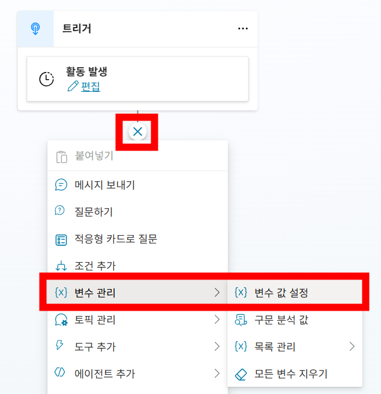

19. **변수 선택**을 클릭한 뒤 **새로 만들기**를 클릭한다.

    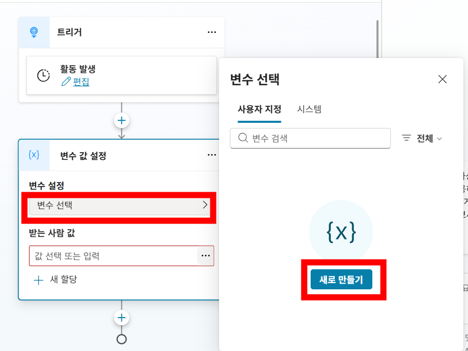

20. `Var1` 변수가 추가된다. 변수 이름의 기본값이 `Var1`로 설정된 것을 확인할 수 있다. `Var1` 변수를 클릭한 뒤 변수 이름을 `attachedFiles`로 변경한다.

    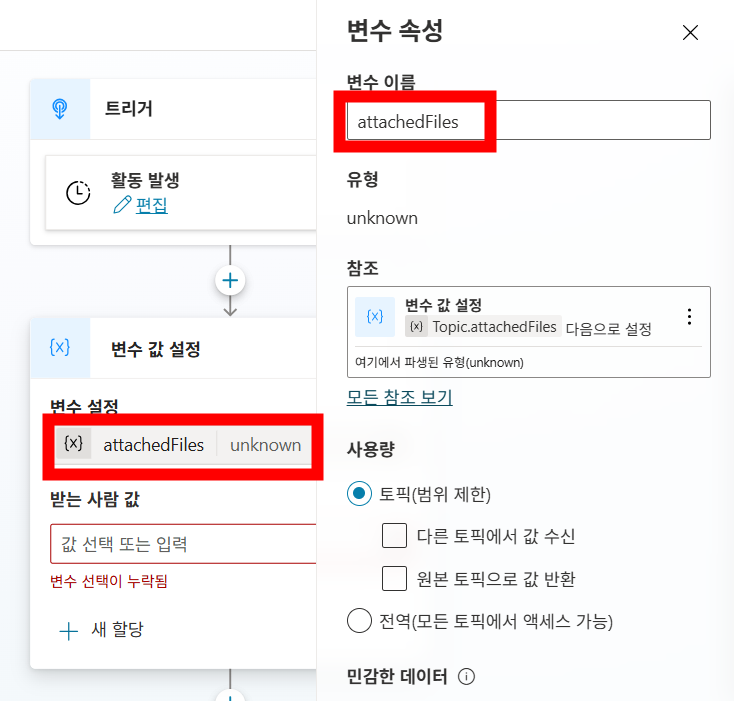

21. **받는 사람** 값의 **…**을 클릭한 뒤 **시스템**으로 이동하여 `Activity.Attachments`를 클릭한다. 이렇게 하여 해당 시스템 변수에 있는 내용물을 다른 변수로 옮겨주었다.

    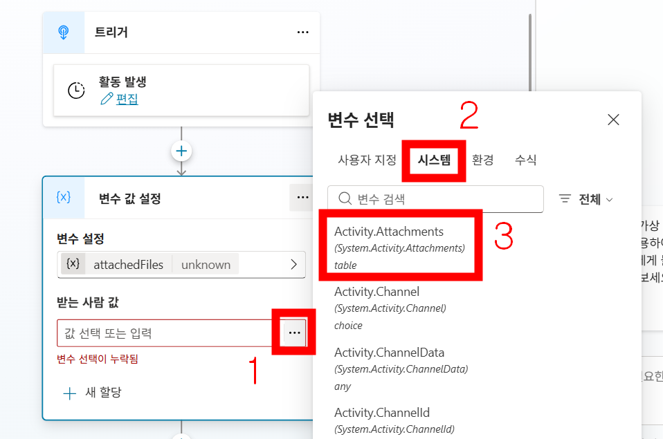

22. `attachedFiles` 변수는 테이블 유형이기 때문에, 여러 개의 레코드가 존재한다. 그러므로 각 레코드마다 처리하는 과정을 반복문으로 만들어줘야 한다.

23. **목록을 통해 루프** 노드를 아래와 같이 추가한다.

    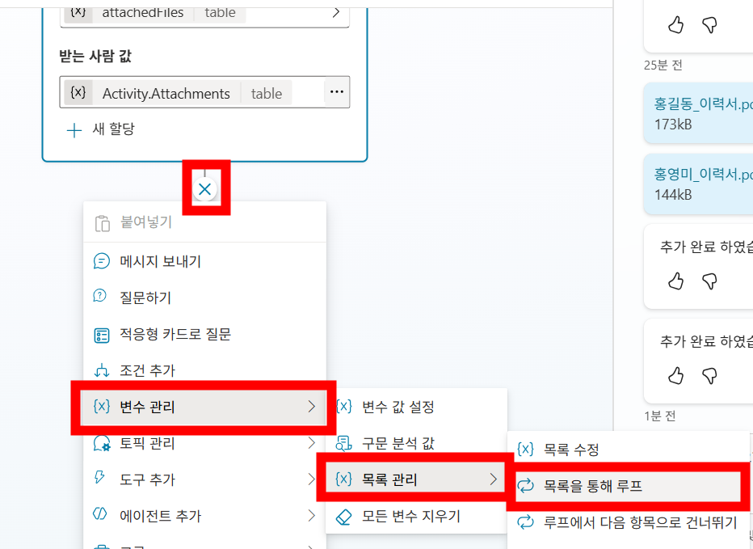

24. `attachedFiles` 변수를 루프할 항목으로 설정한다. 해당 테이블 내에 있는 각 레코드를 `LoopValue1`에 저장하여, 반복하여 하나씩 작업을 수행하는 로직이 형성되었다.

    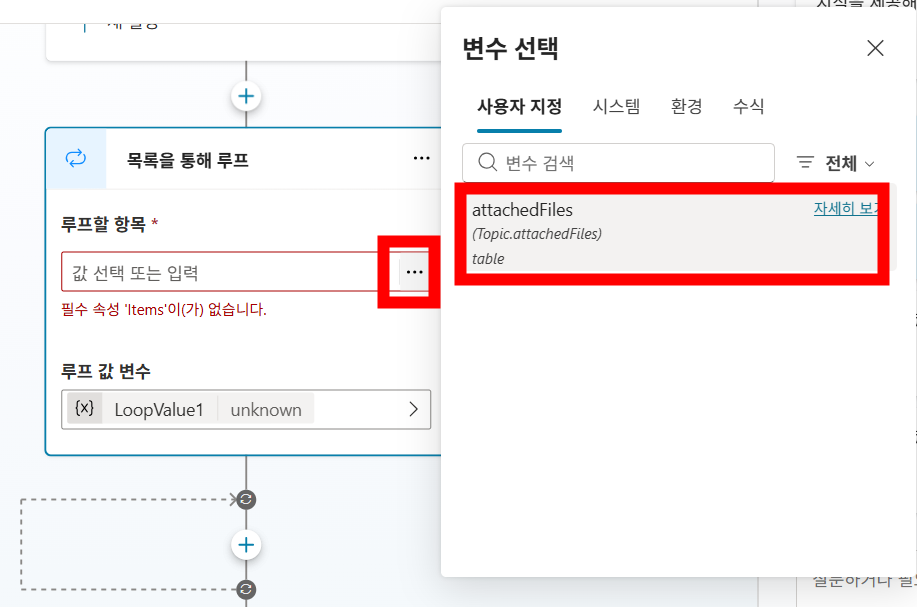

25. 루프 사이에 앞서 만든 **파일에서 추출 후 행 추가** 흐름을 추가한다.

    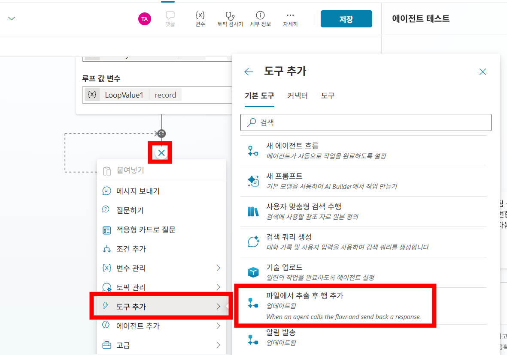

26. `file` 변수의 **…**을 클릭한 뒤 **수식**으로 이동하여 아래와 같은 식을 입력한다. Power Automate의 파일 타입 변수는 아래와 같은 구조의 데이터를 입력 받는다.

    ```
    { contentBytes: Topic.LoopValue1.Content, name: Topic.LoopValue1.Name }
    ```

    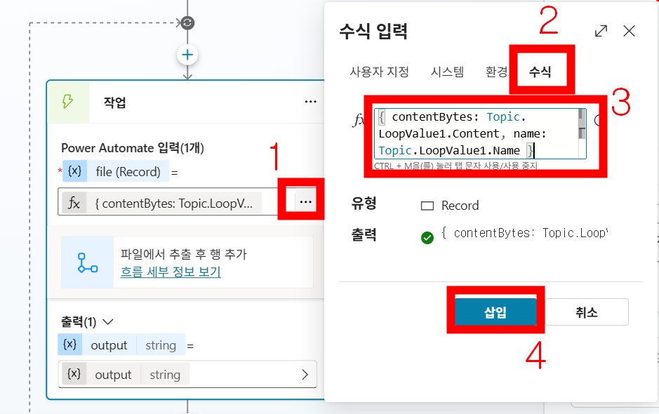

27. **메시지** 노드를 추가하여 입력란에 `Topic.output` 변수를 추가한다. 이를 통해 앞선 노드에서 나온 output 값을 대화 창에 전달할 수 있다.

    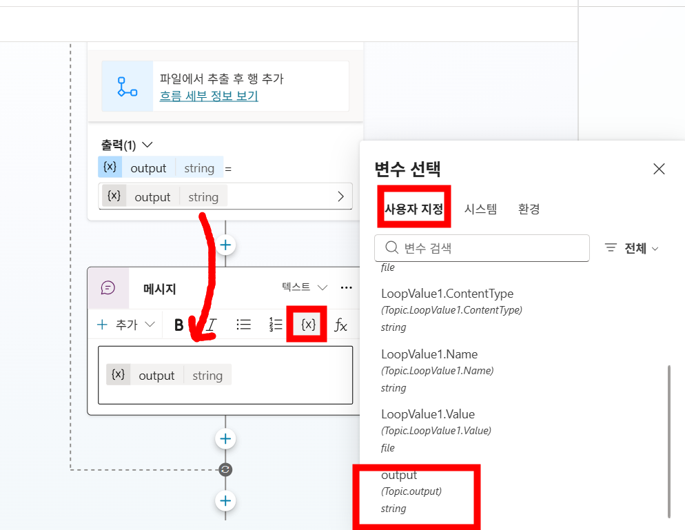

28. 루프 바깥에 **현재 토픽 종료** 노드를 추가하여 토픽을 마무리한다. 그리고 현재까지 수정한 토픽을 우측 상단 **저장** 버튼을 클릭하여 저장한다.

    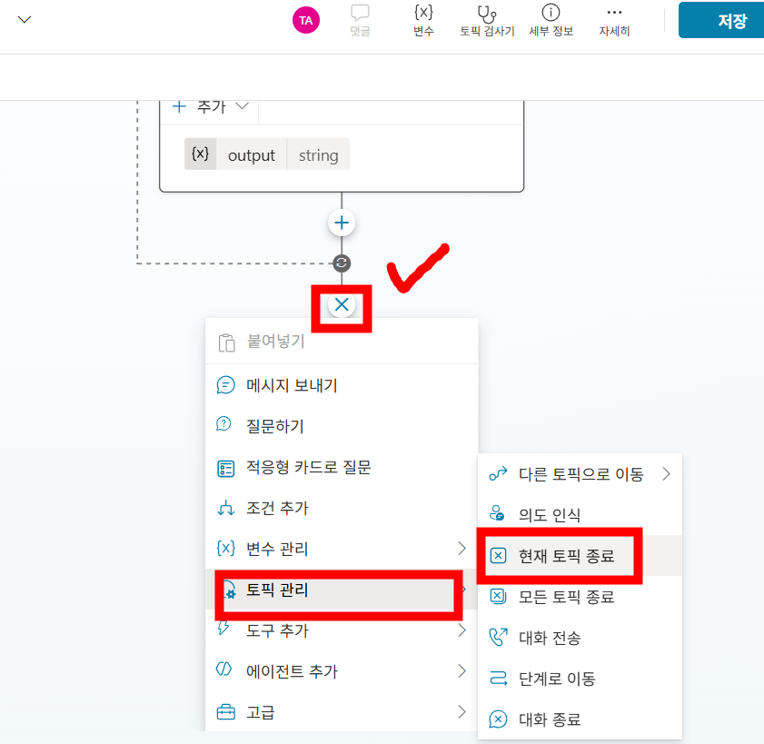

29. 테스트 패널에 이력서 파일을 2개 동시에 입력하고 전송한다. 파일이 첨부 되었는지 확인하는 로직 기반으로 작동하므로, `이력서 분석 해줘`라는 의도가 담긴 메시지를 넣을 필요도 없다. 테스트 할 때는 **토픽 간 추적**을 활성화한 뒤 테스트하면 토픽 내 진행 현황을 확인할 수 있다.

    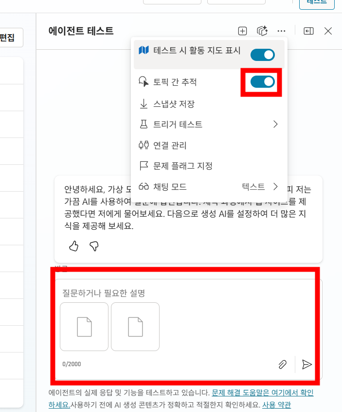

30. 초반에는 커넥터 연결 설정해줘야 하는 것 때문에 작업 수행이 잘 안될 수도 있는데, 한번 연결 잡아주고 나서 그 다음에 다시 한번 더 진행하면 작업이 잘 진행되는 것을 확인할 수 있다.

    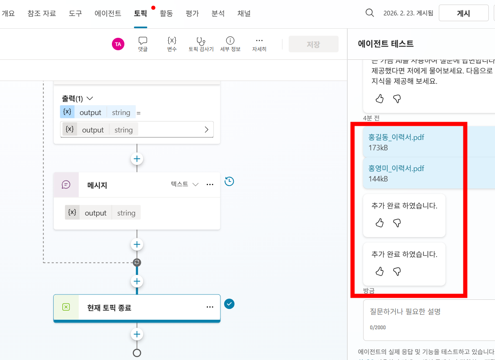

31. 완성된 토픽

    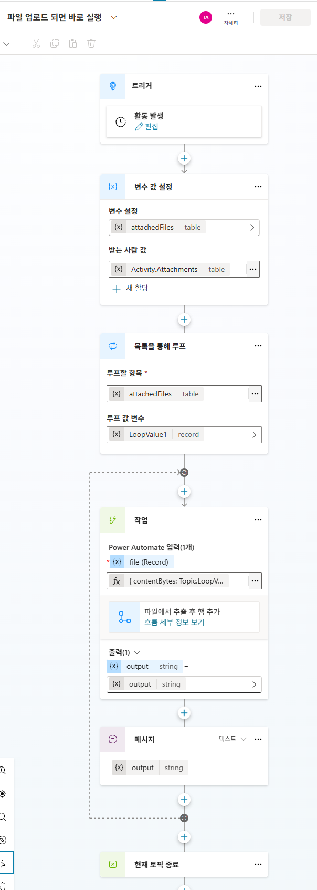

## 실습 요약

- **활동 발생**이라는 트리거 유형을 사용하여 사용자의 대화 의도가 아닌 특정 이벤트 발생 시 실행되는 토픽을 구축해 보았다.
- 토픽 내에서 반복문을 구현해 보았다.
- 파일 전달을 결정론적으로 하는 방법을 체험해 보았다.

