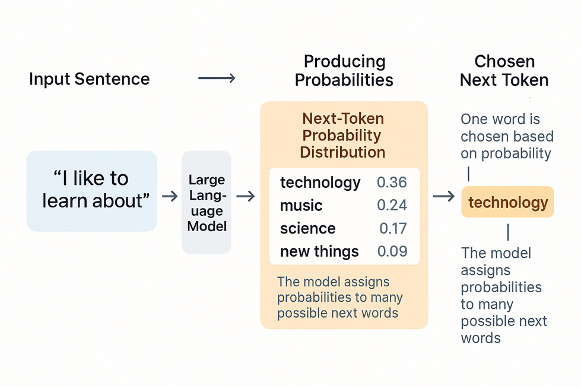
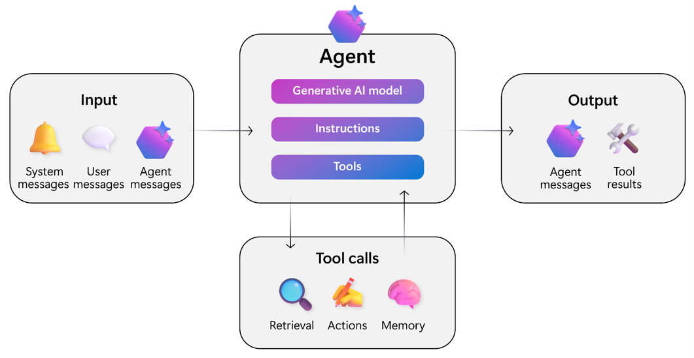
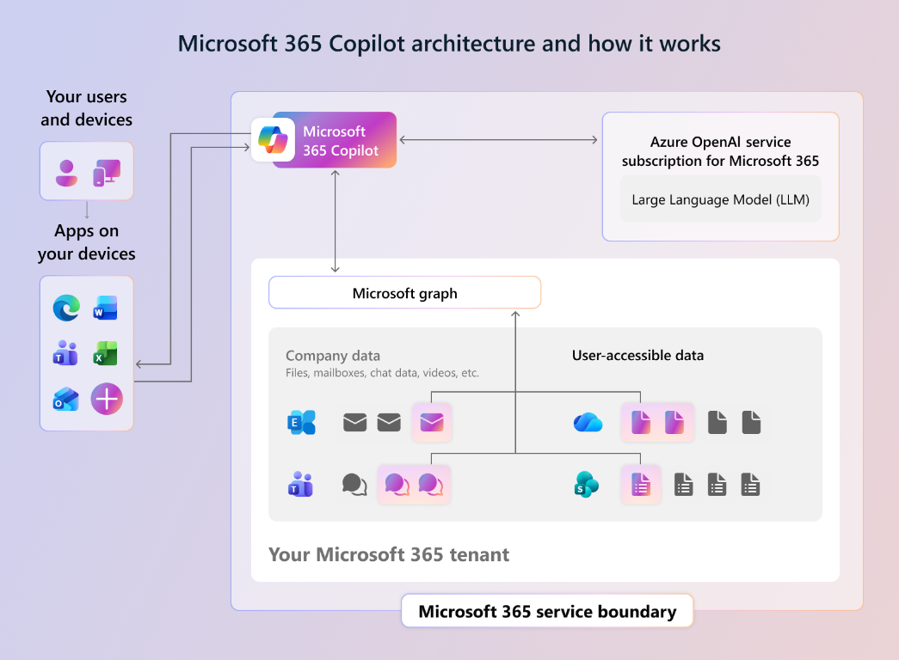

# 에이전트의 기본 이해와 M365 Copilot의 에이전트 빌더로 에이전트 만들기

## LLM(Large Language Model) 이해하기

LLM은 입력된 문장(컨텍스트)을 바탕으로 **다음에 올 단어(토큰)의 확률 분포**를 계산하고, 그 확률에 따라 단어를 하나씩 선택하며 응답을 생성하는 모델이다.



### 특징

- **확률론적(Probabilistic)**: 동일한 입력 값에 대해 항상 동일한 출력 값이 나오지는 않는다. 매번 답변이 조금씩 달라질 수 있다.
- 따라서 **AI가 생성한 결과물은 항상 정확하지 않을 수 있다**는 점을 전제로 활용해야 한다. 중요한 의사결정에 사용하기 전에는 반드시 사람의 검토가 필요하다.

### 한계점

- **Knowledge Cutoff(지식 단절)**: LLM은 학습이 완료된 시점까지의 데이터만 알고 있다. 학습에는 막대한 컴퓨팅 자원과 그에 걸맞는 시간이 필요하기 때문에, 최신 정보나 학습 이후에 발생한 일은 알지 못한다.
- **업무 지식 부재**: GPT, Claude, Gemini와 같은 프론티어(Frontier) 모델들은 인터넷에 공개된 문서를 기반으로 학습되었기 때문에, 사내 규정·내부 문서·기업 고유의 업무 지식은 알지 못한다.

---

## 에이전트(Agent)란?

**에이전트는 LLM 모델을 기반으로 작동하는 하나의 시스템**이다. LLM 단독으로는 앞서 언급한 한계(지식 단절, 업무 지식 부재 등)를 극복할 수 없기 때문에, LLM 외에도 다양한 구성 요소가 함께 결합되어 하나의 시스템으로 동작한다.



*이미지 출처: [Microsoft Learn - AI agents in Cloud Adoption Framework](https://learn.microsoft.com/en-us/azure/cloud-adoption-framework/ai-agents/)*

### 에이전트의 핵심 구성 요소

- **Generative AI Model**: 에이전트의 두뇌 역할을 하는 LLM
- **Instructions(지침)**: 에이전트가 어떻게 행동해야 하는지 정의하는 시스템 메시지
- **Tools(도구)**: 에이전트가 활용할 수 있는 능력들
  - **Retrieval(검색)**: 외부 지식(문서, 데이터베이스 등)에서 정보를 가져옴
  - **Actions(액션)**: 외부 시스템에 작업을 수행 (메일 발송, 데이터 입력 등)
  - **Memory(메모리)**: 사용자에 대한 정보를 기억

### 사용자가 질문할 때 LLM에 실제로 전달되는 것

사용자가 에이전트에게 단순히 한 줄의 질문을 입력해도, 실제로 LLM에 전달되는 것은 **여러 정보가 합쳐진 하나의 큰 컨텍스트**이다.

```
┌─────────────────────────────────────────────────────────┐
│                    LLM에 전달되는 입력                    │
├─────────────────────────────────────────────────────────┤
│  ① 시스템 메시지 (Instructions)                          │
│     "당신은 인사팀 업무를 돕는 에이전트입니다..."          │
│                          +                              │
│  ② 사용자 메모리 + 외부 지식 (Retrieval / Memory)         │
│     - 이전 대화 기록                                      │
│     - 사내 규정 문서에서 검색된 관련 내용                  │
│     - 사용자 프로필 정보                                  │
│                          +                              │
│  ③ 사용자 프롬프트 (User Message)                        │
│     "서울 출장 시 지원되는 금액은?"                       │
└─────────────────────────────────────────────────────────┘
                          ↓
                       [ LLM ]
                          ↓
                     에이전트 응답
```

이렇게 세 가지 요소가 모두 합쳐져 LLM에 전달되기 때문에:

- **시스템 메시지(지침)**를 잘 설계하면 → 에이전트의 답변 스타일·행동 양식을 제어할 수 있다.
- **외부 지식(Retrieval)**을 연결하면 → LLM의 Knowledge Cutoff 한계를 극복하고 최신·내부 업무 지식까지 활용할 수 있다.
- **메모리**를 활용하면 → 대화의 맥락과 사용자 개인의 정보를 반영한 답변이 가능해진다.

즉, 좋은 에이전트를 만든다는 것은 **LLM 자체를 바꾸는 것이 아니라, LLM에 전달되는 컨텍스트(시스템 메시지 + 지식 + 사용자 프롬프트)를 어떻게 구성할 것인가**를 설계하는 일이라고 볼 수 있다.

---

## M365 Copilot도 하나의 에이전트입니다

평상시에 자주 접하셨던 **Microsoft 365 Copilot** 역시 개념적으로는 하나의 **에이전트** 카테고리에 분류됩니다. 앞서 정의한 "LLM 모델을 기반으로 작동하는 시스템"이라는 정의에 정확히 부합하기 때문입니다.



*이미지 출처: [Microsoft Learn - Microsoft 365 Copilot 아키텍처](https://learn.microsoft.com/en-us/microsoft-365/copilot/microsoft-365-copilot-architecture)*

### M365 Copilot의 동작 방식

M365 Copilot은 사용자가 질문을 던지면, **자체 오케스트레이터(Orchestrator)** 가 동작하여 답변에 필요한 정보들을 그때그때 수집한 뒤 LLM에게 전달합니다.

- **시스템 메시지**: Microsoft가 미리 정의해둔 Copilot의 행동 지침
- **외부 지식 / 메모리**: Microsoft Graph를 통해 사용자가 접근 가능한 메일, Teams 채팅, SharePoint 문서, OneDrive 파일 등에서 관련 데이터를 검색
- **사용자 프롬프트**: 사용자가 입력한 질문

이 세 가지가 합쳐져 Azure OpenAI의 LLM에 전달되고, LLM이 생성한 응답이 다시 사용자에게 반환됩니다.

### 정보 검색 중심에서 작업 수행으로 확장 중

M365 Copilot은 Outlook, Word, Excel, Teams, SharePoint, OneDrive 등 여러 M365 앱에 연결되어 있지만, **처음 탄생할 때에는 이러한 앱들에 흩어져 있는 정보를 읽어와서 답변하는 것에 초점을 맞추어 개발**되었습니다. 즉, 메일 요약·문서 요약·회의 내용 정리·문서 초안 작성 등 **"읽고 정리하고 생성"** 하는 기능이 중심이었습니다.

현재는 여기에 더해, 대화창에서 직접 **Outlook 이메일 보내기**, **Teams 메시지 전송**, **회의 일정 잡기** 등 **작업(Action)을 직접 수행하는 기능**들이 하나씩 추가되고 있는 상태입니다.

> 💡 **Note: Copilot Cowork(코파일럿 코워크)**
>
> M365 Copilot이 정보 검색 중심으로 출발해 작업 기능을 점진적으로 추가하고 있는 것과는 다르게, **Copilot Cowork**는 처음 탄생할 때부터 여러 M365 앱을 기반으로 다양한 **작업**을 수행할 수 있도록 설계된 에이전트입니다. 예를 들어:
>
> - 받은 메일함을 자동으로 분류하고 우선순위가 높은 메일을 정리해 보고
> - 회의록을 기반으로 후속 작업 항목을 자동으로 만들어 담당자에게 할당
> - 특정 주제에 대한 사내 자료를 자동으로 수집·정리하여 문서 초안 작성
> - 반복적인 데이터 정리 작업(Excel 데이터 가공 등) 자동 수행
>
> 즉, **"질문에 답하는 비서"** 를 넘어 **"대신 일을 처리해 주는 동료"** 라는 컨셉으로 만들어진 에이전트입니다.

이후 교육 과정에서 다룰 **Copilot Studio**는 이러한 QnA 형태를 넘어, 특정 업무 프로세스를 수행하는 **커스텀 에이전트**를 직접 설계하고 만드는 방법을 다루게 됩니다.

agent builder, copilot studio 도구 언제 쓰는지 당위성 꼭 안내하기 , 지식, 도구, 트리거가 다르다는 점 꼭 강조 